# Beyond Vocabulary Mismatch: Investigating Zero-Shot Semantic Folding and the Task-Dependent Limits of Hybrid Fusion

**Mojtaba Banaei¹, Maseud Rahgozar²**
¹˒² Data Base Research Group Lab (DBRG), University of Tehran
¹ smbanaei@ut.ac.ir, ² rahgozar@ut.ac.ir

## Abstract

Closed-domain question answering in specialized domains such as biomedicine and law is hindered by a cold-start problem: both sparse and dense retrievers require thousands of labeled query-document pairs to adapt to new domain-specific lexicons. We explore whether Semantic Folding, an unsupervised learning method that discovers semantic structure by encoding information into a 2D grid for creating Sparse Distributed Representations, can act as a training-free relevance signal for such specialized question answering tasks. We demonstrate that SF achieves a MRR of 0.955 on PubMedQA, matching BM25's performance (MRR 1.0). On multi-hop reasoning tasks, however, SF's effectiveness drops precipitously. We focus on understanding SF's complementary nature to late fusion retrievers through diagnostic experiments on its ability to capture compositional meaning. We find that reciprocal rank fusion (RRF), the default method for combining multiple ranked lists, performs exceptionally well on reading comprehension tasks (MRR 1.0), but considerably worse than BM25 on multi-hop reasoning (MRR -0.155). We show linear interpolation with appropriate scaling lifts the MuSiQue baseline from 0.482 to 0.782 MRR (+62.2%). We label this phenomenon the Multi-Hop Magnitude Fallacy, as magnitude information is effectively discarded when applying rank fusion to compositional reasoning. We conclude by describing the Operator-Topology constraint, which dictates that an operator is not freely selectable, but rather must be considered in concert with the algorithmic topologies it is applied to.

**Keywords:** Zero-Shot Retrieval, Sparse Distributed Representations, Hybrid Retrieval, Reciprocal Rank Fusion, Information Retrieval Theory, Semantic Folding.

---

## 1. Introduction

The cold-start problem in domain-specific question answering [18, 19, 20] is often posed as a problem of data scarcity: neural retrievers require labeled samples to learn from, while such samples are unavailable in niche domains. This framing, however, obscures a more interesting question—whether unsupervised, training-free retrieval can be of sufficient quality to warrant integration in practical systems. We find partial support for this possibility: Semantic Folding (SF) [5], a recent unsupervised method that encodes semantic structure into Sparse Distributed Representations [1, 2, 3, 4], matches BM25 [11, 12] on single-hop biomedical questions [21, 22, 24] with no training data. Its performance drops precipitously, however, when retrieval requires multi-hop reasoning—a failure that reveals a structural limitation shared by all rank-fusion approaches. We trace this to the Multi-Hop Magnitude Fallacy [15, 33]: rank-based fusion operators discard magnitude information that compositional reasoning critically depends on [41].

Rather than competing with existing retrievers [6,7,8], SF was designed as a probe to understand hybrid retrieval behavior through controlled experiments. SF is rooted in the biologically plausible principle of organizing semantic structure on a 2D grid and representing documents as sparse binary fingerprints over this space [1,2,3,4]. The mathematical simplicity of SF’s architecture allows us to tease out the impact of fusion operators from the confounding variables of learned representations: its deterministic encoding and fixed grid topology enables systematic analysis of hybrid retrieval behavior. By applying SF to 8 closed-domain datasets, we were able to delineate the circumstances under which a hybrid system succeeds or fails, ultimately uncovering general principles (the Multi-Hop Magnitude Fallacy) that drastically constrain the choice of fusion operator to the algorithmic topology of the task [23, 39, 40].

In this paper, we evaluate SF not as an end in itself but as a means to explore the limits of zero-shot semantic matching and hybrid fusion capabilities. We pose four distinct questions:
1. (**Capability**) A 2D spatial grid of a machine learning model that has not learned from examples, can it perform on a level comparable to the trained neural networks from the very beginning?

2. (**Fusion Mechanics**) The inability to retrieve information from the combination of retrieval methods is a limitation of the information source, or is it a shortcoming of the way the pieces of information are being put together?

3. (**Task Topology**) What difference does it make to the reasoning tasks (one-hop vs. multiple-hop) in terms of the mathematical operations used for the combining of results?

4. (**Boundary Conditions**) Exactly where would a spatial method that does not require training stop working when looked at structurally?

Using eight benchmark closed-domain datasets [25, 26, 27, 28, 30, 31], we investigate the possibility of measuring the model's boundaries through various metrics. Standalone SF achieves similar or better results with SF trained on single-hop tasks such as PubMedQA [25] (MRR 0.955 vs. BM25's 1.000) on average with zero training data
however, the effectiveness of standalone SF decreases as the overlap between the two vocabularies increases and ultimately converges with SFs trained on the same task. In addition, we observe that SFs have little value in answering compositional multi-hop questions

One of the most interesting findings concerns the mechanisms of fusion [41], rather than the properties of approaches that operate independently. First evidence suggests that linear fusion SF with SPLADE [9] leads to largely negative results on most of the single-hop settings that we tested. By using Reciprocal Rank Fusion (RRF), we showed that this ‘illusion’ was created by the use of fundamentally different score scales, which does not allow direct comparison of reciprocal ranks, rather than the actual similarity of the ranking results.
By doing this, we found that **RRF recovers the performance of single-hop tasks to satisfactory levels** (1.000 MRR on Belebele) but strongly harms the performance of multi-hop setting (2WikiMultihopQA sees the drop by 15.5 MRR points). By contrast, the Linear operator, fused with the multi-hop task, demonstrates the best gain among all the methods we tried in this paper: the MuSiQue [27] MRR jumps from 0.482 (BM25) to 0.782, a 62.2% improvement, after its scores are linearly combined with the results of another system in accordance with the way these results were obtained. This finding, which underlines the importance of proper fusion methods, might be the most valuable diagnostic finding of this paper.

To complement the preceding arguments, here is what we provide:
• **A multi-topic diagnostic evaluation** with detailed statistics that validate the entire Semantic Folding pipeline, plus a set of ablations that demonstrate the contribution of individual pipeline elements, to facilitate architectural deletions;
• **An explanation of how and why the Linear Fusion Scale Mismatch** is addressed by demonstrating that a RRF is able to fully recover the one-hop case performance, due to proper normalization of the input signal;
• **The Multi-Hop Magnitude Fallacy**, which formally derives its incompatibility with compositional reasoning on the rank level, with a demonstration of its most practically impactful instantiation – a 62.2 PCT relative MRR gain on MuSiQue that would have been erroneously discarded by a RRF;

---

## 2. Related Work

### 2.1 The Cold-Start Problem in Closed Domain QA

QA systems for specialized domains [18, 19, 20] have to be able to quickly adopt to shifts in terminology [21, 22] (see, e.g., [15, 33]). BM25 [11, 12] , which is often used as a zero-shot baseline, is particularly challenged by the presence of domain-specific synonyms [15, 33] .
Meanwhile, neural approaches close this ranking gap, but with a significant amount of in-domain annotation, which is unavailable at the beginning [6, 7, 8, 9, 33, 35, 36] . Unsupervised representations (obtained, e.g., via word embeddings or matrix factorization) offer a potential way to alleviate this issue, but their performance often remains inferior to exact topological matching [15, 32, 37] .

### 2.2 Modern Sparse and Dense Fusion
Recently there has been a surge in hybrid architecture research for search systems. Dense Passage Retrieval (DPR) [6] and late-interaction models (ColBERT [7], ColBERTv2 [8]) have both shown state-of-the-art performance on semantic interaction tasks, but require substantial amounts of costly GPU computation. On the other hand, learned sparse approaches, SPLADE [9] in particular, and later its derivatives (e. g. Mistral-SPLADE), offer a middle ground for bridging the precision-recall gap between dense and sparse methods by learning to produce sparse query expansions with contextualized scoring of relevant terms.
The standard approach to combine the strengths of different models is to fuse their scores at the top of the ranking using either Reciprocal Rank Fusion (RRF) [41] or linear interpolation [33].
In this work, we argue (in greater detail than in the original conference paper) that, in general, these approaches tend to overlook the possibility that signals can be combined in more ways than just by mixing them at the top of the list. In fact, we argue that the very act of choosing a particular combination method implicitly makes assumptions about how different signals interact. More specifically, there is no a priori reason to believe that simply combining scores at the top of the ranking is actually the optimal way to exploit the potential of different signals, since doing so may destroy the mathematical properties that make individual signals useful in the first place (e. g. their ability to preserve rank order information). In our conference paper, we highlight with both theoretical and empirical evidence that the subtle distinction between different signals, which was largely ignored in most of the hybrid-IR literature, ultimately determines the effectiveness of multi-hop sparse-dense retrieval.

### 2.3 Sparse Distributed Representations in IR

**Sparse distributed representations (SDRs)**, first proposed in the context of Kanerva’s Sparse Distributed Memory [1], are binary vectors with a large number of dimensions, most of which are zero [2, 3, 4]. The appeal of SDRs lies in their potential to store and retrieve information densely due to the near-orthogonality of randomly generated binary vectors in high-dimensional spaces (e.g. d=4096) [39, 40]. The Semantic Folding [5, 37] approach attempted to apply SDRs to text by arranging the vocabulary as a 2D grid [38]. Previous studies attributed the effectiveness of SDRs to their neurobiological plausibility. We will side-step the discussion of biology and focus on evaluating the hypothesis that SDRs form an effective indexing topology from an information retrieval perspective [10]. By deliberately restricting the consideration to the informational properties of SDRs, we adopt a narrower research question than the one implied by the neurobiological arguments.

### 2.4 The Mathematics of Score Fusion

The theory of score combination has a considerable history. Fox and Shaw [42] proposed to normalize scores by a common function. Cormack et al. [41] proposed Reciprocal Rank Fusion (RRF) on the grounds that scores from different models are not comparable, and suggested replacing them by their ranks.

score(d) = Σ 1 / (k + rank(d))

RRF has since gained near-ubiquitous adoption as the fusion method of choice, precisely because it sidesteps the scale normalization problem. One could say “RRF solves the fusion problem”, but “sidestepping” is not “solving”: in fact, RRF entirely discards absolute scores in favor of relative ranks. The loss of information that this implies is benign when ranks are informative enough statistics (as they are, for instance, in single-step ad-hoc retrieval over large corpora such as TREC or MS MARCO). We believe that RRF’s theoretical guarantees do not extend to multi-hop compositional tasks where absolute scores encode reasoning depth, however. To our knowledge, this property of RRF has not been discussed in the literature: we attempt to characterize it in this work, and show how it can deteriorate retrieval performance in practice

---

## 3. The Semantic Folding Architecture
SF is a fully unsupervised pipeline, thus requiring no labeled data, gradients or GPU’s. The process encodes raw text as binary vectors v ∈ {0, 1}^d arranged as a discrete 2D grid through six deterministic operations

Figure 1. Semantic Folding pipeline. Blue = offline indexing (stages 1–3). Purple = fingerprint generation (stages 4–5) and query matching (stage 6). Teal = SPLADE hybrid.
### 3.1 Phrase Extraction and Distributional Statistics (Stages 1 & 2)
While individual word tokens tend to have high similarity under the matching layer, multi-word domain specific terms (“ventricular assist device”) are often under-represented, particularly for clinical text. SF extracts multi-word phrases using a standard 6-pass heuristic over spaCy’s dependency parses.
Having obtained a set of multi-word phrases, we calculate a term-context matrix M ∈ R^{|C|×|P|} of distributional statistics la Harris [13, 14]. Individual entries M₍ᵢⱼ₎ are given by TF-IDF weighting of their co-occurrence : 

M₍ᵢⱼ₎ = TF(p₍ⱼ₎, c₍ᵢ₎) × log( |C| / (1 + DF(p₍ⱼ₎)) )

The resulting matrices are stored on disk in a memory efficient manner using compressed sparse rows.

### 3.2 Semantic Space Construction: The Necessity of UMAP (Stage 3)

We compared t-SNE with UMAP [16]. t-SNE aims to minimize Kullback-Leibler (KL) divergence, but because KL divergence is not symmetric, it fails for points that are far apart in the high-dimensional space but brought close together in 2D (false neighbors) by ignoring them during optimization, leading to an overlap in projections of unrelated concepts on the discrete grid. By contrast, UMAP has a cross-entropy objective function that includes a crucial repulsive term that actively pushes apart dissimilar concepts:

C₍UMAP₎ = Σ [ w₍ᵢⱼ₎ log(w₍ᵢⱼ₎ / ŵ₍ᵢⱼ₎) + (1 − w₍ᵢⱼ₎) log((1 − w₍ᵢⱼ₎) / (1 − ŵ₍ᵢⱼ₎)) ]  for i ≠ j

In practice, UMAP (n_neighbors=15, min_dist=0) leads to an increase of 1.3% in average MRR compared with the base method. The result shows that global topological distance is indispensable for grid-based retrieval. The continuous 2D coordinates are turned into a 64 × 64 grid (d=4096).

### 3.3 Morton Encoding: Topology Preservation (Stage 4a)

The usual way of flattening arrays in the row-major manner totally breaks down spatial locality. Indeed, two cells, (0, N-1) and (1, 0) that are adjacent in 2D, end up being far away from each other in 1D with respect to linear distance. SF takes advantage of Morton Z-order curve encoding [17], a method that allows 2D Euclidean distance to be strictly and purely monotonically related to 1D Hamming distance.

### 3.4 Fingerprint Generation (Stage 4b)
With discrete grids, the brittle boundary effects can be a problem. We have used a 2D isotropic Gaussian filter having σ of 1.5 for this purpose. The continuous output thus obtained is limited by thresholding so that only the top ρ of 10% of active cells remain.

### 3.5 Spreading Activation (Stage 6)

For more robust searching, we add "spreading activation" for query fingerprint q. Activation of surrounding cells within a certain Chebyshev distance r=1 is attenuated:

Q̃₍x, y₎ = Σ Q₍u, v₎ · γ^dist, γ = 0.5, over (u, v) ∈ neighborhood(x, y)

Documents are ranked according to cosine similarity between the spread query and the document fingerprints normalized via L2 norms.

### 3.6 Algorithmic Formalization and Complexity

- **Space Complexity**: The 4096-bit document vectors with sparsity ρ=0.10 only preserve approximately 410 meaningful binary coefficients. To be precise, this type of vectors stored as an array of integers with a word size of 64 bits (i.e., packed integers) occupies 4096 / 8 = 512 bytes per document.
That's about 6 times smaller than a normal float DPR vector (3KB) represented in a dense format
**Time Complexity**: Indexing in the method is mainly carried out by the UMAP algorithm which is of complexity O(|C| log |C|).
The maximum cost of the query is a single dot product operation which is O(D · d). Here, d=4096 bits as the document vectors are 4096-bit long. And so, these bitwise operations are blazingly fast!

---

## 4. Experimental Diagnostic Framework

### 4.1 Datasets and the Diagnostic Matrix

To evaluate the robustness of our hybrid approach, we selected eight closed-domain benchmarks [25, 26, 27, 28, 30, 31] that showcase different failure modes [29]. The eight QA datasets are tested on manually crafted candidate sets of 20 passages (with one reference and 19 BM25 negatives), while PopQA and PubMedQA are tested on naturally occurring candidate sets (with much smaller sizes than the other datasets). NQ-REaR conducts full-corpus ranking (i.e., all documents) for score compression analysis.

*Table 1: Dataset Statistics.*

| Dataset | Domain | Task | Avg Query Len | Avg Doc Len | Pool Size | Queries |
| :--- | :--- | :--- | :--- | :--- | :--- | :--- |
| PopQA | Wikidata | Entity Lookup | 5.2 | 112.4 | 2 | 1,000 |
| NarrativeQA | Scripts | Narrative Comp. | 12.8 | 845.2 | 1 | 50 |
| Belebele | Multilingual | Reading Comp. | 14.1 | 156.3 | 1 | 100 |
| PubMedQA | Biomedical | Domain QA | 25.4 | 210.5 | 3-4 | 200 |
| 2WikiMulti | Wikipedia | Multi-hop (2) | 18.9 | 195.4 | 20 | 50 |
| HotpotQA | Wikipedia | Multi-hop (2) | 21.3 | 210.1 | 20 | 50 |
| MuSiQue | Wikipedia | Multi-hop (2-5) | 32.1 | 245.8 | 20 | 2,417 |
| NQ-REaR | Web | Factoid | 6.8 | 580.2 | ~1039 | 100 |

### 4.2 Baselines and Statistical Protocols

We compared different methods one based on BM25 (k1=1.2, b=0.75) and another on the frozen SPLADE model (splade-cocondenser-ensembledistil) [33, 34, 35, 36].

All the presented MRR values are accompanied by 95% Bootstrap Confidence Intervals computed from 1, 000 resamplings, and the level of significance was 0.05.

If the result of a difference in the scores is not greater than the bounds of their overlapping 95% confidence intervals, then the difference is deemed insignificant.

### 4.3 The Dual-Operator Hybrid Configuration

To figure out if hybrid failures are resulting from *signals* or *math*, we test two scenarios:

**1. Linear Interpolation:**

score₍lin₎ = α · cosine(q₍SF₎, d₍SF₎) + (1 − α) · score₍SPLADE₎,  α = 0.3

**2. Reciprocal Rank Fusion:**

score₍RRF₎ = Σ 1 / (k + rank₍r₎),  r ∈ {SF, SPLADE},  k = 60

We also carried out tests on k ∈ {10, 30, 60, 100} to confirm that our method is solid and reliable. From our findings, we determined that k = 60 is the value that achieves the best compromise between rank sensitivity and noise reduction on all our tasks.

---

## 5. Results and Diagnostic Analysis

### 5.1 The Zero-Shot Niche: Standalone SF Diagnostics

To begin our discussion on hybrid fusion techniques, let us first establish the context within which the standalone Semantic Folding is supposed to operate. Namely, SF does not appear to be a direct replacement for the existing neural retrievers; instead, it is a method of choice for zero-shot domain adaptation.
In Table 2, we provide the results of SF as a standalone method compared against the zero-shot lexical baseline (BM25). The compared results are organized according to the task topology, which in turn serves to delineate the theoretical boundaries discussed in this work.

*Table 2: Standalone SF Diagnosis Results for Diverse Task Structures. The values are the Mean Reciprocal Rank (MRR) ± the confidence interval half width for the Bootstrap Confidence Interval at a 95% confidence level. The column "Diagnostic Verdict" describes the structure of the mechanism primarily responsible for the result.*

| Dataset | Task Topology | Pool Size | SF-Only (Zero-Shot) | BM25 (Zero-Shot) | Diagnostic Verdict |
| :--- | :--- | :--- | :--- | :--- | :--- |
| **PopQA** | Entity Lookup | 2 | 0.980 | **1.000** | Near-Ceiling (Trivial exact match) |
| **PubMedQA** | Biomedical QA | 3-4 | 0.955 | **1.000** | Strong Semantic Parity |
| **NarrativeQA** | Narrative Comp. | 1 | 0.939 | **0.980** | Semantic Parity |
| **Belebele** | Reading Comp. | 1 | 0.880 | **0.995** | Vocabulary Mismatch Handled |
| **2WikiMulti** | Multi-hop (2) | 20 | 0.788 | **0.921** | **Compositional Gap** |
| **HotpotQA** | Multi-hop (2) | 20 | 0.726 | **0.869** | **Compositional Gap** |
| **MuSiQue** | Multi-hop (2-5) | 20 | 0.453 | **0.482** | **Severe Compositional Gap** |
|| **NQ-REaR** | Factoid | ~1,039 | 0.574 | **0.675** | **Score Compression** |

**Zero-Shot Strength (PubMedQA)**.PubMedQA [25] is a biomedical QA dataset heavily laced with domain terminology. In such cases, the ability of retrieval systems that match only exact lexemes would be expected to give superior results. This makes the fact that unsupervised SF on PubMedQA, without using any training data, can get up to an MRR of **0.955**, being within statistical distance to BM25 (1.000), even more impressive. SF closing, with little supervision, most, if not even, the advantage of exact match retrieval which is the strongest sign in our results that a discrete, high-dimensional binary grid can serve a purpose similar to that of a retriever which uses exact matches when the labeled data is unavailable on the very day.

**structural Failures**: Table 2 shows the places where unsupervised SF is in a dead end, and we find two major shortcomings.

1. **Compositional Gap (Multi-hop Tasks)**: SF exhibits a steady drop in quality with growing hop count (0.788 on 2-hop, only 0.453 on 2-5 hop) [26, 27, 30]. By design, SF decomposes words into independent spatial fingerprints, which prevents any higher order tensor operations to bind factual tokens from different documents into a joint matrix.
2. **Score Compression (Large Corpora)**: On NQ-REaR (1039 documents), SF drops down to 0.574 MRR. The SDR's dot-products have a dynamic range that scales as O(√N), whereas their competitors' have a dynamic range that scales as O(N). As a consequence, scores from different documents in a large corpus become indistinguishable from noise, collapsing to a flat, noisy distribution.

SF is not capable of spanning the compositional gap and is not scalable to large corpuses, being forced to use a learned model such as SPLADE to be employed within current QA pipelines. However, such a combination would only add another non-ideal layer on top of a highly complex model, which poses additional risks, which we explore in the next section.

### 5.2 The Scale Mismatch and the Complementarity Illusion

The main idea of hybrid retrieval is that combining two signals produces better results. The very first experiments of the linear interpolation (α=0.3) were showing that this statement was not right. The "Linear (α=0.3)" column of Table 3 reveals that linear fusion performance was strictly worse than SPLADE-only in 4 out of these 7 datasets, particularly decreasing Belebele score from a perfect 1.000 to 0.920.

*Table 3: The Fusion Operator Paradox: The metrics mentioned here are the Mean Reciprocal Rank (MRR) ± one-half of the 95% Bootstrap Confidence Interval (1, 000 resamples). The bold-faced line shows the statistically better set-up. RRF gets the single-hop right but still breaks down on multi-hop.*

| Dataset | Task Type | SPLADE-Only | Linear (α=0.3) | RRF (k=60) | Kendall's τ | Outcome |
| :--- | :--- | :--- | :--- | :--- | :--- | :--- |
| **Belebele** | Single-hop | **1.000** | 0.920 ± 0.06 | **1.000** | 0.86 | **Scale Mismatch** |
| **NarrativeQA** | Single-hop | **0.967 ± 0.04** | 0.940 ± 0.06 | **0.967 ± 0.04** | 0.85 | **Scale Mismatch** |
| **2WikiMulti** | Multi-hop | 0.797 ± 0.11 | **0.901 ± 0.07** | 0.761 ± 0.11 | 0.65 | **Magnitude Destruction** |
| **HotpotQA** | Multi-hop | **0.957 ± 0.05** | 0.872 ± 0.09 | 0.857 ± 0.09 | 0.85 | **Magnitude Destruction** |
| **NQ-REaR** | Factoid | **0.677 ± 0.12** | 0.632 ± 0.13 | 0.631 ± 0.13 | 0.82 | True Redundancy |
| **PubMedQA** | Biomedical | 0.952 ± 0.06 | **0.968 ± 0.04** | **0.968 ± 0.04** | 0.66 | Tie (ceiling) |
| **PopQA** | Entity | **1.000** | **1.000** | **1.000** | 1.00 | Tie (ceiling) |

**Why does Linear Fusion fail on Single-Hop?**
Our Kendall's τ rank correlation calculation was conducted on SF-only vs SPLADE-only on the sets where linear fusion is not effective: **Belebele, NarrativeQA**, τ > 0.80 Although these two methods identify the same documents, their ranking scores are very different from one another. SF generates cosine similarities bounded between 0 and 1, max 1.0, while SPLADE produces dot-products that are not bounded, usually 30-50+. If the linear combination 0.3 · SF + 0.7 · SPLADE was used, it would mean that the contribution of SF to the hybrid score would be relatively low (a perfect SF score of 1 would just contribute 0.3), whereas a moderately confident SPLADE score of 30 would contribute 21.0 to the hybrid score.
Therefore, the hybrid model does not represent an improvement over the SPLADE-only version.

**How RRF Rescues Single-Hop:**
RRF eliminates this issue by converting both the signals to unitless rank space 1/(60 + rank). In this case, a rank of 1 from SF would mean the same as a rank of 1 from SPLADE, even though their raw scores may differ a lot. From Table 3, one can see that RRF totally gets rid of degeneracy in single-hop tasks: Belebele reaches a near perfect MRR score **1.000** (+6.4% over linear) and NarrativeQA jumps to **0.967** (+2.8%). Thus one might say that SF and SPLADE do complement each other at the level of ranking [41], however, linear interpolation by its very nature covers up this complementary relationship.

### 5.3 The Multi-Hop Magnitude Fallacy

In Table 3, RRF's catastrophic failure on multi-hop composite tasks stands out as the most astonishing result. On 2WikiMultihopQA dataset, RRF falls down to 0.761, while Linear is at 0.901. That is only 0.761 vs Linear's 0.901 which is a huge loss of **-15.5%**. On the HotpotQA dataset, RRF only comes to 0.857 vs Linear's 0.872. The cost of these error conditions is greatest exactly when multi-hop retrieval is hardest, i.e., on MuSiQue task, a mistake in the operator choice could lead to a 62.2% relative MRR gain being lost.

Why does RRF, which is effective for single-hop questions, perform so badly on multi-hop ones? We believe it has to do with what we call **Multi-Hop Magnitude Fallacy**. It is a realization that score magnitudes house a critical, task-dependent information, which gets discarded during rank aggregation

We found that, in multi-hop QA, absolute values of SPLADE scores cannot be ignored, because they represent confidence in each hop. When asking for a relation between two entities from different documents, a very high score (e.g., 45) suggests that the model has found a matching between two spans, one in each document, while a low score (e.g., 10) would imply that only one hop has been satisfied.

When Linear Fusion is used (i.e. 0.3 SF + 0.7 SPLADE), the model retains the original “magnitude or strength” of the search component.
In other words, roughly speaking, the new “hybrid score” retains the “compositional strength”
For example, consider a scenario where one retrieves a “multi-hop bridge” document with a very strong confidence level (rank 1 / score 45) and a superficial “one hop” document with a low confidence level (rank 1 / score 10)
With RRF, the two documents would have the same final rank (1/61). By only using the RRF approach, one fails to distinguish between genuine compositional evidence and lexical associations.

**Theorem 1 (The Operator-Topology Constraint):** A hybrid retrieval system"s optimal fusion operator is a task complexity-driven function.
If the task is simple-hopped matching, rank-level fusion (RRF) is a natural consequence of scale-invariance property and must be the strictly dominant option.
Compositional multi-hop reasoning with the linear fusion of scores preserving magnitude-encoded confidence signals must be strictly dominant.

#### 5.3.1 Qualitative Case Studies

To empirically ground Theorem 1, we present two query analyses from our benchmark logs.

**Case study 1: The Rescue of Scale through Antonyms (Belebele Single-Hop)**

*Query:* "Which of the following is an antonym for 'happy'?"

- *Document 1 (Gold):* Contains "sad". Score_SF = 1.0, Score_SPLADE = 32.0.
- *Document 2 (Distractor):* Contains "joyful". Score_SF = 0.4, Score_SPLADE = 34.0.
- *Linear Fusion:* Doc 1 = 0.3(1.0) + 0.7(32.0) = 22.70. Doc 2 = 0.3(0.4) + 0.7(34.0) = 23.92. Since the SPLADE difference of 2 and the difference of 1.8 between the SF scores is greater than the SF difference of 0.6 linear ranking will pick Doc 2 first.
- *RRF Fusion:* The fact that there are two documents for which Doc1 is first in the list means that there were two documents of Doc1 and we get RRF(2, Doc1) = RRF(1.2) = 2/62=0.0322. Doc2 is SF 3rd ranking, SPLADE 1st, so 1/62+1/63=0.0319. RRF ranks Dok 1 as first and the semantic signal is unchanged.

**Case Study 2: The Magnitude Fallacy (2WikiMultihopQA - Multi-Hop)**

*Query:* "Who was the president of the country where the inventor of the telephone was born?" (Requires bridging Telephone → Alexander Graham Bell → Scotland/Canada → President).

- *Document 1 (Gold)*: Successfully bridges both entities. Score SF = 0.65, Score SPLADE = 45.2 (High magnitude = high compositional confidence).
- *Document 2 (False Positive)*: matches 'inventor of telephone', but fails on the second hop. Score SF = 0.60, Score SPLADE = 12.1 (low magnitude = single-hop match).
- *Linear Fusion*: Doc 1 = 0.30(0.65) + 0.70(45.2) = 31.8, Doc 2 = 0.30(0. 60) + 0.70(12.1) = 8.68. Linear ranks Doc 1 first by a large margin, SPLADE magnitude is the decider.
- *RRF Fusion*: Since Doc 1 is Rank 1 in both the measures, the weight is (1/63 + 1/61) = 0.0322. For Doc 2, he is Rank 2 in the SF score, Rank 1 in the SPLADE score, so sum (1/62 +1/61) = 0.0324. So, according to RRF, Doc 2 comes first. Without considering magnitudes, RRF gives a higher rank to the result of the simple matching over that of the complex bridging which is more accurate.

#### 5.3.2 The Ultimate Boundary: OTC-Tuned Hybrid vs. BM25

We can see that RRF works best when applied to single-hop tasks whereas Linear performs well in multi-hop tasks. However, a question might arise: Does the application of the **Operator-Topology Constraint (OTC)** help SF+SPLADE hybrid model to completely displace the lexical retrieval method?

Table 4 addresses the question by pitting the mathematically optimized SF hybrid (using RRF for single-hop, Linear for multi-hop) directly against BM25. The main finding is MuSiQue: OTC-tuned hybrid delivers **0.782 MRR versus the BM25 baseline of 0.482**, i.e., it is a 62.2% absolute performance rise with regards to this most complex and composed of components, hardest task in our benchmark, exactly a task which would require most from a semantic signal and least from lexical one.

*Table 4: The Ultimate Boundary. Comparing the performance of the OTC-Optimized SF+SPLADE Hybrid with an example of the BM25 Lexical baseline, "Δ" refers to the performance difference while the boldface characterizes the outperforming method.*

| Dataset | Task Topology | Optimal Operator | OTC-Tuned SF+SPLADE | BM25 | Δ | Verdict |
| :--- | :--- | :--- | :--- | :--- | :--- | :--- |
| **MuSiQue** | Multi-hop (2-5) | **Linear** | **0.782 ± 0.11** | 0.482 | **+62.2%** | **Hybrid Dominates** |
| **Belebele** | Single-hop | **RRF** | **1.000** | 0.995 | **+0.5%** | **Hybrid Wins** (Perfect MRR) |
| **HotpotQA** | Multi-hop (2) | **Linear** | **0.872 ± 0.09** | 0.869 | **+0.3%** | **Marginal Hybrid Win** |
| **PopQA** | Entity | Any | 1.000 | **1.000** | 0.0% | Tie (Ceiling) |
| **NarrativeQA** | Single-hop | **RRF** | 0.967 ± 0.04 | **0.980** | −1.3% | BM25 Holds |
| **2WikiMulti** | Multi-hop (2) | **Linear** | 0.901 ± 0.07 | **0.921** | −2.2% | BM25 Holds |
| **PubMedQA** | Biomedical | Linear/RRF | 0.968 ± 0.04 | **1.000** | −3.2% | BM25 Holds |
| **NQ-REaR** | Factoid | Linear/RRF | 0.632 ± 0.13 | **0.677** | −6.6% | BM25 Holds |

**The Diagnostic Takeaway:**
From the OTC the two distinct interpretations are possible which in themselves may already be quite informative. In the case of MuSiQue which requires quite complex compositional reasoning in combination with a very vocabulary generous matching or in the case of Belebele which demands catching subtle semantic differences through one match and even in the grid vector space the result is a combination of the corresponding operator together with a very strong performance in this area as opposed to BM25.

The MuSiQue's improvement of 62.2% presented above is the most eloquent statistic of the paper's main finding.

However, it is worth mentioning that out of 8 total datasets, the hybrid mathematically optimized model was surpassed by BM25 in only 4!. Moreover, this example reveals that the hybrid retrieval combination might be limited, especially if you do not take fusion math for granted when you do fusion based tasks or do not take it into account. The synergistic effect of the combination of retrieval models is not realized until it is superior to the term frequency approach at every time it is employed.

For those of you for whom major evidence to discrimination came in the form of direct match with words this is NarrativeQA, WikiQA multi and PubMedQA datasets the unsupervised spatial grid was found to be generating more noise than adding value in SPLADEs learned expansions. Practically speaking, this means the hybrid doesn't necessarily always perform better than BM25, in fact, it mainly serves as a kind of 'repair work' when BM25 doesn't take account of the mismatch through composition during heavy composition. So, do yourself a favor and be clear what you are aiming for when making a choice of hybrid model or not.

Since additional tuning of the operator doesn't seem to be the right move, what is left in this paper is an examination of other ways to break the deadlock, i.e., changing the internal layout of the Semantic Folding topology itself.
Finally, in the last part of this work, we provide a proof of the concept that the strategies proposed above, too, don' t quite lead to a breakthrough.

---

## 6. Discussion and Deployment Guidelines

Based on our analysis we propose the following design guidelines for hybrid architecture:

## Hybrid Design Guidelines

### Operator-Topology Constraint

Do not conflate RRF and Linear as hyperparameter search space over shared set of parameters. Our empirical analysis demonstrates that for certain tasks they are fundamentally different in theoretical properties.

For **single-hop factoid/rc** tasks use SF + SPLADE with RRF (k = 60)

Due to the operator interference problem linear fusion is inappropriate choice for such tasks, as it causes Magnitude Fallacy to occur.

For **multi-hop compositional tasks** use SF + SPLADE with Linear Fusion (α=0.3)

In this case application of RRF leads to Magnitude Fallacy, which in context of MuSiQue is exceptionally costly in terms of performance.

### Pre-Fusion Diagnostic Compulsory

Apply Kendall’s τ test. If τ > 0.80 is achieved on multi-hop task, consider abandoning fusion entirely (it reflects true redundancy of the signals). If it is achieved for single-hop task consider switching to RRF.

### Score Compression is to be Recognized

Only apply SDRs to very small sets of candidates retrieved with particular task, for which N < 100 holds.

### 6.1 Deployment Economics: A CPU-Only Alternative

One thing we have to say that we did not discuss yet, that we did not utilize any GPU at all for the results reported in this paper [37, 38, 39, 40].
Both retrieval based on semantic fingerprints and query processing take place on CPUs, while storing 512-bytes per document, as compared to ∼1/6 of the storage footprint needed to hold a dense 768-dimensional DPR vector (Section 3.6).
If your team is facing the cold-start problem described in Section 1, this alternative view on deployment economics changes the comparison between approaches from “it’s not just about "zero-shot vs. fine-tuned" models” to “it’s not just about GPU-hosted vs. CPU-only models”. For the tasks where OTC-tuned hybrid model provides a clear improvement over MuSiQue / Belebele (two out of six), you can score a compositional reasoning gain without having to invest extra in new inference hardware for the sentence fermentation part. For the tasks where BM25 is still king (NarrativeQA, 2WikiMulti, PubMedQA, NQ-REaR), that same CPU-only economics allow you to trial SF with little risk of wasting your computational budget - which means it is particularly compelling in the resource-constrained setting when your compute is either costly or scarce versus the plentiful free compute of the benchmarking papers.

---

## 7. Threats to Validity

We recognize a number of limitations. First, we only selected two dozen primary sources of candidates for most QA datasets. Even though we theoretically concluded the existence of score compression at approximately O(√N), we did not validate our algorithm SF against the entire corpus of a million plus passages such as in MS MARCO due to the limitations of CPU-indexing. We leave this large-scale validation as a follow-up task; the only large corpus we've run into, NQ-REaR which consists of about 1, 039 documents, is itself a mid-sized approximation. So, we recommend with caution that anyone trying to get the exact score compression constants for considerably larger corpora without first doing some measurement.

Second, our Operator-Topology Constraint is a scale property of the splade-cocondenser-ensembledistil checkpoint which we have evaluated. If newer sparse models have different magnitude distributions, this could have pushed Multi-Hop Magnitude Fallacy to a different degree.
Furthermore, through our multi-hop case studies we have interpreted SPLADE score magnitudes as 'compositional confidence scores', which is a specific case of term expansion density, the black-box nature of neural operators was the cause of investigation, and it is only an assumption, though well-justified, that score magnitudes would be correlated with it.
Finally, all our evaluations have been conducted in English, and while the Operator- Topology Limit might hold for German or other European languages, there is no basis for assuming that it holds for languages with different morphology or resource availability [21, 22], for which BM25 and SPLADE have quite different approximations.

---

## 8. Conclusion and Future Work

We did a diagnosis of hybrid information retrieval through a Semantic Folding example.
The results suggest that alone, unsupervised SF is close to BM25 on many single-hop tasks with no training data(e.g., PubMedQA MRR 0.955), but even more importantly is understanding which method should work in conjunction with a learned model.

Our paper explores the phenomenon of the "complementarity illusion": when linear fusion of models fails on single-hop tasks, it is the mismatch of score scales that explains this failure rather than the lack of complementarity a problem Reciprocal Rank Fusion solves.
The rescue by RRF led us to discover a new fallacy, which is called the Multi-Hop Magnitude Fallacy, also the downfall of the paper that we cite as destroying the Multi-Hop Magnitude Fallacy. The loss due to the fallacy is largest where multi-hop retrieval is also most difficult. For example, if, while retrieving with BM25, we combine the results not with RRF (our method), but with Linear interpolation (just a different method, a very common and very simplistic one) then the result on MuSiQue is improved from the BM25 baseline of 0.482 to **0.782 (MRR)**, that is a total increase of about 62.2 %! We proposed the Operator-Topology Constraint in such a way that now Hybrid Design is not going to be a guess, but it should go into hand with the law that we formulate. It is a mathematical one that we think the IR community would find useful.

Future research should tackle the problem of score compression at larger corpus sizes by, perhaps, using hierarchical SDRs [23, 24]. Besides that, the Operator-Topology Constraint has to be tested in a variety of different modalities (e.g., integrating dense vectors with sparse vectors) and across languages to find out if it truly is a Law for Information Retrieval or just a feature specific to the sparse-lexical signals here [24]. The implications for retrieval-augmented generation (RAG) systems are profound: our findings suggest that the Operator-Topology Constraint directly applies to the fusion of retrieval signals with generator confidence [43, 44, 45].

---

## 9. References

1. Kanerva, P.: Sparse Distributed Memory. MIT Press, Cambridge (1988).
2. Kanerva, P.: Hyperdimensional computing: An introduction to computing in distributed representation. Cognitive Computation 1(2), 139–159 (2009).
3. Hawkins, J., George, D.: Hierarchical Temporal Memory: Concepts, Theory, and Terminology. Numenta Technical Report (2006).
4. Ahmad, S., Hawkins, J.: Properties of sparse distributed representations and their application to hierarchical temporal memory. arXiv:1503.07469 (2015).
5. Webber, F.D.S.: Semantic Folding Theory and its Application in Semantic Fingerprinting. arXiv:1511.08855 (2015).
6. Zhao, W.X., Liu, J., Gu, R., Wen, J.-R.: Dense Text Retrieval based on Pretrained Language Models: A Survey. ACM Transactions on Information Systems (2024).
7. Lassance, C., et al.: SPLATE: Sparse Late Interaction Retrieval. In: Proceedings of the 47th International ACM SIGIR Conference (SIGIR 2024).
8. Santhanam, K., et al.: ColBERTv2: Effective and Efficient Retrieval via Lightweight Late Interaction. In: Proceedings of NAACL 2022, pp. 3715–3734 (2022).
9. Formal, T., Piwowarski, B., Clinchant, S.: SPLADE: Sparse Lexical and Expansion Model for First Stage Ranking. In: Proceedings of SIGIR 2021, pp. 2288–2296 (2021).
10. Salton, G., Wong, A., Yang, C.S.: A vector space model for automatic indexing. Communications of the ACM 18(11), 613–620 (1975).
11. Robertson, S.E., Zaragoza, H.: The Probabilistic Relevance Framework: BM25 and Beyond. Foundations and Trends in Information Retrieval 3(4), 333–389 (2009).
12. Robertson, S.E., et al.: Okapi at TREC-4. In: NIST Special Publication SP 500-236, pp. 73–96 (1996).
13. Harris, Z.S.: Distributional Structure. Word 10(2-3), 146–162 (1954).
14. Firth, J.R.: A synopsis of linguistic theory, 1930–1955. Studies in Linguistic Analysis, pp. 1–32 (1957).
15. Furnas, G.W., et al.: The vocabulary problem in human-system communication. Communications of the ACM 30(11), 964–971 (1987).
16. McInnes, L., Healy, J., Melville, J.: UMAP: Uniform Manifold Approximation and Projection for Dimension Reduction. arXiv:1802.03426 (2018).
17. Morton, G.M.: A computer oriented geodetic data base and a new technique in file sequencing. IBM Technical Report (1966).
18. Farea, A., Emmert-Streib, F.: Understanding question-answering systems: Evolution, applications, trends, and challenges. Engineering Applications of Artificial Intelligence (Elsevier, 2025).
19. Zhang, Q., Chen, S., Xu, D., Cao, Q., Chen, X., Cohn, T., Fang, M.: A Survey for Efficient Open Domain Question Answering. In: Proceedings of ACL 2023 (2023).
20. Omar, R., Dhall, I., Kalnis, P., Mansour, E.: A Universal Question-Answering Platform for Knowledge Graphs. Proceedings of the ACM on Management of Data (PACMMOD) 1(1) (2023).
21. Jin, Q., Kim, W., Chen, Q., Comeau, D.C., Yeganova, L., Wilbur, W.J., Lu, Z.: MedCPT: Contrastive Pre-trained Transformers with large-scale PubMed search logs for zero-shot biomedical information retrieval. Bioinformatics 39(11), btad651 (2023).
22. Jin, Q., et al.: Biomedical question answering: A survey of approaches and challenges. ACM Computing Surveys 55(2), 1–38 (2022).
23. Kleyko, D., et al.: A Survey on Hyperdimensional Computing aka Vector Symbolic Architectures, Part II. ACM Computing Surveys 55(9), 1–35 (2023).
24. Otegi, A., et al.: Information retrieval and question answering: A case study on COVID-19 scientific literature. Knowledge-Based Systems 242, 108380 (2022).
25. Jin, Q., et al.: PubMedQA: A Dataset for Biomedical Research Question Answering. In: Proceedings of EMNLP 2019, pp. 2567–2577 (2019).
26. Yang, Z., et al.: HotpotQA: A Dataset for Diverse, Explainable Multi-hop QA. In: Proceedings of EMNLP 2018, pp. 2369–2380 (2018).
27. Trivedi, H., et al.: MuSiQue: Multihop Questions via Single-hop Question Composition. Transactions of the Association for Computational Linguistics 10, 539–554 (2022).
28. Bandarkar, L., et al.: Belebele: A Massive Multilingual Multiple Choice Reading Comprehension Dataset. arXiv:2308.16884 (2023).
29. Mallen, A., et al.: When Not to Trust Language Models. arXiv:2305.14283 (2023).
30. Ho, X., Nguyen, A.K., Sugawara, S., Aizawa, A.: Constructing A Multi-hop QA Dataset for Comprehensive Evaluation of Reasoning Steps. In: Proceedings of the 28th International Conference on Computational Linguistics (COLING 2020), pp. 6609–6625 (2020).
31. Kwiatkowski, T., et al.: Natural Questions: A Benchmark for Question Answering Research. Transactions of the Association for Computational Linguistics 7, 452–466 (2019).
32. Lei, Y., et al.: Unsupervised Dense Retrieval with Relevance-Aware Contrastive Pre-Training. In: Findings of the Association for Computational Linguistics: ACL 2023, pp. 10932–10947 (2023).
33. Thakur, N., et al.: BEIR: A Heterogeneous Benchmark for Zero-shot Evaluation of IR Models. arXiv:2104.08663 (2021).
34. Kamalloo, E., Thakur, N., Lassance, C., Ma, X., Yang, J.-H., Lin, J.: Resources for Brewing BEIR: Reproducible Reference Models and Statistical Analyses. In: Proceedings of the 47th International ACM SIGIR Conference (SIGIR 2024), pp. 1431–1440 (2024).
35. Wischounig, L., Abdallah, A., Jatowt, A.: Negative Sampling Techniques in Information Retrieval: A Survey. In: Findings of EACL 2026. arXiv:2603.18005 (2026).
36. Xiao, S., Liu, Z., Shao, Y., Cao, Z.: RetroMAE: Pre-Training Retrieval-oriented Language Models Via Masked Auto-Encoder. In: Proceedings of EMNLP 2022. arXiv:2205.12035 (2022).
37. Cortical.io: Semantic Folding: A Proprietary Implementation of SDR for Text. Cortical.io Inc. (2015).
38. Clay, V., et al.: The Thousand Brains Project: A New Paradigm for Sensorimotor Intelligence. arXiv:2412.18354 (2024).
39. Sanati, S., Rouhani, M., Hodtani, G.A.: Information-theoretic analysis of Hierarchical Temporal Memory-Spatial Pooler algorithm. Frontiers in Computational Neuroscience 17, 1140782 (2023).
40. Sanati, S., et al.: Information-theoretic foundations of sparse distributed representations in brain-inspired architectures. Frontiers in Computational Neuroscience (2023).
41. Cormack, G.V., Clarke, C.L.A., Buettcher, S.: Reciprocal Rank Fusion outperforms Condorcet and Individual Rank Learning Methods. In: Proceedings of SIGIR 2009, pp. 758–759 (2009).
42. Fox, E.A., Shaw, J.A.: Combination of multiple searches. In: Proceedings of the 2nd Text REtrieval Conference (TREC-2), pp. 243–252 (1994).
43. Gao, Y., et al.: Retrieval-Augmented Generation for Large Language Models: A Survey. arXiv:2312.10997 (2023).
44. Xiong, S., et al.: Benchmarking Retrieval-Augmented Generation for Medicine. arXiv:2402.13178 (2024).
45. Jin, Q., et al.: PubMed and Beyond: Biomedical Literature Search in the AI Age. eBioMedicine (2024).
