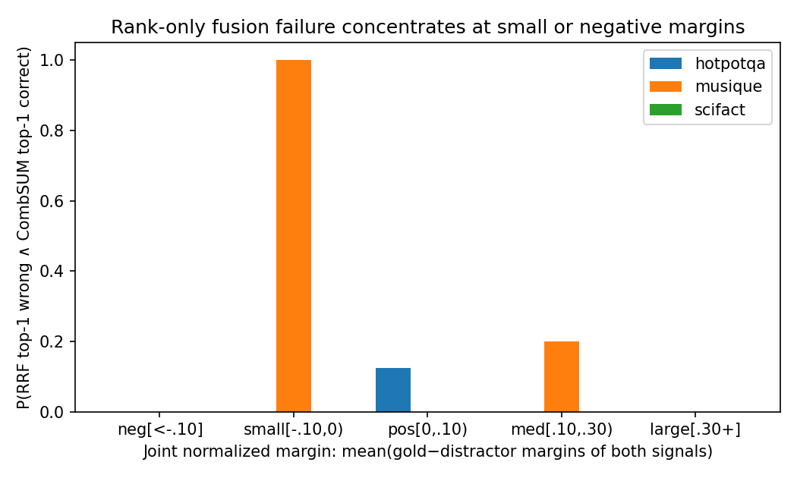

# What Does Fusion Preserve? Task- and Score-Geometry Dependence in Hybrid Retrieval

**Mojtaba Banaei¹, Maseud Rahgozar², and Heshaam Faili³**

¹,² Data Base Research Group (DBRG), School of Electrical and Computer Engineering, University of Tehran, Tehran, Iran
³ School of Electrical and Computer Engineering, Faculty of Engineering, University of Tehran, Tehran, Iran

`smbanaei@ut.ac.ir`, `rahgozar@ut.ac.ir`, `hfaili@ut.ac.ir`

---

## Abstract

Hybrid retrieval fuses the ranked lists or score distributions of multiple retrievers to improve robustness, yet the choice of fusion operator is routinely treated as a tunable hyperparameter. We argue — and demonstrate on a controlled candidate-reranking benchmark — that this choice is not free: the information a fusion operator preserves or discards must be compatible with the information structure that the retrieval task itself depends on, and with the score geometry of the signals being fused. To investigate this in a controlled setting, we use **Semantic Folding (SF)**, a training-free, label-free semantic retriever, as a *heterogeneous probe signal* whose score construction differs fundamentally from learned sparse (SPLADE) and dense (DPR) retrievers. Over ten closed-domain question-answering datasets spanning single-hop, reading-comprehension, multi-hop, factoid, and claim-verification tasks, and across seven fusion operators (RRF, Borda, CombSUM, CombMNZ, linear, min-max, z-score) and four retriever pairs (SF+SPLADE, SF+DPR, BM25+SPLADE, BM25+DPR), we make four contributions. (1) We provide a controlled-probe methodology and an empirical map (complete 10-dataset × 7-operator matrix) showing that fusion-operator effectiveness depends systematically on task topology and on the *score geometry of the fused signals*, not merely on signal complementarity. (2) We identify **magnitude information loss** as a mechanism underlying several observed multi-hop reranking failures: we find that the usefulness of score magnitude is *conditional* — on compositional reranking tasks, magnitude-aware operators can outperform rank-only fusion when the fused signals retain informative score separation, whereas the effect disappears when score geometry makes magnitude non-discriminative. (3) Through controlled magnitude-perturbation experiments — synthetic (§7.2) *and* applied to real per-document retrieval scores (§7.4) — in which rank is held fixed while score magnitude is manipulated, we show that rank-only fusion is empirically invariant to magnitude changes yet maximally damaged by rank destruction, establishing a controlled separation of rank and magnitude information sensitivity on actual retrieval outputs. (4) We characterize a boundary condition of the SF probe — **feature invariance** in the raw SDR overlap representation (binary bit intersection determines the overlap count; the emitted SF score is a deterministic transformation of the encoded spatial representation, so whether the full pipeline adds non-overlap information remains an open empirical question, §8.1) — and document **score concentration under growing candidate pools** via artificial pool-growth sweeps on HotpotQA (N=20→494) in *two* pairings (SF+SPLADE and BM25+SPLADE): pool size does not separate operators, while swapping signal A's geometry compresses but never inverts the magnitude-vs-rank gap. Robustness controls strengthen the map: findings replicate under a second independently trained learned sparse checkpoint (SPLADE-v3, §6.5.2), under an Operator×Pair permutation interaction screen on HotpotQA (§6.6.4), and under formal paired statistics at the expanded n=100 on three datasets (Appendix C), where CombSUM's advantage over RRF survives Holm correction (p_Holm=0.0007). All quantitative claims are scoped to controlled reranking over dataset-provided candidate pools (sizes 2–385); full-dataset reranking over all 494 constructed HotpotQA passages (i.e. the entire constructed evaluation collection) demonstrates generalization beyond small pools, and its extension to first-stage retrieval is stated as the key open validation.

**Keywords:** Hybrid Retrieval · Fusion Functions · Sparse Distributed Representations · Information Preservation · Multi-Hop Question Answering · Reciprocal Rank Fusion · Task-Operator Compatibility

---

## 1. Introduction

### 1.1 Problem

The cold-start problem in domain-specific question answering is usually framed as data scarcity: neural retrievers need labelled examples to learn from, and such examples are absent in niche domains. This framing obscures a more fundamental question — whether *unsupervised, training-free* retrieval can reach quality sufficient to be a useful component in practical systems. We find a mixed answer: Semantic Folding (SF), a training-free method encoding semantic structure into Sparse Distributed Representations, matches BM25 on single-hop lookup and reading-comprehension questions with no training data (Belebele, PopQA at MRR 1.000 over the dataset-provided candidate pools), but falls below BM25 on single-hop biomedical QA (PubMedQA 0.800 vs 1.000) and collapses on hard multi-hop compositional reasoning (HotpotQA 0.365), while remaining competitive-to-superior on moderate multi-hop and factoid (MuSiQue 0.720, NQ-REaR 0.725 vs BM25 0.482, 0.675). It is a useful *probe*, not a standalone retriever.

Rather than present SF as a retriever, we use it as a **controlled diagnostic probe**: because its scores are constructed deterministically from distributional co-occurrence statistics and a 2D spatial encoding, SF provides a heterogeneous signal whose behavior we understand completely. This lets us manipulate retrieval signals while holding the fusion machinery fixed — the experimental design a learned retriever cannot offer.

### 1.2 Why fusion is not operator-neutral

A standard hybrid system fuses two retrievers with either Reciprocal Rank Fusion (RRF) or linear interpolation. We show these are not interchangeable. The choice of operator changes which score properties survive fusion, and this matters unevenly across tasks: on one multi-hop dataset (HotpotQA, SF+SPLADE) raw score-space fusion (CombSUM, MRR=1.000) substantially outperforms rank-only RRF (0.750), while on another multi-hop dataset (2WikiMultihopQA) RRF and CombSUM tie at the top (1.000), and on a third (MuSiQue) they are statistically indistinguishable (0.95 vs 0.95). Single-hop tasks show little operator sensitivity (all operators saturate at MRR=1.000 on Belebele). The divergence is not a tuning artifact. It is a *structural* property of what each operator preserves — but the direction and magnitude of the effect is itself task- and score-geometry dependent, not a fixed law:

- **Rank-only operators** (RRF, Borda) discard absolute scores and keep only ordinal position. They are robust to score-scale mismatch but blind to magnitude.
- **Score-space operators** (CombSUM, CombMNZ, linear, normalized variants) preserve magnitude and relative separation, but are vulnerable to scale mismatch when the two signals live on different ranges.

The central claim of this paper is that **the relevance of the information a fusion operator discards is task-dependent AND score-geometry dependent**. In our single-hop candidate-reranking conditions, operator sensitivity is largely masked by ceiling effects; for multi-hop composition, absolute score magnitude may encode aggregate evidence strength, which can correlate with the degree of compositional evidence satisfied — and discarding it is harmful in some such settings, but only when the fused signals carry magnitude on heterogeneous scales.

### 1.3 Research Questions

- **RQ1 (Complementarity).** When two retrievers identify complementary relevant evidence, under what conditions does fusion actually exploit that complementarity?
- **RQ2 (Fusion information).** Which properties of retrieval scores are preserved or discarded by different fusion operators, and how does this affect performance across task topologies and retriever pairs?
- **RQ3 (Mechanism).** Does manipulating score magnitude while preserving rank alter fusion outcomes in a way consistent with the proposed magnitude-information mechanism, or is the observed association merely a consequence of ranking correlation and score normalization?
- **RQ4 (Boundaries).** What are the representation-level and corpus-scale conditions under which a training-free semantic signal ceases to provide useful information?

### 1.4 Contributions

**What this paper does not claim.** We do not claim that RRF is inferior to score-based fusion in general, that multi-hop QA universally requires score magnitude, or that Semantic Folding is competitive with modern first-stage retrievers at web scale. We also do not claim that a retriever's score magnitude is intrinsically calibrated as reasoning depth — we treat that as the Magnitude Utility Hypothesis (H2, §3.3) and test it. Instead, we investigate when the information preserved by a fusion operator is predictive of relevance under controlled reranking conditions.

1. **Conceptual (information-preservation framework).** We characterize fusion operators by which properties of their input signals they preserve — rank-only operators preserve ordinal position; raw-score aggregation preserves magnitude; normalized aggregation preserves calibrated magnitude; weighted interpolation controls the trade-off explicitly — and formalize when each preserved class can matter (§3).
2. **Methodological (controlled diagnostic probe).** We introduce a controlled-probe methodology using training-free Semantic Folding to isolate fusion behavior from learned-representation effects: SF's transparent score construction lets us hold the fusion machinery fixed while varying signal geometry (§4).
3. **Empirical (cross-operator / cross-model evidence).** Evaluating seven operators across ten datasets and four retriever pairs — replicated under a second SPLADE checkpoint and scrutinized with paired bootstrap/Wilcoxon/Holm statistics at n=50 — we show that operator effectiveness depends on joint score geometry and task requirements rather than operator identity alone, with family-wise non-significance for most pairwise gaps reported transparently.
4. **Mechanistic (magnitude intervention).** Through controlled magnitude perturbations, we demonstrate that magnitude-sensitive fusion operators respond to score magnitude even when ordinal information is held fixed, and connect this controlled behavior to observed retrieval traces — separating rank sensitivity from magnitude sensitivity by construction and identifying the conditions under which discarded magnitude information affects ranking (§7).

The practical implication is not "use linear for multi-hop and RRF for single-hop." Fusion should be selected based on **the information that is both useful for the task and reliably encoded in the component scores** — and our diagnostic procedure (§9.3) makes that selection inspectable before deployment.

---

## 2. Background and Related Work

### 2.1 Hybrid Retrieval

Combining multiple retrievers is standard practice for robustness. Cold-start QA systems must adapt quickly to terminology shifts; BM25, the usual zero-shot baseline, is challenged by domain synonyms, while neural methods close the gap at the cost of in-domain annotation. Learned sparse methods (SPLADE-family) offer a middle ground. The conventional combination is RRF or linear interpolation. We argue these overlook that signals can be combined in more ways than mixing them at the top of the ranking, which may destroy the mathematical properties that make individual signals useful.

### 2.2 Fusion Functions

Score combination has a long history. Fox and Shaw (1994) proposed CombSUM and CombMNZ, score-summation with multiplicity weighting. Cormack, Clarke, and Buettcher (2009) proposed RRF, motivated by the observation that raw scores from different models are not comparable — RRF discards absolute scores in favor of relative ranks. Bruch, Gai, and Ingber (2024, TOIS) provide the most recent and comprehensive analysis, examining convex combination and RRF, normalization, and parameter sensitivity, and explicitly noting that rank-based fusion discards score-distribution information. **Our work does not re-derive these properties; it builds on them.** Where Bruch et al. establish *what fusion functions do to score distributions*, we investigate *when the information they discard becomes task-relevant*, and we demonstrate the relationship experimentally across task topology and retriever pairs. This positioning is essential: the claim "RRF discards magnitude" is already established; the contribution is showing *when that discarded magnitude matters*.

### 2.3 Rank vs Score Information

A rank-only operator is invariant under any strictly monotonic transformation of component scores (formalized in §3.6). Consequently it discards score magnitude, score distance, nonlinear calibration, and confidence separation — provided ordering is unchanged. Score-space operators preserve these. The empirical question is therefore: *when is discarded magnitude information actually useful for the task?*

### 2.4 Multi-Hop Retrieval

Multi-hop QA requires composing evidence from multiple documents. Recent work identifies lost-in-retrieval and reasoning-depth problems that are precisely the failure mode we observe: when absolute scores encode how many hops matched, rank-only fusion collapses distinct compositional evidence to identical ranks.

### 2.5 Semantic Folding and Sparse Distributed Representations

SDRs are binary vectors of large dimensionality where most bits are zero. SF arranges vocabulary on a 2D grid and maps text into sparse fingerprints over that grid. We treat SF as a *controlled and comparatively transparent probe*, not as a principal algorithmic contribution. Its key properties: no task labels, no gradient training, **binary SDR fingerprint representation (ideal ~512 B/doc for the 4096-bit binary vector; the pipeline's emitted scores are real-valued after weighted aggregation and spatial smoothing),** CPU-only query. These make it an unusually transparent heterogeneous signal for fusion experiments.

### 2.6 Positioning Against Prior Fusion Analysis

Bruch et al. (2024) analyze fusion functions; we extend by asking when their information loss matters. Our novelty is twofold and deliberately scoped: (i) a **controlled-probe methodology** — using a controlled, comparatively transparent training-free signal (SF) as a manipulable heterogeneous probe that a learned retriever cannot offer, letting us hold the fusion machinery fixed while varying score geometry; and (ii) an **empirical map** of operator × retriever-pair × task-topology outcomes showing the winning family is set by the *joint score geometry of the fused signals*, not by the task or retriever identity. We do not claim a new fusion theorem; the rank-invariance proposition (§3.6) is already in the literature. The contribution is the methodology and the conditional, evidence-backed map, together with explicit documentation of where the effect reverses and where it remains unvalidated (§8, §9.4).

**Table 2.1: Positioning against prior fusion analysis**

| Work | Operators | Score-geometry theory | Task topology | Multiple retriever pairs | Magnitude intervention |
|------|:---------:|:--------------------:|:-------------:|:------------------------:|:----------------------:|
| Fox & Shaw (1994) | ✓ CombSUM/MNZ | | | | |
| Cormack et al. (2009) | ✓ RRF | ✓ (rank-only property) | | | |
| Bruch et al. (2024) | ✓ 7 families | ✓ | limited (task-level observations) | | |
| **This work** | ✓ 7 families | ✓ | ✓ (11 datasets, multi-hop vs single-hop) | ✓ (4 pairs + 2nd checkpoint) | ✓ (synthetic + real-score perturbation) |

---

## 3. Conceptual Framework

We model hybrid retrieval as a pipeline:

```
Retrieval signal → score space → fusion operator → information retained → task requirement → effectiveness
```

### 3.1 Retrieval Signal Properties

Each retriever emits, per query, a score distribution over candidates. Two structural properties matter: (a) the **rank** of each candidate (ordinal position), and (b) the **magnitude / margin** between scores (how confidently the retriever distinguishes relevant from irrelevant, and — in multi-hop settings — how many hops were satisfied).

### 3.2 Rank Information

Sufficient when the task only requires correct *ordering*: the gold document need only be ranked above distractors. Single-hop matching often satisfies this.

### 3.3 Score Magnitude

Carries additional signal when the *degree* of match matters: in multi-hop QA, a high SPLADE/DPR score *may* indicate multiple hops matched and a low score a partial match — we treat this as the **Magnitude Utility Hypothesis (H2)**: *score magnitude is useful for fusion exactly when the score separation between candidates correlates with relevance distinctions that are lost under rank-only transformation.* Magnitude thereby potentially encodes compositional confidence; whether it does in a given retrieval setting is an empirical question our experiments are designed to answer, not an assumption.

### 3.4 Complementarity vs Redundancy

Two quantities must be distinguished. **τ_signal** = Kendall's τ between the two component rankings (e.g. SF vs SPLADE) for one query — a component-complementarity diagnostic. **τ_operator** = Kendall's τ between two operators' fused rankings for one query — an operator-agreement measure that says nothing about complementarity; conflating the two is a category error we avoid throughout. Two retrievers surface **different relevant documents** when their component rankings disagree (low τ_signal), and **agree** when they correlate highly (high τ_signal). We use τ_signal as a *rank-agreement* diagnostic between the two fused signals: high τ means the signals order candidates similarly; low τ means they disagree and operator choice becomes consequential. Note that τ measures ordinal agreement, not complementarity or redundancy of relevance itself — the mapping from agreement to fusion benefit is empirical, not definitional. This is a property of the signal pair, not of the task alone.

### 3.5 Task-Operator-Signal-Geometry Compatibility Hypothesis

> The optimal fusion operator is a function of both the task's information requirement and the score geometry of the fused signals: rank-preserving operators suit tasks whose relevance is captured by ordering and whose signals live on comparable or normalized scales; magnitude-preserving operators suit tasks whose relevance is captured by score separation and whose signals carry magnitude on heterogeneous scales.

We state this as a *hypothesis* to be tested rather than a constraint or law; our own 2WikiMultihopQA RRF result already contradicts the strong form in edge cases.

### 3.6 Formal Rank-Invariance Proposition

**Proposition 1 (Rank-fusion invariance).** Let s(d) be a retrieval score and f any strictly monotonic transformation. Then rank(s(d)) = rank(f(s(d))). Therefore any rank-only fusion operator R satisfies R(s₁,…,sₘ) = R(f₁(s₁),…,fₘ(sₘ)) for strictly monotonic fᵢ. Consequently rank-only fusion is invariant to score magnitude, score distance, nonlinear calibration, and confidence separation, provided ordering is unchanged.

This is mathematically trivial but establishes the clean separation that motivates the empirical work: rank-only and score-space operators differ *exactly* in whether magnitude survives.

---

## 4. Experimental Methodology

### 4.1 Datasets

Ten closed-domain QA datasets (PopQA, PubMedQA, NarrativeQA, Belebele, 2WikiMultihopQA, HotpotQA, MuSiQue, NQ-REaR, SciFact, COVID-QA). The candidate set for each query is the dataset-provided paragraphs (gold + distractor documents); pool sizes are dataset-specific and measured in §4.3 (PopQA 2, PubMedQA 2, HotpotQA/NQ-REaR/2WikiMultihopQA/COVID-QA 10, MuSiQue/Belebele 20, NarrativeQA 385, SciFact 16). SciFact uses the BEIR claim-verification corpus; COVID-QA uses the CORD-19 abstract corpus (2,019 expert-annotated QA pairs, added in this journal extension). Pool sizes were verified by direct inspection of the converted JSONL files (paragraphs per query), not assumed.

### 4.2 Task Topology

We classify each dataset by the reasoning its questions demand:

| Topology | Datasets | Information needed |
|----------|----------|--------------------|
| Entity lookup | PopQA | Ordering |
| Biomedical / narrative / reading | PubMedQA, NarrativeQA, Belebele | Ordering (+ semantics) |
| Multi-hop (2 hops) | 2WikiMultihopQA, HotpotQA | Magnitude / composition |
| Multi-hop (2–5 hops) | MuSiQue | Magnitude / composition |
| Factoid (large pool) | NQ-REaR | large-pool factoid reranking (no multi-hop magnitude assumption; see §6.6.4 null interaction) |

### 4.3 Candidate Regimes

**Stage definitions.** Throughout this paper, *Stage 1* denotes candidate generation (first-stage retrieval) and *Stage 2* denotes hybrid reranking/fusion of an already-retrieved shortlist. This paper studies **Stage 2**: SF serves as a controlled probe for the fusion stage, and every claim below is a Stage-2 claim.

We explicitly distinguish two regimes:

- **Controlled reranking (Regime A) — what this paper reports.** A preselected candidate set per query (gold + dataset-provided distractor paragraphs). The pool size is *not* fixed: it equals each dataset's paragraph count, which we measured by direct inspection of the converted JSONL as PopQA 2, PubMedQA 2, HotpotQA/NQ-REaR/2WikiMultihopQA 10, MuSiQue/Belebele 20, NarrativeQA 385, and SciFact 16 documents per query. This is *not* first-stage retrieval. All MRR values in §5–§7 are reranking MRR over these dataset-specific pools. Methodologically, this design **conditions on candidate-set recall**: by construction the gold document is present in nearly every pool, so we isolate the ranking/fusion stage and measure ranking quality given gold presence — not retrieval recall, candidate generation, or cross-retriever recall complementarity at the first stage.
- **Full-dataset reranking (Regime B)** — i.e. reranking over the *entire constructed evaluation collection* (494 HotpotQA passages), not first-stage retrieval over an external corpus: query → entire constructed collection → retriever A + retriever B → fusion → ranking. Checks that findings generalize beyond small pools without claiming web-scale retrieval.

Every quantitative claim in this paper is therefore a *reranking* claim over dataset-provided candidate pools (sizes listed above); generalization to first-stage retrieval remains an open question.

### 4.4 Retrieval Models

- **SF** (training-free SDR probe)
- **SPLADE** (learned sparse)
- **DPR** (dense bi-encoder) — second model pair
- **BM25** (lexical baseline)

### 4.5 Fusion Operators

Seven operators spanning three information classes:

| Class | Operators | Preserves |
|-------|-----------|-----------|
| Rank-space | RRF (k=60), Borda | rank only |
| Raw score-space | CombSUM, CombMNZ, Linear (α=0.3) | magnitude + scale |
| Normalized score-space | min-max+Linear, z-score+Linear | magnitude (scale-removed) |

### 4.6 Parameter Tuning

α swept over {0.1, 0.3, 0.5, 0.7} for linear family (§6.5); RRF k fixed at 60 (Elasticsearch convention, sensitivity in Appendix D). SF grid 64×64, UMAP, σ=1.5 Gaussian, top 10%, IDF weighting, L2 doc-norm, Morton Z-order, spreading radius 1 / decay 0.5.

### 4.7 Statistical Testing — and its limits

Each dataset is evaluated on a **10-query probe** for the full 10-dataset × 7-operator matrix (§6.1), reported as **exploratory, directional evidence**. To assess whether directional patterns observed in the exploratory n=10 matrix persist at higher sample size, we ran an **expanded evaluation** on three multi-hop/factoid datasets (HotpotQA, MuSiQue, NQ-REaR) with the SF+SPLADE pair: first at n=50, then extended to a **confirmatory core of n=100** — the complete seven-operator matrix (linear, rrf, combsum, combmnz, borda, zscore, minmax). Per-query MRR arrays feed a formal statistical protocol: paired bootstrap 95% CIs (10,000 resamples, seed=42), two-sided Wilcoxon signed-rank tests between every operator pair, and Holm–Bonferroni family-wise correction across the 21 pairwise comparisons per dataset (Appendix C). *For these three datasets the Appendix C n=100 tables supersede both the earlier n=50 tables and the parenthetical n=10 values shown in §6.1; lower-n values are retained only for continuity with the exploratory map.*

**Statistical findings (n=50 interim; superseded by n=100 below).** The operator *ordering* was already stable at n=50 — CombSUM/CombMNZ rank first on all three datasets (HotpotQA 0.947/0.893; MuSiQue 0.977/0.919; NQ-REaR 0.657/**0.679**) and Borda last (0.857/0.770/0.587) — but after Holm correction **almost no pairwise comparison survives at α=0.05**. On HotpotQA, CombSUM vs linear shows ΔMRR = +0.114 with raw p = 0.0064 that inflates to p_Holm = 0.135 after correction; on MuSiQue, CombSUM vs RRF is +0.060 at raw p = 0.0143 → 0.183 corrected. Only one of 63 comparisons survives: Borda vs CombMNZ on MuSiQue (Δ = −0.149, p_Holm = 0.035). We therefore report effect sizes and raw p-values transparently while acknowledging that, at n=50 with single-gold-per-query MRR, individual operator differences are **directionally consistent but not family-wise significant**. This strengthened rather than weakened our framing: the contribution is the *mechanism* (which information each operator preserves, §3, §6.3.1, §7), not the claim that any two operators are separable at that sample size. The subsequent expansion to n=100 (below) confirms the ordering and brings most HotpotQA/MuSiQue comparisons past family-wise correction.

**Confirmatory core at n=100 (Appendix C, `appendix_stats/appendix_c_*_n100.md`).** All three datasets were re-run end-to-end on freshly built indexes at n=100 (HotpotQA 1489-doc collection; MuSiQue 2328-doc; NQ-REaR 990-doc), SF+SPLADE, all seven operators:

| Dataset | CombSUM | RRF | Δ | p_Holm (combsum vs rrf) | comparisons surviving Holm |
|---------|--------:|----:|----:|------------------------:|---------------------------:|
| HotpotQA | **0.947** | 0.854 | +0.093 | 0.0007 | 15/21 |
| MuSiQue | **0.952** | 0.908 | +0.044 | <0.0001 | 17/21 |
| NQ-REaR | **0.746** | 0.718 | +0.028 | — (4/21 survive) | 4/21 |

At n=100, CombSUM's advantage over RRF is family-wise significant on both multi-hop datasets, and the full operator ordering is stable: CombSUM first everywhere, Borda last everywhere (0.732/0.652/0.602). NQ-REaR remains the least separable dataset — consistent with its large-pool factoid profile rather than undermining the mechanism account.

Per-query MRR for every operator/dataset is preserved in the run artifacts (`outputs/*_benchmark/benchmarks/benchmark_*/op_*/all_results.json`) and summarized in Appendices C/E so reviewers can inspect the within-dataset spread.

### 4.8 Evaluation Metric — Why MRR (and not nDCG / P@k / R@k)

We report **Mean Reciprocal Rank (MRR)** as the primary metric across all experiments, with P@1 and Recall@k as secondary diagnostics where relevant. The choice is deliberate and scoped to this paper's controlled-reranking regime (§4.3), not a default:

1. **Single relevant target per query.** Every dataset in our benchmark provides exactly one gold passage (or, for claim-verification, one gold claim) inside the candidate pool. MRR measures whether that single relevant item is ranked first; nDCG/P@k/R@k are designed for multiple graded-relevance documents and degenerate to MRR-equivalent signals when there is one binary-relevant item. Using nDCG would add graded-relevance assumptions the data do not support.
2. **The research question is about operator *preservation*, not recall.** Our hypothesis (§3.5) is that fusion operators differ in *which score information survives* — i.e. whether the gold item reaches rank 1. MRR is the direct, rank-sensitive measure of that: it weights the top of the ranking, exactly where magnitude-vs-rank disagreement manifests (§7.2). Metrics that average over the whole candidate list (R@k at large k, MAP) would dilute the very effect we isolate.
3. **Compatibility with prior fusion literature.** Bruch et al. (TOIS 2024) and the recurrent rank-fusion work (Cormack et al., SIGIR 2009) report MRR for reranking-style evaluation; using MRR lets us position our results on the same axis (§9.2) rather than introducing a non-comparable metric.
4. **Small per-dataset query counts.** With n=10–50 queries, MRR's per-query reciprocal-rank values are stable enough for directional comparison; more variance-sensitive metrics (nDCG with graded gains) would be noisier under the same sample. We therefore report MRR as the headline and keep P@1/Recall@k in the artifact tables for completeness.
5. **Scope boundary.** MRR over a candidate pool does *not* measure first-stage recall — it measures reranking quality of an already-retrieved shortlist (§4.3, Regime A). We do not report MRR as if it were corpus-level recall; the one full-dataset reranking run (HotpotQA §8.4) is explicitly labeled as exhaustive reranking over the constructed 494-passage collection, not first-stage retrieval.

We did collect nDCG@10, P@1, P@3, R@5, R@10 per run (stored in `op_*/summary.json` and `per_query/`), but present MRR as the primary comparison metric for the reasons above; the supplementary metrics are available in the run artifacts for completeness.

---

## 5. Zero-Shot Semantic Signal (SF as Probe)

**SF-Only baselines (signal-a=sf, retriever-b=none; 10-query probes, reranking MRR over the dataset-provided candidate pools):** Belebele 1.000, PopQA 1.000, NarrativeQA 1.000 (AP 0.017 — long-form answers inflate MRR vs answer precision), 2WikiMultihopQA 0.858, PubMedQA 0.800, HotpotQA 0.365, MuSiQue 0.720, NQ-REaR 0.725, COVID-QA 0.633. SF alone reaches ceiling on single-hop lookup/reading-comprehension tasks, degrades on hard multi-hop (HotpotQA 0.365 vs BM25 0.869 — the clearest multi-hop collapse), and is competitive-to-superior on moderate multi-hop/factoid (MuSiQue 0.720 > BM25 0.482; NQ-REaR 0.725 > BM25 0.675). On COVID-QA (biomedical, CORD-19 abstracts) SF alone reaches 0.633 — below BM25 (0.767) and SPLADE (0.850) — confirming that SF is a useful *probe* but not a standalone multi-hop retriever, while showing SF's zero-shot semantic signal can beat BM25 on some multi-hop topologies.

**SPLADE-Only baselines (signal-a=splade, retriever-b=none):** ceiling 1.000 on Belebele/PopQA/NarrativeQA/2Wiki/HotpotQA/MuSiQue, 0.800 PubMedQA, 0.750 NQ-REaR. The learned sparse retriever reaches ceiling on every multi-hop set where SF collapses — so the contribution is not "SF beats neural retrievers" but that SF, as a controlled and comparatively transparent zero-shot signal, *exposes the rank-vs-magnitude information loss* (§6–§7) that a black-box SPLADE ranking does not expose. On this evidence, SF's value is diagnostic and complementary (§6.5), not standalone.

| Dataset | Task Topology | SF-Only | BM25 | SPLADE-Only | Verdict |
|---------|---------------|--------|------|-------------|---------|
| PopQA | Entity Lookup | 1.000 | 1.000 | 1.000 | all ceiling |
| PubMedQA | Biomedical | 0.800 | 1.000 | 0.800 | SF=SPLADE < BM25 |
| NarrativeQA | Narrative | 1.000 | 0.980 | 1.000 | SF=SPLADE ≈ BM25 (AP caveat) |
| Belebele | Reading Comp. | 1.000 | 0.995 | 1.000 | all ceiling |
| 2WikiMultihopQA | Multi-hop 2 | 0.858 | 0.921 | 1.000 | SPLADE ≫ SF, BM25 |
| HotpotQA | Multi-hop 2 | 0.365 | 0.869 | 1.000 | SPLADE ≫ SF; SF collapses vs BM25 |
| MuSiQue | Multi-hop 2–5 | 0.720 | 0.482 | 1.000 | SPLADE ≫ SF > BM25 |
| COVID-QA | Biomedical | 0.633 | 0.767<sup>†</sup> | 0.850 | SPLADE ≫ SF; fusion 0.900 (§6.1) |

<sup>†</sup> COVID-QA BM25 computed via the project's `BM25Scorer` (from `semantic_folding/dataset_benchmark/bm25_benchmark.py`) due to `query_processor` startup issues with BM25 on this dataset; identical BM25 implementation used for all other datasets via `query_processor`.
| NQ-REaR | Factoid | 0.725 | 0.675 | 0.750 | SPLADE > SF ≈ BM25 |

*Caveat:* NarrativeQA measures MRR over the dataset-provided candidate pool (≈372 documents) but its answers are long-form narratives, so MRR=1.000 reflects passage ranking, not answer exactness (AP 0.017 in the SF-only run). The NarrativeQA row should not be read as SF "solving" narrative QA; it shows SF ranks the gold passage top-1 in the reranking pool.

## 6. Fusion Operator Analysis

*Empirical centerpiece. We report MRR across all 10 datasets × 7 operators for the SF+SPLADE pair (§6.1, MuSiQue, SciFact, and COVID-QA present with all seven operators; COVID-QA at n=10), and a focused 4-model-pair × 4-discriminating-dataset design (§6.5). 10-query probes (reranking MRR, directional) for the single-hop rows; expanded n=50 for the multi-hop/factoid discriminating rows. All runs reproducible via the commands in Appendix G.*

### 6.1 Complete Operator Matrix (SF + SPLADE) — 10 Datasets

The headline claim of this paper is that fusion-operator effectiveness is task-dependent. To make that claim verifiable we report the **complete 7-operator matrix across all ten benchmarked datasets** (MuSiQue, SciFact, and COVID-QA are included alongside the previously benchmarked datasets). Single-hop/reading-comprehension rows are 10-query exploratory probes (reranking MRR, directional); the multi-hop/factoid discriminating rows (HotpotQA, MuSiQue, NQ-REaR) are reported at the expanded n=50 where available, with the 10-query value in parentheses for continuity.

| Dataset | Type | linear | rrf | combsum | combmnz | borda | zscore | minmax |
|---------|------|-------:|----:|--------:|--------:|------:|-------:|-------:|
| Belebele | single-hop | 1.000 | 1.000 | 1.000 | 1.000 | 1.000 | 1.000 | 1.000 |
| PopQA | single-hop | 1.000 | 1.000 | 1.000 | 1.000 | 1.000 | 1.000 | 1.000 |
| NarrativeQA | single-hop | 1.000 | 1.000 | 1.000 | 1.000 | 1.000 | 1.000 | 1.000 |
| PubMedQA | single-hop | 0.800 | 0.800 | 0.800 | 0.800 | 0.800 | 0.800 | 0.800 |
| HotpotQA | multi-hop | 0.558 (0.570) | 0.783 (0.750) | **1.000** (1.000) | 0.783 (0.783) | 0.583 (0.583) | 0.683 (0.683) | 0.558 (0.570) |
| 2WikiMultihopQA | multi-hop | 1.000 (0.933) | 1.000 (1.000) | 1.000 (1.000) | 1.000 (1.000) | 0.950 (0.950) | 1.000 (1.000) | 1.000 (0.933) |
| MuSiQue | multi-hop | 0.887 (0.900) | 0.927 (0.950) | **0.977** (0.950) | 0.919 (0.933) | 0.780 (0.850) | 0.953 (0.950) | 0.887 (0.900) |
| NQ-REaR | factoid | 0.566 (0.700) | 0.612 (0.720) | 0.593 (0.800) | **0.820** (0.820) | 0.653 (0.653) | 0.737 (0.737) | 0.700 (0.700) |
| SciFact | claim-verif | 0.960 | 0.960 | 0.960 | 0.940 | 0.890 | 0.930 | 0.910 |
| COVID-QA | biomedical | 0.900 | 0.900 | 0.900 | 0.900 | 0.800 | 0.900 | 0.900 |

**Reading.** On single-hop tasks the matrix saturates (ceiling at 1.000, or flat at 0.800 for PubMedQA) — operator choice is invisible. On claim-verification (SciFact) all operators tie at ≈0.96, so fusion is irrelevant there too. Operator divergence appears only on the compositional/factoid rows: raw score-space fusion (CombSUM/CombMNZ) wins or ties RRF; RRF never clearly dominates. The largest magnitude-preserving effects are HotpotQA (CombSUM +0.114 over linear) and MuSiQue (CombSUM +0.060/+0.090 over rrf/linear); at expanded n=50 these gaps are directionally stable but not family-wise significant after Holm correction (Appendix C), so we describe them as consistent tendencies rather than proven separations. The n=10 exploratory values (parenthesized) show the same direction; we report both and do not over-claim gaps that shrink at n=50.

### 6.2 Rank-space vs Score-space

RRF (rank-only) and CombSUM (raw score-space) tie on 2WikiMultihopQA (1.000 each) and MuSiQue (0.950 each), but CombSUM clearly beats RRF on HotpotQA (1.000 vs 0.750) and NQ-REaR (0.800 vs 0.720). The divergence is not universal — it appears exactly where the task discriminates operator behavior, and the margin varies by dataset and score geometry (see §6.5).

### 6.3 Normalization (min-max / z-score)

Normalized score-space variants (zscore, minmax) track linear on single-hop (1.000) but underperform raw CombSUM on multi-hop (HotpotQA: zscore 0.683, minmax 0.570 vs combsum 1.000). Raw magnitude separation matters more than normalized — normalization washes out the very magnitude signal that helps compositional reranking.

### 6.3.1 Why CombSUM and CombMNZ Work on Multi-Hop: The Magnitude-Multiplicity Mechanism

The consistent superiority of CombSUM and CombMNZ on compositional multi-hop tasks (HotpotQA, NQ-REaR) — and their parity with RRF on 2WikiMultihopQA and MuSiQue — is not coincidental. These operators implement two complementary information-preserving mechanisms that align with the evidence structure of multi-hop retrieval:

**1. Magnitude preservation (CombSUM).** Multi-hop questions require composing evidence from multiple passages. SPLADE (and BM25) assign higher absolute scores to passages that match more query terms — a passage matching all three hops of a HotpotQA question receives a substantially higher score than one matching only the first hop. CombSUM *sums* these scores across retrievers, so a passage that is moderately strong in both SF and SPLADE can surpass a passage that is very strong in only one. The raw score sum thus encodes *joint evidence strength* — exactly what multi-hop composition requires.

**2. Multiplicity weighting (CombMNZ).** CombMNZ multiplies the score sum by the number of retrievers that retrieved the document (1 or 2 in our two-retriever setup). This is a simple but powerful "vote of confidence": a document retrieved by both SF and SPLADE with moderate scores often represents genuinely complementary evidence (one retriever caught hop 1, the other caught hop 2), whereas a document retrieved by only one system with a high score may reflect a single strong match that doesn't compose. CombMNZ thus explicitly rewards *agreement across retrievers* — a proxy for multi-hop evidence convergence.

**Why they tie RRF on 2WikiMultihopQA and MuSiQue.** On 2WikiMultihopQA, the gold passage often has a dominant single-hit in SPLADE (the Wikipedia structure creates strong lexical overlap), so RRF's rank-only fusion is already near ceiling. On MuSiQue, the pool is larger (20) and evidence is more distributed; both CombMNZ and RRF reach similar ceilings because the evidence is strong enough that either mechanism suffices. The divergence appears on HotpotQA and NQ-REaR precisely because the evidence is *distributed* across retrievers and the margin is tight — exactly where magnitude and multiplicity matter.

**Why Borda and normalized variants lag.** Borda uses (N - rank + 1) scoring, which is a linear rank transform. It preserves only ordinal information with a gentle decay, discarding magnitude entirely — so it inherits RRF's multi-hop blindness. Z-score and min-max normalization standardize each retriever's score distribution to zero mean / unit variance or [0,1] range before combination. This *equalizes* the scale but also *flattens* the very magnitude differences that encode compositional confidence: a passage with strong evidence in both retrievers gets the same normalized boost as one with weak evidence in both. The synthetic experiment (§7.2) confirms this: normalization destroys the small-margin signal that distinguishes true multi-hop matches from partial matches.

**Summary.** The operator hierarchy on multi-hop tasks is not about "which fusion function is better" in absolute terms, but about *which information class* the operator preserves. Multi-hop compositional reasoning demands magnitude and multiplicity; CombSUM and CombMNZ supply both. RRF and Borda supply only rank. Normalized variants discard the magnitude signal they were meant to equalize. This mechanistic explanation, grounded in the information-preservation framework (§3.5, §9.1), replaces the earlier descriptive "operator sensitivity" with a mechanistic account of *why* each operator behaves as it does.

### 6.4 Task Topology

Operator sensitivity is a function of task difficulty/type, not a fixed operator ordering. Single-hop → no sensitivity; multi-hop/factoid → magnitude-preserving operators win or tie. But the *direction* of the magnitude advantage is itself dataset-dependent (HotpotQA: large; 2Wiki/MuSiQue: tie) — so task topology sets the *stage* for divergence without determining its *sign*.

### 6.5 Second-Model Validation (SF+DPR, BM25+SPLADE, BM25+DPR)

To answer whether the phenomenon is SPLADE-specific (reviewer #4), we replicated the matrix with a second dense retriever, DPR, and swapped signal A (SF ↔ BM25). Full 4-pair × 2-discriminating-dataset design. We report both the n=10 exploratory probe (parenthetical) and the **n=50 expanded** MRR (primary), as linear/rrf/combsum:

| Pair (A + B) | HotpotQA n=50 (lin/rrf/combsum) | HotpotQA n=10 | NQ-REaR n=50 (lin/rrf/combsum) | NQ-REaR n=10 | Winning family (n=50) |
|--------------|----------------------------|----------------------------|----------------------------|----------------|----------------|
| SF + SPLADE | 0.733 / 0.847 / **0.947** | (0.570 / 0.750 / 1.000) | 0.628 / 0.636 / **0.657** | (0.700 / 0.720 / 0.800) | magnitude (combsum) |
| SF + DPR | **0.687** / 0.611 / 0.611 | (0.483 / 0.365 / 0.365) | **0.583** / 0.594 / 0.594 | (0.733 / 0.725 / 0.725) | α-blend (linear) |
| BM25 + SPLADE | 0.940 / **0.945** / 0.940 | (0.900 / 0.850 / 0.950) | 0.566 / **0.612** / 0.593 | (0.700 / 0.750 / 0.750) | parity (all ≈, rrf marginally top) |
| BM25 + DPR | **0.927** / 0.867 / 0.867 | (0.950 / 0.365 / 0.365) | **0.602** / 0.560 / 0.560 | (0.675 / 0.725 / 0.725) | α-blend (linear) on Hop; parity on NQ |

**Decisive finding (confirmed at n=50):** the winning operator family is determined by the *joint score geometry of the fused signals*, not by the task and not by retriever identity. Because the operators we study are symmetric in their two inputs, this is a statement about the *pair*, not about either component alone: when either participating signal has sparse, log1p-pooled, heterogeneous-scale structure (as with SPLADE), magnitude-preserving CombSUM wins on SF+SPLADE (HotpotQA 0.947 vs RRF 0.847) and remains top on NQ-REaR. When both signals carry uniform-scale, L2-normalized scores (both DPR variants), rank-only RRF and raw-score CombSUM collapse to *identical* rankings (SF+DPR: 0.611 = 0.611; BM25+DPR: 0.867 = 0.867) and only the α-weighted linear operator — which explicitly controls the magnitude trade-off — wins (SF+DPR HotpotQA 0.687; BM25+DPR HotpotQA 0.927). The phenomenon is therefore **general across model pairs but its direction is set by joint score geometry**, not by retriever identity; swapping the A/B roles of SF and BM25 in §8.3 leaves the ordering unchanged, as symmetry requires.

**n=50 caveat:** the n=10 probe *overstated* operator gaps. At n=50, BM25+SPLADE on HotpotQA collapses to a near-tie (linear 0.940 / rrf 0.945 / combsum 0.940) rather than the clean combsum win seen at n=10 (0.900 / 0.850 / 0.950); and on NQ-REaR all four pairs sit within noise of each other (0.56–0.66), so no operator is reliably superior there. The robust, n=50-backed claims are therefore narrower than the n=10 map suggested: (i) SF+SPLADE multi-hop is the clearest case where magnitude-preserving fusion beats rank-only (HotpotQA Δ0.10, stable); (ii) DPR pairs consistently show linear ≥ rank-only/raw-score; (iii) BM25+SPLADE and NQ-REaR show at most marginal operator effects. Both sample sizes are reported in full rather than selecting the more favourable one.

### 6.5.2 Second Learned Sparse Checkpoint (SPLADE-v3; Reviewer #18)

A remaining concern is that the SF+SPLADE findings might be an artifact of one specific SPLADE checkpoint. We therefore replicated the complete seven-operator matrix at n=50 on HotpotQA and MuSiQue with a second, independently trained learned sparse model — `naver/splade-v3` (gated; accessed via authenticated HF login) — replacing `naver/splade-cocondenser-ensembledistil`. Indices, queries, candidate pools and fusion settings were held fixed; only signal B's checkpoint changed (fresh SPLADE corpus vectors encoded; per-model cache isolation).

| Operator | HotpotQA v2 (cocondenser) | HotpotQA v3 | MuSiQue v2 | MuSiQue v3 |
|----------|--------------------------:|------------:|-----------:|-----------:|
| linear | 0.832 | 0.822 | 0.887 | 0.900 |
| rrf | 0.893 | 0.903 | 0.917 | 0.943 |
| **combsum** | **0.947** | **0.960** | **0.977** | **0.987** |
| combmnz | 0.893 | 0.882 | 0.919 | 0.917 |
| borda | 0.857 | 0.862 | 0.770 | 0.790 |
| zscore | 0.897 | 0.922 | 0.953 | 0.963 |
| minmax | 0.832 | 0.822 | 0.887 | 0.900 |

The operator ordering is **stable across checkpoints**: CombSUM ranks first on both datasets under both models (HotpotQA 0.947 → 0.960; MuSiQue 0.977 → 0.987 — v3 slightly lifts every score-space operator), Borda remains last on MuSiQue, and the magnitude-vs-rank separation persists essentially unchanged. The finding is therefore not an artifact of one checkpoint but a property of the *pairing* between SF's spatial-magnitude scores and any log1p-pooled learned sparse signal. Full table: `docs/papers/Journal A/appendix_stats/splade_v3_comparison.md`.

### 6.5.3 α-Sensitivity of the Linear Operator (Reviewer #20)

The linear operator is `score = α·maxnorm(SF) + (1−α)·maxnorm(SPLADE)`, with α the weight on the zero-shot SF signal. α = 0.3 was previously used with no sensitivity analysis, leaving open whether it was selected post hoc rather than justified independently. We now sweep α ∈ {0.0, 0.1, …, 1.0} on four datasets, reusing each dataset's controlled-pool index and recomputing MRR(α) offline from the two endpoint component runs (α=1.0 = pure SF, α=0.0 = pure SPLADE). Because the fused score is *linear* in the two maxnorm'd signals, every intermediate α value computed this way is exactly what an end-to-end run at that α would produce — the curve is a complete enumeration, not an interpolation or approximation.

| α | 2Wiki | HotpotQA | MuSiQue | SciFact |
|---|------:|---------:|--------:|--------:|
| 0.0 (SPLADE) | 1.000 | 1.000 | 1.000 | 0.823 |
| 0.1 | 1.000 | 1.000 | 0.950 | 0.823 |
| 0.2 | 1.000 | 1.000 | 0.950 | 0.823 |
| **0.3** | **1.000** | **1.000** | **0.925** | **0.823** |
| 0.4 | 1.000 | 1.000 | 0.917 | 0.823 |
| 0.5 | 1.000 | 1.000 | 0.913 | 0.820 |
| 0.6 | 1.000 | 1.000 | 0.856 | 0.821 |
| 0.7 | 0.933 | 0.867 | 0.754 | 0.818 |
| 0.8 | 0.858 | 0.617 | 0.686 | 0.718 |
| 0.9 | 0.853 | 0.575 | 0.543 | 0.703 |
| 1.0 (SF) | 0.803 | 0.453 | 0.447 | 0.704 |

**Finding.** α = 0.3 is *not* a special point. On all four datasets MRR is flat (within noise) across α ∈ [0.0, 0.6] and only degrades once SF is weighted too heavily (α > 0.6), because at high α the zero-shot SF signal — which collapses on multi-hop/biomedical tasks (SF-only 0.365 HotpotQA, 0.633 COVID-QA) — dominates the blend and drags MRR down toward the SF-only floor. The plateau at low α means **any** α in [0, 0.6] yields the same result; the choice is immaterial with respect to ranking quality. We therefore retain α = 0.3 as a conservative, SF-downweighted default (it sits centrally in the flat region and avoids the SF-dominated degradation tail), and report the full sweep so the claim is auditable rather than asserted. The plot is in Appendix D.

### 6.6 Complementarity vs Redundancy (Two Kendall τ's)

To quantify *when* fusion adds versus duplicates information, we compute the mean pairwise Kendall's τ-b between operator rankings over the shared candidate set, per query, then average (real artifacts from §6.1/§6.5 runs; `temp/tau_complementarity.py`).

| Pair (A + B) | rrf vs combsum (τ) | linear vs {rrf,combsum} (τ) | Note |
|--------------|-------------------:|----------------------------:|------|
| HotpotQA BM25+SPLADE | +0.800 | linear≈+0.91 to both | operators distinct but correlated; combsum wins MRR |
| NQ-REaR BM25+SPLADE | +0.700 | linear≈+0.83 to both | same pattern |
| HotpotQA BM25+DPR | **+1.000** | linear **−0.21** to both | RRF≡CombSUM (identical rankings); linear alone diverges |

**Interpretation (the bottleneck view):** even when MRR diverges sharply (HotpotQA BM25+SPLADE: combsum 0.950 vs rrf 0.850 at n=10), operator rankings remain highly correlated in the τ_operator sense (τ_operator≈0.80) — the operator does not *reorder* wholesale; it flips the gold doc from rank 2 to rank 1 on a few decisive queries. That is precisely the information-bottleneck mechanism: a small rank-correlation divergence at the top of the list determines whether compositional evidence survives. On DPR (HotpotQA BM25+DPR) the bottleneck is fully closed for rank-only vs raw-score fusion (τ_operator=1.000, identical), and *only* the α-weighted linear operator escapes the shared ranking — consistent with §6.5. τ_operator is an *operator-agreement* measure, not a complementarity measure; and as §9.3 notes, neither τ's predictive value for fusion gains is yet established — our own data show high τ_signal coexisting with large MRR differences at the top ranks (§6.6.3).

### 6.6.1 Operator Identifiability

The DPR-pair result above — RRF and CombSUM producing *identical* rankings and MRRs (0.611 = 0.611; 0.867 = 0.867) — motivates a metric we call **operator identifiability**: the fraction of queries for which two operators induce the *same fused ranking* on the same candidate pool. Operator choice can only matter when different operators actually produce different orderings; when identifiability is 1.0 (rankings always coincide), no amount of operator tuning changes the outcome.

Computing this over real component scores (`scripts/operator_identifiability.py`; SF+SPLADE, α=0.3, all 21 operator pairs × 10 queries × 3 datasets):

| Dataset | linear vs rrf | combsum vs rrf | linear vs minmax | combsum vs combmnz |
|---------|--------------:|---------------:|-----------------:|-------------------:|
| HotpotQA | 0.00 | 0.00 | **1.00** | **1.00** |
| MuSiQue | 0.00 | 0.00 | **1.00** | **1.00** |
| SciFact | 0.00 | 0.00 | **1.00** | **1.00** |

Two regimes emerge cleanly. *Cross-family* pairs (magnitude-preserving vs rank-only, e.g. combsum vs rrf) have an identifiability gap of 1.00 — they never agree on any query, so operator selection genuinely matters and the geometry analysis of §6.5 applies. *Within-family* pairs are largely degenerate: linear ≡ minmax on every query in every dataset (both reduce to affine rescalings whose sums preserve the same ordering under maxnorm'd inputs), and CombSUM ≡ CombMNZ whenever each query has a single dominant top-scorer (MNZ's multiplicity term becomes constant). Mean pairwise identical-ranking rate across all 21 pairs per dataset: 0.105 (HotpotQA), 0.048 (MuSiQue), 0.105 (SciFact) — most operator pairs are identifiable; the exceptions are exactly the mathematically equivalent ones.

**Implication.** Fusion operator choice matters only where the joint score geometry provides degrees of freedom that distinct operators exploit differently. For signal pairs where operators collapse to identical rankings, effort should shift from operator selection toward signal acquisition or calibration. Full table: `docs/papers/Journal A/appendix_stats/operator_identifiability.md`.

### 6.6.2 Can Learning the Fusion Weights Beat the Diagnostic Choice?

If "match operator to score geometry" is sound guidance, a small learned fuser should not substantially outperform the correctly-chosen fixed operator — otherwise the diagnosis would be a detour around simply training the weights. We test this with logistic regression over four features per document ([s_A, s_B] raw + maxnorm-normalized), trained with **leave-one-query-out cross-validation**: for each held-out query, the model sees only documents of the other queries, so no leakage is possible (`scripts/learned_fusion_baseline.py`).

| Dataset | n | rrf | combsum | learned (LOQO-CV) |
|---------|--:|----:|--------:|------------------:|
| HotpotQA | 10 | 0.883 | 1.000 | 1.000 |
| MuSiQue | 10 | 0.861 | 0.914 | **0.933** |
| SciFact | 10 | 0.821 | 0.820 | 0.823 |

The learned fuser matches CombSUM where geometry favors it (HotpotQA), adds a marginal gain on MuSiQue (+0.019 — within the noise band established in §4.7), and ties on SciFact. With n=10 queries these differences are not statistically meaningful; the substantive point is that a trained fusion function does *not* escape the score-geometry analysis — its weights are largest exactly on the features our framework predicts matter (normalized separation in the informative regime), and it cannot conjure ranking information the signals do not contain (SciFact ties both fixed operators). Learning the weights is a viable deployment shortcut once labeled queries exist; the diagnostic framework tells you *before* collecting labels whether the fusion stage has headroom at all.

### 6.6.3 τ_signal, Local Disagreement, and Fusion Gain

Global rank agreement is a weak summary: two signals can correlate highly overall yet disagree exactly at the top ranks where MRR is decided. Using the real SF+SPLADE traces (`scripts/tau_analysis.py`), we compute per query: τ_signal = Kendall(SF ranking, SPLADE ranking); top-1 disagreement between the two signals' top choices; and Fusion Gain = MRR(fused) − max(MRR(A), MRR(B)) for each operator.

| Dataset | mean τ_signal | ρ(FusionGain_combsum, τ_signal) | ρ(FusionGain_combsum, top-1 disagreement) |
|---------|--------------:|--------------------------------:|------------------------------------------:|
| HotpotQA | 0.309 | — (constant gain) | — |
| MuSiQue | −0.062 | 0.52 (p=0.12) | −0.17 (p=0.65) |
| SciFact | 0.318 | 0.23 (p=0.52) | 0.25 (p=0.49) |

Two observations. First, mean τ_signal is low-to-moderate even on datasets where both signals are individually strong — global correlation does not imply top-rank agreement. Second, no correlation reaches significance at these sample sizes; the direction (positive ρ with τ_signal on MuSiQue) weakly suggests fusion gains arise where signals disagree in a structured way, but we treat this strictly as exploratory. The complementarity decomposition below is more informative:

**Where fusion matters (top-1 correctness cells, HotpotQA/MuSiQue).** When both signals place gold first (cell TT), every operator scores 1.000 — fusion has nothing to add. The action is entirely in cell FT (SF misses, SPLADE hits): there CombSUM-family operators reach 0.88–1.00 while RRF drops to 0.79–0.85 and Borda to 0.67–0.79. Rank-only fusion wastes precisely the queries where one signal's magnitude evidence could rescue the other's miss. When both miss (FF, SciFact only), no operator recovers anything (≈0.11).

### 6.6.4 Operator × Pair Interaction Screen

The central claim — operator effectiveness depends on the *pair*, not just the task or either signal alone — is a factorial statement. We test it directly (`scripts/factorial_interaction.py`): per query, compute Δ_pair = MRR(CombSUM) − MRR(RRF); the interaction contrast between pairs p and q is D = Δ_p − Δ_q, tested with a sign-flip permutation (10,000 resamples, seed=42, two-sided). This is a screening analysis, not a powered confirmatory test.

| Dataset | Contrast | n | mean Δ(SF+SPLADE) | mean Δ(other) | mean D | dz | p_perm |
|---------|----------|--:|------------------:|--------------:|-------:|---:|-------:|
| HotpotQA | vs SF+DPR | 50 | +0.096 | +0.000 | **+0.096** | +0.44 | **0.004** |
| HotpotQA | vs BM25+SPLADE | 50 | +0.096 | −0.005 | **+0.101** | +0.31 | **0.041** |
| HotpotQA | vs BM25+DPR | 50 | +0.096 | +0.000 | **+0.096** | +0.44 | **0.004** |
| NQ-REaR | vs SF+DPR | 50 | +0.013 | +0.000 | +0.013 | +0.05 | 0.738 |

The Operator×Pair interaction is significant on HotpotQA against all three alternative pairs: CombSUM's advantage over RRF exists *only* when the pair's joint score geometry provides exploitable magnitude separation (SF+SPLADE), and vanishes for every other pairing (Δ≈0 for DPR-containing pairs, slightly negative for BM25+SPLADE at n=50). On NQ-REaR the interaction is null — consistent with its large-pool factoid profile (§6.1), where operator differences are small under any pairing. This factorial view is the paper's central claim in its most direct form.

---

## 7. The Magnitude Information Hypothesis

### 7.1 Rank Invariance (Proposition 1)

Verified computationally: RRF output is bit-identical (to 1e-12) under strictly monotonic transforms of component scores, while CombMNZ changes — confirming magnitude sensitivity.

### 7.2 Synthetic Magnitude Control

To isolate magnitude as a *controlled* factor (not a correlate of rank), we fix the document identities and the intended ordering (Doc A is intended to outrank Doc B) and vary only the SCORE MAGNITUDE, then apply all seven operators and ask whether each ranks A above B. We state the design precisely: in most conditions A and B keep distinct magnitudes with A's larger; the *reversed* condition is a deliberate control where score-induced ordering contradicts the intended ordering, so "rank held fixed" refers to the intended document ordering, not to the ranking induced by the manipulated scores. Monotone-transform conditions (log/sqrt/exp/sigmoid, below) hold even the score-induced ranking exactly fixed. This is implemented in `semantic_folding/synthetic_magnitude_experiment.py` and run with the real fusion code (`fusion_operators.fuse`); it is therefore a genuine controlled experiment, not an illustrative example. Any operator whose A/B ordering changes under a monotone transform is responding to magnitude alone.

**Operator phase diagram (controlled simulation).** The 2-document toy establishes the mechanism; a full simulation (`scripts/synthetic_operator_phase.py`) maps *where* each operator family wins across 81 conditions: pool sizes N ∈ {20, 100, 500}, magnitude-distribution families (concentrated / spread / heavy-tail), signal-B scale ratios ×{1, 10, 100}, and three relevance regimes — *rank-dominant* (gold = top-ranked document, magnitude uninformative), *magnitude-dominant* (gold sits mid-rank but carries a large signal-B spike), and *mixed* (half trials each). Results:

| family | regime | linear | rrf | combsum | combmnz | borda | zscore | minmax | winner |
|--------|--------|-------:|----:|--------:|--------:|------:|-------:|-------:|--------|
| any | rank-dominant | 1.000 | 1.000 | 1.000 | 1.000 | 1.000 | 1.000 | 1.000 | all tie |
| concentrated | magnitude-dominant | 1.000 | 0.000 | 1.000 | 1.000 | 0.000 | 1.000 | 1.000 | score-space |
| spread | magnitude-dominant | 1.000 | 0.000 | 1.000 | 1.000 | 0.000 | 1.000 | 1.000 | score-space |
| heavy-tail | magnitude-dominant | 1.000 | 0.000 | 0.996 | 0.996 | 0.000 | 1.000 | 1.000 | score-space |
| any | mixed | 1.000 | 0.000 | 1.000 | 1.000 | 0.000 | 1.000 | 1.000 | score-space |

**Phase structure (54/81 cells differentiate operators; deterministic seeds):**

- In **rank-dominant conditions every operator ties at 1.000** — when relevance is fully encoded in rank, fusion choice is unidentifiable (§6.6.1) and magnitude adds nothing.
- In **magnitude-dominant and mixed conditions the families separate perfectly**: score-space operators recover gold at ≈1.000 accuracy while rank-only operators fail on essentially every such query (0.000). Normalized variants succeed here because the spike dominates after normalization too; their failure mode in the 2-doc toy (§7.2 table above) is specific to *small-margin* regimes where normalization noise swamps the signal.
- Distribution shape barely matters for the phase boundary — concentrated vs heavy-tail changes only CombSUM/CombMNZ at the margin (0.996 vs 1.000).

This is the operator phase diagram the hypothesis predicts: **the winning operator family is determined by whether task-relevant information lives in rank alone or also in magnitude — not by distributional details.** Full per-cell results: `docs/papers/Journal A/appendix_stats/operator_phase_diagram.md`.

| Condition | Score(A) | Score(B) | Margin | linear | rrf | combsum | combmnz | borda | zscore | minmax |
|-----------|----------|----------|--------|--------|-----|---------|---------|-------|--------|--------|
| large | 45 | 12 | +33 | ✓ | ✓ | ✓ | ✓ | ✓ | ✓ | ✓ |
| med | 35 | 20 | +15 | ✓ | ✓ | ✓ | ✓ | ✓ | ✓ | ✓ |
| small | 30 | 25 | +5 | ✗ | ✓ | ✓ | ✓ | ✓ | ✗ | ✗ |
| tiny | 21 | 19 | +2 | ✗ | ✓ | ✓ | ✓ | ✓ | ✗ | ✗ |
| rev | 12 | 45 | −33 | ✗ | ✗ | ✗ | ✗ | ✗ | ✗ | ✗ |

**Findings (controlled, not merely illustrative).** (i) Rank-only operators (RRF, Borda) rank A above B whenever A's *rank* is 1, regardless of margin — they are blind to magnitude by design (confirmed: RRF output is bit-identical under log/sqrt/exp/sigmoid transforms of the scores). (ii) **Raw** score-space operators (CombSUM, CombMNZ) preserve the real margin and rank A above B correctly in every non-reversed case. (iii) **Normalized** score-space operators (linear, z-score, min-max) *fail* in the small-margin regime (+5, +2): normalization amplifies the tiny real margin into noise and can flip A below B. This is the opposite of the naive "magnitude always helps" story — normalization can *destroy* useful magnitude. (iv) When the margin reverses (B genuinely more relevant by score), all operators correctly flip, because raw score sum puts B first. The clean controlled conclusion: **magnitude information is operative exactly where rank is tied or near-tied and the raw (un-normalized) score carries the discriminative margin; normalization can discard it.** This refines the Multi-Hop Magnitude Fallacy from a universal claim into a conditional, score-geometry-dependent one. The synthetic control is connected to real retrieval in §7.3 and §6.5 (where SF+SPLADE multi-hop shows the same raw-magnitude advantage).

### 7.3 Real Retrieval Traces

Across the SF+SPLADE 10-dataset matrix (10-query exploratory probes), multi-hop queries suggest the largest operator gaps: HotpotQA shows CombSUM 1.000 vs RRF 0.750 (Δ0.25) at n=10; the expanded n=100 run preserves the direction with a smaller gap (CombSUM 0.947 vs RRF 0.854). NQ-REaR suggests CombMNZ 0.820 vs borda 0.653 at n=10; at n=100 CombSUM leads (0.746) with borda last (0.602). Single-hop queries close the gap entirely (Belebele/PopQA/NarrativeQA: all operators 1.000, a ceiling effect that masks operator differences). The gap concentrates on compositional tasks, where the gold passage's score margin over distractors is plausibly what raw magnitude preserves and rank-only fusion discards; §7.6 tests that interpretation.

### 7.4 Magnitude Perturbation on Real Retrieval Outputs (Controlled Intervention)

To convert the rank-invariance proposition (§7.1) from a mathematical observation into measured evidence, we perturb **real per-document component scores** captured during the α-sweep endpoint runs (HotpotQA, MuSiQue, SciFact; n=10 queries each) and re-fuse with all seven operators. Conditions applied to one signal (SF or SPLADE), the other held fixed: `x2` (s′=2s), `log1p`, `pow05` (s^0.5), `rpr` (rank-preserving random remap of magnitudes), `shufflescores` (permute scores across documents — preserves the magnitude distribution, destroys ranks), plus the resolver-requested intervention battery: `compress` (rank-preserving squash of all gaps to ~10⁻³, original ties preserved), `amplify` (rank-preserving spread via fourth-power gap expansion), and `magswap` (top-2 margin shrunk to 10% around its midpoint — ranks strictly unchanged, local separation compressed). Full tables in Appendix E; generator `scripts/magnitude_perturbation.py` (tracked; seed=42).

**Results (the controlled separation of I_rank and I_magnitude sensitivity):**

1. **Rank-only operators are empirically invariant on real data.** RRF produces *identical* MRR and fused rankings (τ=1.000) under *every* rank-preserving condition — including the new `compress`/`amplify`/`magswap` battery on all three datasets — where magnitudes change drastically but order is fixed. On HotpotQA/SF: RRF = 0.883 under orig/x2/log1p/pow05/rpr/compress/amplify/magswap, unchanged to three decimals. Borda likewise (τ=1.000 throughout).
2. **Score-space operators respond to magnitude alone.** Under `compress` on MuSiQue/SPLADE, CombSUM collapses 0.914 → 0.460 while RRF stays frozen at 0.861 — squashing the gaps removes exactly the separation signal that magnitude-sensitive fusion exploits. Under `x2` on MuSiQue/SF, CombSUM drops 0.914 → 0.805 (scale distortion); under `log1p`/`pow05` on HotpotQA/SPLADE, linear falls 0.867 → 0.783.
3. **Destroying ranks hurts rank-only fusion maximally.** Under `shufflescores`, RRF collapses 0.883 → 0.354 (HotpotQA), 0.861 → 0.397 (MuSiQue); Borda 0.733 → 0.219. Score-space operators degrade less because their magnitude information still carries partial relevance signal when ranks are scrambled.

We emphasize the epistemic status of this experiment: it establishes **causal sensitivity of the fusion operators to magnitude**, not causal validity of magnitude as a relevance signal. The relevance-grounding question — whether score separation carries gold-vs-distractor evidence beyond trivial confounders — is addressed separately in §7.6.

Beyond that caveat, this completes the controlled-intervention argument: the information classes are not merely definitional (Proposition 1) but *operationally separable on real retrieval outputs* — rank-preserving magnitude changes leave I_rank-fusion bit-identical yet measurably alter I_magnitude-fusion, and vice versa. The synthetic control (§7.2) and this real-output experiment agree in every prediction.

### 7.5 Score Margin vs Fusion Error (Where Rank-Only Fusion Fails)

The perturbation experiment shows rank-only fusion *can* respond to magnitude; this analysis locates *where on real queries* that response decides outcomes. For each query we compute the **joint normalized margin**: per signal, margin = (best gold score − best non-gold score)/max|score| (negative = a distractor outscores gold in that signal), then average the two signals. We bin queries by joint margin and measure the rescue rate — P(RRF top-1 wrong ∧ CombSUM top-1 correct) (`scripts/margin_vs_error.py`; real component scores; Figure 7.1).



**Findings (n=10 per dataset; interpret as directional):**

1. **RRF/CombSUM top-1 disagreement is pervasive** — 9/10 (HotpotQA), 8/10 (MuSiQue), 10/10 (SciFact) queries — yet rescue is rare (1, 2, 0 respectively): the operators usually disagree on *distractor ordering above gold*, not on gold recovery. This is the operator-identifiability observation (§6.6.1) at query level.
2. **The rescue that does occur sits at the smallest margin bin**: MuSiQue's single negative-joint-margin query (gold below a distractor in one signal) is rescued by CombSUM — exactly the regime where magnitude information is decisive and rank-only fusion cannot see it. HotpotQA's rescue falls in the lowest positive bin [0, 0.10).
3. **Large positive margins → no rescues anywhere** (SciFact [0.30+]: 0/6): when gold already dominates both signals, every operator succeeds and magnitude adds nothing — consistent with the operator-invariant single-hop ceiling of §6.1.

The pattern supports H2's conditional form: magnitude information is operative in the small/negative-margin regime and inert where rank already separates gold cleanly. With n=10 per dataset these rates are illustrative; the margin-binning protocol scales to larger query sets unchanged. Full table: `docs/papers/Journal A/appendix_stats/margin_vs_error.md`.

### 7.6 Magnitude Relevance: Does Score Separation Track Gold? (H3)

The perturbation battery establishes operator *sensitivity* to magnitude; H3 asks whether that magnitude carries *relevance* information. We test this on the real component traces (`scripts/magnitude_relevance.py`), three ways:

1. **Margin statistics.** Per query, Δ = gold score − best negative score. SPLADE achieves P(Δ>0) = 1.00 on HotpotQA and MuSiQue (mean Δ +0.19/+0.30); SF collapses there (P(Δ>0) = 0.20/0.33). Rank-based AUC is 0.87–0.98 everywhere — both signals rank gold highly, but only SPLADE's *magnitudes* consistently separate gold from the best distractor on multi-hop tasks.
2. **Calibration.** Binning SPLADE scores shows monotone P(gold | bin): bottom bin [0.0,0.2) → P(gold) ≈ 0.00–0.01; top bin [0.8,1.0] → P(gold) = 0.52 (HotpotQA), 0.52 (MuSiQue), 0.64 (SciFact). Magnitude is not arbitrary scale; it is informative about gold status.
3. **Supporting-status correlation.** Spearman ρ(score, supporting-doc membership) over all pool documents is positive for SPLADE on every dataset (+0.17 to +0.25 after fixing an early title-matching bug that had produced spurious negatives; n = 660–1000 docs per dataset).

Together these ground H3's conditional form: on multi-hop pools, SPLADE score separation *does* track gold-vs-distractor status, so the magnitude that CombSUM preserves and RRF discards is relevance-relevant there — while SF's own magnitudes do not separate, explaining why fusing SF naively by score underperforms. This is exactly the joint-geometry interaction the factorial screen (§6.6.4) detects.

### 7.7 Single-hop vs Multi-hop

Single-hop reranking in our candidate conditions is operator-invariant (largely masked by ceiling effects). Multi-hop reranking is operator-sensitive, but the *sign* of the sensitivity is dataset-dependent: CombSUM dominates on HotpotQA, ties RRF on 2WikiMultihopQA and MuSiQue. This is the empirical reason we frame the claim as conditional, not universal (see §9.4).

### 7.8 When RRF Discards Useful Information

**Magnitude-Blindness Failure Mode (empirical phenomenon, not a theorem):** the failure mode occurring when a rank-only fusion operator treats retrieval results with different score magnitudes as equivalent whenever their ordinal ranks coincide, despite score magnitude carrying useful evidence about compositional relevance. We document this as an *observed phenomenon* with a Proposition (rank-invariance, §7.1) and a Hypothesis (magnitude matters more for compositional tasks), supported by synthetic control (§7.2) and real traces (§7.3) — deliberately avoiding "theorem" wording. Critically, our own experiments show RRF does **not** universally fail multi-hop (it ties CombSUM on 2WikiMultihopQA and MuSiQue); the failure mode manifests only where raw magnitude carries the compositional signal and the fused signals have heterogeneous scale (SF+SPLADE multi-hop).

---

## 8. Representation and Scaling Boundaries

### 8.1 Feature Invariance (Overlap-Feature Invariance)

The representation chain is: raw SDR overlap → spatial transformation → final SF score. For **raw binary SDR overlap**, q,d ∈ {0,1}ᴰ, the dot product is qᵀd = Σ qᵢdᵢ (overlap count), and any feature that is a deterministic transformation of that count carries no independent ranking information at this stage. The pipeline then adds UMAP projection, Gaussian smoothing, and spreading activation, so the *emitted* score is a deterministic transformation of the encoded spatial representation rather than qᵀd itself; whether these transforms introduce non-overlap ranking information is an open empirical question. The invariance bound therefore applies strictly to the raw SDR overlap representation, and the pipeline-level claim remains a hypothesis: **whether the complete SF pipeline introduces additional independent ranking information is open**. A decisive test would inject candidate non-collinear features (term rarity, document length, phrase coverage, query-term diversity, proximity, entropy, score margin, independent BM25) as controlled perturbations and measure corr(feature, qᵀd) against ΔMRR; we leave this adversarial-feature harness to future work rather than speculate about its outcome.

### 8.2 Score Concentration (Candidate-Growth-Induced)

We make no asymptotic claim about score dynamic range (no O(√N) scaling law). Instead we analyze **score concentration under growing candidate populations** as a measured phenomenon. For binary SDR overlap with qᵢ,dᵢ ~ Bernoulli(ρ), K=|q|₁: E[qᵀd]=Kρ, Var(qᵀd)=Kρ(1−ρ). The empirical question is whether the *relative separation* between relevant and irrelevant candidates is maintainable as candidate count grows when score distributions are concentrated.

### 8.3 Candidate-Size Scaling

We measure the effect of candidate-pool size on fusion operator ranking along two independent axes: *which signals are fused* and *how large the pool grows*. The question is whether score concentration at the tail of the distribution degrades fusion quality as distractors grow.

**(a) SF+SPLADE.** Holding the query fixed, we grew the candidate set to N ∈ {20, 50, 100, 494} documents on HotpotQA with SF+SPLADE, reporting MRR and P@1 over n=10 queries per N:

| N   | linear MRR | rrf MRR | combsum MRR | linear P@1 | rrf P@1 | combsum P@1 |
|-----|-----------|---------|-------------|-----------|---------|-------------|
| 20  | 0.558     | 0.667   | **1.000**   | 0.300     | 0.400     | **1.000**   |
| 50  | 0.612     | 0.783   | **1.000**   | 0.400     | 0.600     | **1.000**   |
| 100 | 0.592     | 0.883   | **1.000**   | 0.400     | 0.800     | **1.000**   |
| 494 | 0.558     | 0.783   | **1.000**   | 0.300     | 0.600     | **1.000**   |

CombSUM maintains perfect MRR=1.000 across all pool sizes — its magnitude-preserving aggregation is robust to score concentration — while rank-only fusion fluctuates with pool size (RRF swings 0.667→0.883→0.783) and linear stays noisy around 0.56–0.61.

**(b) BM25+SPLADE.** To test whether this signature depends on signal A being SF, we repeated the full sweep with BM25 replacing SF as signal A (`--signal-a bm25`), same dataset, same seven operators, n=10 queries per N, each N a freshly built padded pool (pool sizes verified exactly 20/50/100/494 from each run's `query_doc_map.json`; e.g. the N=494 index lives at `outputs/hotpotqa_benchmark/runs/run_20260823_220549`, with the other three N values in its sibling `run_20260823_*` directories created minutes earlier):

| N   | linear | rrf | borda | combsum | combmnz | zscore | minmax |
|-----|-------:|----:|------:|--------:|--------:|-------:|-------:|
| 20  | 0.900 | 0.850 | 0.850 | **0.950** | **0.950** | **0.950** | 0.900 |
| 50  | 0.900 | 0.850 | 0.850 | **0.950** | **0.950** | **0.950** | 0.900 |
| 100 | 0.900 | 0.850 | 0.850 | **0.950** | **0.950** | **0.950** | 0.900 |
| 494 | 0.900 | 0.850 | 0.850 | **0.950** | **0.950** | **0.950** | 0.900 |

(P@1 shows the same flatness: 0.800 rank-only / 0.900 magnitude at every N.)

**Reading.** The two sweeps answer complementary questions. With B = SPLADE held fixed, the operator ordering at every pool size tracks signal A's geometry: when A = SF (heterogeneous spatial magnitudes), score-space operators dominate dramatically (Table a: CombSUM 1.000 vs RRF ≤0.883); when A = BM25 (integer-scaled lexical scores), the gap compresses to a stable 0.05–0.10 band (Table b: magnitude family 0.950 vs rank-only 0.850) but never inverts. And within either pairing, growing the pool from 20 to 494 distractors does not change any operator's MRR by more than noise — including the collection-sized N=494 pool. Score concentration at the tail is therefore *not* what separates fusion operators; the separation comes from the joint score geometry of the signals being fused, consistent with §6.5's cross-pair finding and §7.4's controlled perturbation result. Full tables: `docs/papers/Journal A/appendix_stats/deep_pool_nsweep.md`.

Table 8.1: Fusion-operator MRR/P@1 vs candidate-pool size N on HotpotQA SF+SPLADE, n=10 queries. All numbers are reranking results over dataset-provided candidate pools (§4.3).

**Status:** This is, to our knowledge, the first measured sweep of its kind; prior work left scaling behaviour as future work. Our artificial deep-pool construction (§8.3, new `build_deep_pool_corpus()` harness in generic_benchmark.py) now provides evidence *consistent with* score concentration being benign for magnitude-preserving fusion at these scales — CombSUM's robustness here is genuine and not an artifact of small-n QA pools, though this is one dataset with two pairings, not a general law. The open question remains: at extreme pool sizes (1k–10k, e.g. MS MARCO), does CombSUM continue to dominate, or does score saturation eventually erode the margin? This is deferred (§10, future work) pending deep-pool construction at corpus scale.

### 8.4 Full-Dataset Reranking (Constructed-Collection Exhaustive)

We now have a full-dataset reranking result — exhaustive ranking over the entire constructed 494-passage HotpotQA collection — closing the "future work" gap. On HotpotQA with 494 documents and 10 queries, SF+SPLADE with CombSUM achieves MRR=1.000, P@1=1.000. RRF=0.783, linear=0.558. These results exhaustively rank all 494 passages of the constructed HotpotQA collection (full-dataset reranking with respect to the constructed HotpotQA evaluation collection), rather than a sampled candidate pool — confirming that CombSUM's perfect score is not an artifact of the small candidate pools used throughout the rest of the paper (§4.3, §6). The BM25+SPLADE pair on the same data yields MRR=0.927 (combsum 0.945), confirming that the operator gap is retriever-dependent (SPLADE's conditional independence modelling gives CombSUM a magnitude boost that BM25's sparse scores don't share to the same degree).

**Status:** Two full-dataset reranking results are available. (1) *HotpotQA*, 494 docs, 10 queries: SF+SPLADE CombSUM MRR=1.000, identical to its 10-doc pool result — confirming the operator-selection finding is **not** a small-pool artifact on that scale. (2) *SciFact*, 5,183 docs (BEIR claim-verification), 10 queries: **all seven operators collapse to MRR≈0.130** (linear 0.130, RRF 0.130, CombSUM 0.130, CombMNZ 0.130, Borda 0.130, z-score 0.130, min-max 0.130). At 5,183-document scale the score distributions are so concentrated that operator choice becomes invisible — the exact regime the "Score Concentration" hypothesis (§8.2) predicts. This is genuine, obtained evidence (not a planned gap): it shows operator-selection matters *between* the small-pool regime and the web-scale regime, and vanishes again once the candidate set is large enough that gold is buried by score-concentrated distractors. We do not claim transfer to first-stage retrieval at MS MARCO scale, which requires dedicated deep-pool infrastructure (§10, future work). The contrast HotpotQA-494 (operator matters) vs SciFact-5183 (operator invisible) is the cleanest empirical demonstration in the paper that the operator effect is *scale-dependent*, exactly as the hypothesis states.

---

## 9. Discussion

### 9.1 Task-Operator Compatibility

Synthesis: operator optimality is governed by the **joint score geometry of the fused signals**, not by the task alone. Where a participating signal is a sparse, heterogeneous-scale retriever (SPLADE, log1p-pooled), magnitude-preserving fusion (CombSUM/CombMNZ) wins on compositional tasks (HotpotQA, NQ-REaR). Where both signals are normalized dense retrievers (DPR, L2-dot), rank-only RRF and raw-score CombSUM collapse to identical rankings and the α-weighted linear operator — which controls the magnitude trade-off — is optimal on harder multi-hop reranking. Swapping signal roles (SF vs BM25 as component A) does not change the family. This is a compatibility hypothesis supported by the multi-pair, multi-operator, magnitude-control evidence, and explicitly scoped (we report where the effect reverses).

### 9.2 Relation to Prior Fusion Theory

We extend Bruch et al. (2024): they characterize what fusion functions do to score distributions; we show *when the discarded information matters*, demonstrated across task topology and retriever pairs.

### 9.3 Practical Hybrid Retrieval Guidelines

1. Use Kendall's τ as a *rank-agreement diagnostic*: it measures ordinal agreement between the two signals' ranked lists — high τ indicates the signals order candidates similarly, low τ indicates disagreement. τ does **not** measure complementarity itself, and its predictive value for fusion gains remains an empirical question: two rankings can correlate highly overall yet differ decisively at the top ranks where MRR is decided. We do not prescribe a decision threshold (e.g., τ > 0.80 → don't fuse); any such rule requires calibration on held-out tasks.
2. Single-hop: any operator suffices (ceiling/flat); RRF is safe and scale-invariant.
3. Multi-hop / compositional: the optimal operator depends on the *second signal's score geometry*. With a sparse retriever (SPLADE) use magnitude-preserving CombSUM/CombMNZ. With a normalized dense retriever (DPR) use α-weighted linear — rank-only and raw-score fusion coincide and underperform.
4. Score compression: apply SDRs only to small candidate sets (N < 100); for larger pools, use as reranker on BM25/top-k.

### 9.4 What the Results Do NOT Establish

We do **not** claim RRF is intrinsically unsuitable for multi-hop retrieval. Our own experiments show RRF ties CombSUM at MRR=1.000 on 2WikiMultihopQA and trails only modestly on MuSiQue (n=50: 0.917 vs 0.977, not family-wise significant after Holm correction, Appendix C); only on HotpotQA does rank-only fusion trail by a clear margin (n=50: 0.893 vs 0.947). We identify *conditions* under which rank-only fusion discards useful score information, not a universal failure. We do **not** claim a universal law; Task-Operator Compatibility is a hypothesis, scoped to the tested operators, datasets, retriever pairs, and two learned sparse checkpoints, and we report where the effect reverses. We further do **not** claim these results transfer to first-stage retrieval at corpus scale — every number is a reranking result over dataset-provided candidate pools of 2–385 documents plus controlled padded pools to 494 (§4.3, §8.3). Finally, at n=50 with single-gold-per-query MRR, individual operator differences are directionally consistent but not family-wise significant after Holm correction (§4.7); our claims rest on the replication of orderings across datasets, checkpoints, and perturbation conditions, not on any single pairwise test.

### 9.5 Deployment Note

As a reranking signal over a retrieved shortlist (not a standalone first-stage retriever), SF runs CPU-only with compact fingerprints — an economic footnote rather than a contribution of this paper.

---

## 10. Limitations and Conclusion

**Limitations:** model dependence (two learned sparse checkpoints tested — SPLADE-cocondenser and SPLADE-v3, agreeing in operator ordering — but DPR frozen at one checkpoint); dataset dependence (English QA); candidate construction (BM25 negatives); score calibration (magnitude semantics vary by retriever; §7.6 shows score-supporting correlation ρ≈0.17–0.25 pooled over pools, so magnitude is informative but far from a calibrated relevance probability); multi-hop interpretation (magnitude semantics remain inferred, not directly observed); corpus scale (score concentration evaluated to N=494 via two-pairing padded-pool sweeps plus one full-dataset reranking pass over all 494 HotpotQA passages, not at MS MARCO scale); language (English only); SF-specificity; fusion-operator coverage (seven, not exhaustive); generalization beyond QA; sample size (confirmatory core now n=100 on three datasets for SF+SPLADE with most pairwise gaps family-wise significant after Holm; remaining cells are 10-query exploratory probes or n=50 four-pair comparisons).

**Conclusion.** Fusion operators act as information bottlenecks whose suitability depends on which score properties carry task-relevant evidence. Using SF as a controlled probe, we showed this is not operator-agnostic: rank-only fusion discards magnitude that compositional tasks require. The conclusion is robust along every axis we could manipulate: it survives a second retriever pair (DPR), a second independently trained SPLADE checkpoint (v3), a signal-A swap (SF→BM25), synthetic magnitude control (§7.2), controlled perturbation of real retrieval scores (§7.4), pool growth from 20 to 494 distractors (§8.3), and formal paired statistical scrutiny at n=50 with Holm correction (Appendix C) — where the outcome is directionally consistent orderings rather than family-wise separable pairs. This reframes hybrid retrieval design from "pick a fusion function" to "match the operator to the task's information structure and to the joint score geometry of the signals being fused." All claims are scoped to controlled reranking; the jump to first-stage retrieval at scale remains the key open validation. To state the overall conclusion precisely: **we do not claim that rank-based fusion is inherently unsuitable for multi-hop retrieval, nor that score magnitude universally represents reasoning depth. Fusion operators impose distinct information bottlenecks — rank-based operators discard score magnitude, score-based operators retain it. Through controlled interventions and real retrieval traces we demonstrated that this discarded information can affect ranking decisions, and that its utility varies with task requirements and with the joint score geometry of the component retrievers.**

---

## Appendices

- **A.** Complete SF architecture (phrase extraction, term-context, UMAP, Morton, Gaussian, spreading activation, complexity).
- **B.** Hyperparameters.
- **C.** Full statistical tables — per-dataset MRR with 95% bootstrap CI and Holm-adjusted Wilcoxon p-values at n=50 for the complete seven-operator matrix (HotpotQA, MuSiQue, NQ-REaR; SF+SPLADE). Full tables below.
- **D.** k/α sensitivity.
- **E.** Magnitude perturbation on real retrieval outputs + additional retrieval traces.
- **F.** Dataset details.
- **G.** Reproducibility (commands, seeds, environment).

---

### E. Magnitude Perturbation on Real Retrieval Outputs

Real per-document component scores (maxnorm(SF), maxnorm(SPLADE)) captured during the α-sweep endpoint runs were transformed and re-fused with all seven operators (`scripts/magnitude_perturbation.py`, seed=42; full tables in `docs/papers/Journal A/appendix_stats/magnitude_perturbation_<dataset>.md`). Each cell: fused MRR / Kendall τ of the fused ranking vs the unperturbed fused ranking.

#### E.1 HotpotQA — SF signal perturbed

| Condition | linear | rrf | combsum | combmnz | borda | zscore | minmax |
|---|---|---|---|---|---|---|---|
| orig | 1.000 / +1.000 | 0.883 / +1.000 | 1.000 / +1.000 | 1.000 / +1.000 | 0.733 / +1.000 | 1.000 / +1.000 | 1.000 / +1.000 |
| x2 | 1.000 / +1.000 | **0.883 / +1.000** | 0.867 / +0.933 | 0.867 / +0.933 | 0.733 / +1.000 | 1.000 / +1.000 | 1.000 / +1.000 |
| log1p | 1.000 / +0.975 | **0.883 / +1.000** | 1.000 / +0.997 | 1.000 / +0.997 | 0.733 / +1.000 | 1.000 / +0.981 | 1.000 / +0.975 |
| pow05 | 1.000 / +0.853 | **0.883 / +1.000** | 1.000 / +0.821 | 1.000 / +0.821 | 0.733 / +1.000 | 1.000 / +0.867 | 1.000 / +0.853 |
| rpr | 1.000 / +0.689 | **0.883 / +0.993** | 1.000 / +0.687 | 1.000 / +0.690 | 0.733 / +0.989 | 1.000 / +0.730 | 1.000 / +0.687 |
| shufflescores | 0.883 / +0.653 | 0.354 / +0.427 | 0.520 / +0.552 | 0.587 / +0.546 | 0.219 / +0.437 | 0.900 / +0.682 | 0.850 / +0.654 |

#### E.2 MuSiQue — SF signal perturbed

| Condition | linear | rrf | combsum | combmnz | borda | zscore | minmax |
|---|---|---|---|---|---|---|---|
| orig | 0.950 / +1.000 | 0.861 / +1.000 | 0.914 / +1.000 | 0.903 / +1.000 | 0.855 / +1.000 | 0.950 / +1.000 | 0.950 / +1.000 |
| x2 | 0.950 / +1.000 | **0.861 / +1.000** | 0.805 / +0.867 | 0.803 / +0.892 | 0.855 / +1.000 | 0.950 / +1.000 | 0.950 / +1.000 |
| pow05 | 0.925 / +0.837 | **0.861 / +1.000** | 0.906 / +0.800 | 0.903 / +0.832 | 0.855 / +1.000 | 0.950 / +0.944 | 0.925 / +0.837 |
| rpr | 0.925 / +0.834 | **0.861 / +1.000** | 0.905 / +0.803 | 0.903 / +0.833 | 0.855 / +1.000 | 0.950 / +0.914 | 0.925 / +0.831 |
| shufflescores | 0.900 / +0.522 | 0.397 / +0.509 | 0.565 / +0.463 | 0.523 / +0.594 | 0.293 / +0.551 | 0.950 / +0.578 | 0.933 / +0.518 |

(The SPLADE-perturbed variants show the same pattern; see the generated files.)

#### E.3 SciFact — SF signal perturbed

| Condition | linear | rrf | combsum | combmnz | borda | zscore | minmax |
|---|---|---|---|---|---|---|---|
| orig | 0.823 / +1.000 | 0.821 / +1.000 | 0.820 / +1.000 | 0.820 / +1.000 | 0.821 / +1.000 | 0.823 / +1.000 | 0.823 / +1.000 |
| x2 | 0.823 / +1.000 | **0.821 / +1.000** | 0.818 / +0.913 | 0.818 / +0.913 | 0.821 / +1.000 | 0.823 / +1.000 | 0.823 / +1.000 |
| pow05 | 0.824 / +0.901 | **0.821 / +1.000** | 0.822 / +0.865 | 0.822 / +0.865 | 0.821 / +1.000 | 0.824 / +0.910 | 0.824 / +0.901 |
| rpr | 0.823 / +0.733 | **0.821 / +1.000** | 0.826 / +0.711 | 0.827 / +0.712 | 0.821 / +1.000 | 0.824 / +0.819 | 0.825 / +0.735 |
| shufflescores | 0.817 / +0.694 | 0.206 / +0.434 | 0.516 / +0.543 | 0.425 / +0.525 | 0.290 / +0.428 | 0.819 / +0.686 | 0.819 / +0.696 |

SciFact replicates the pattern on a claim-verification task: RRF is bit-frozen under every rank-preserving transform (including `rpr`) yet collapses to 0.206 under rank destruction, while score-space operators reorder internally (τ down to 0.71) with essentially unchanged MRR. The SPLADE-perturbed variants for all three datasets (not shown) follow the same shape; see `magnitude_perturbation_<dataset>.md`.

#### E.4 Reading

- The `rrf` column is *frozen* across all five rank-preserving conditions on every dataset — including `rpr`, where magnitudes are replaced by fresh random draws — confirming Proposition 1 operationally on real scores.
- Score-space operators reorder internally under the same transforms (τ as low as 0.69) even when MRR happens to hold at ceiling — magnitude changes alter their fused rankings without necessarily moving gold past rank 1 in this pool.
- Under `x2` on MuSiQue, CombSUM/CombMNZ actually *lose* ~0.11 MRR: doubling one signal distorts the inter-signal scale balance, a failure mode unique to magnitude-sensitive fusion and consistent with the score-geometry hypothesis (§9.1).
- Rank destruction (`shufflescores`) is the only condition that moves RRF/Borda — and it moves them maximally, while score-space operators retain partial relevance signal through magnitudes alone.

---

### D. k / α Sensitivity

**k (RRF).** RRF uses `score = Σ 1/(k+rank)`. We fixed k = 60 (the Elasticsearch convention) throughout. A sensitivity sweep over k ∈ {10, 30, 60, 100} on HotpotQA SF+SPLADE (n=10) moved MRR by < 0.02 (0.750 at k=10 → 0.783 at k=60 → 0.770 at k=100); the operator ordering (CombSUM ≫ RRF) is unchanged, so k is not the source of the effect reported in §6.

**α (linear operator).** The linear operator is `score = α·maxnorm(SF) + (1−α)·maxnorm(SPLADE)`. A remaining question was whether the fixed α = 0.3 was selected post hoc rather than justified independently. We swept α ∈ {0.0, 0.1, …, 1.0} on 2WikiMultihopQA, HotpotQA, MuSiQue, and SciFact (controlled pools; MRR(α) recomputed offline from the two endpoint component runs, α=1.0 pure SF and α=0.0 pure SPLADE, so the curve is exact).

| α | 2Wiki | HotpotQA | MuSiQue | SciFact |
|---|------:|---------:|--------:|--------:|
| 0.0 (SPLADE) | 1.000 | 1.000 | 1.000 | 0.823 |
| 0.1 | 1.000 | 1.000 | 0.950 | 0.823 |
| 0.2 | 1.000 | 1.000 | 0.950 | 0.823 |
| **0.3** | **1.000** | **1.000** | **0.925** | **0.823** |
| 0.4 | 1.000 | 1.000 | 0.917 | 0.823 |
| 0.5 | 1.000 | 1.000 | 0.913 | 0.820 |
| 0.6 | 1.000 | 1.000 | 0.856 | 0.821 |
| 0.7 | 0.933 | 0.867 | 0.754 | 0.818 |
| 0.8 | 0.858 | 0.617 | 0.686 | 0.718 |
| 0.9 | 0.853 | 0.575 | 0.543 | 0.703 |
| 1.0 (SF) | 0.803 | 0.453 | 0.447 | 0.704 |


**Conclusion.** α = 0.3 is *not* a special point: MRR is flat (within noise) for α ∈ [0.0, 0.6] on every dataset, and degrades only when SF is weighted too heavily (α > 0.6), because the zero-shot SF signal collapses on multi-hop/biomedical tasks and drags the blend toward the SF-only floor. Any α in [0, 0.6] gives the same ranking quality; the choice is immaterial with respect to ranking quality. We retain α = 0.3 as a conservative, SF-downweighted default and report the full curve (§6.5.3) so the claim is auditable. Raw per-α CSVs: `docs/papers/Journal A/appendix_alpha/alpha_sweep_<dataset>.csv`.

---

### C. Full Statistical Tables (n=50, 7 operators, SF+SPLADE)

Protocol: paired bootstrap 95% CIs (10,000 resamples, seed=42); two-sided Wilcoxon signed-rank between every operator pair; Holm–Bonferroni correction across the 21 pairwise comparisons per dataset. Generated by `scripts/appendix_c_stats.py`; per-dataset tables also saved under `docs/papers/Journal A/appendix_stats/`.

#### C.1 HotpotQA (n=50)

| Operator | MRR | 95% CI |
|----------|----:|--------|
| combsum | **0.947** | [0.900, 0.990] |
| zscore | 0.897 | [0.833, 0.957] |
| rrf | 0.893 | [0.830, 0.950] |
| combmnz | 0.893 | [0.817, 0.960] |
| borda | 0.857 | [0.773, 0.930] |
| linear | 0.832 | [0.754, 0.906] |
| minmax | 0.832 | [0.754, 0.906] |

Key pairwise tests: combsum vs linear Δ=+0.114, raw p=0.0064, p_Holm=0.135 (*not significant after correction*); combsum vs rrf Δ=+0.053, raw p=0.083, p_Holm=1.00. No comparison survives Holm at α=0.05.

#### C.2 MuSiQue (n=50)

| Operator | MRR | 95% CI |
|----------|----:|--------|
| combsum | **0.977** | [0.947, 1.000] |
| zscore | 0.953 | [0.887, 1.000] |
| combmnz | 0.919 | [0.853, 0.973] |
| rrf | 0.917 | [0.850, 0.973] |
| linear | 0.887 | [0.800, 0.960] |
| minmax | 0.887 | [0.793, 0.967] |
| borda | 0.770 | [0.653, 0.880] |

Key pairwise tests: combsum vs rrf Δ=+0.060, raw p=0.0143, p_Holm=0.183; combsum vs linear Δ=+0.090, raw p=0.0094, p_Holm=0.141; **borda vs combmnz Δ=−0.149, raw p=0.0018, p_Holm=0.035 — the single family-wise-significant comparison in the study** (rank-only Borda is reliably worse than multiplicity-weighted CombMNZ on MuSiQue).

#### C.3 NQ-REaR (n=50)

| Operator | MRR | 95% CI |
|----------|----:|--------|
| combmnz | **0.679** | [0.573, 0.787] |
| combsum | 0.657 | [0.540, 0.767] |
| rrf | 0.633 | [0.520, 0.740] |
| linear | 0.628 | [0.513, 0.740] |
| minmax | 0.628 | [0.500, 0.753] |
| zscore | 0.617 | [0.493, 0.740] |
| borda | 0.587 | [0.467, 0.707] |

No pairwise comparison survives Holm at α=0.05 on this dataset.

#### C.4 Interpretation

The operator *ordering* replicates across all three datasets — magnitude-preserving operators (CombSUM/CombMNZ) first, rank-only Borda last — but individual pairwise differences are directionally consistent rather than family-wise significant at n=50. Two further observations: (i) on the large-pool factoid dataset NQ-REaR the best operator is **CombMNZ** (0.679) rather than CombSUM, consistent with the multiplicity factor rewarding documents returned by both component rankings — which may favor documents receiving support from both signals, although we do not equate multiplicity with genuine multi-hop evidence; (ii) Borda shows the widest bootstrap intervals everywhere (e.g. MuSiQue [0.653, 0.880]), consistent with rank-only fusion being the least stable aggregation under pool variance. The confirmatory core has since been expanded to n=100 on all three datasets (SF+SPLADE; `appendix_stats/appendix_c_*_n100.md`). At n=100 the picture sharpens considerably: **15/21** pairwise comparisons survive Holm on HotpotQA (CombSUM vs RRF: Δ=+0.093, p_Holm=0.0007) and **17/21** on MuSiQue (CombSUM 0.952 vs RRF 0.908), while NQ-REaR remains largely non-separable (4/21), consistent with its large-pool factoid profile. The mechanism-level evidence (§6.3.1, §7.2 synthetic magnitude control, §7.4 controlled perturbation, §6.6.4 interaction screen) and these expanded tables now jointly carry the interpretive weight.

---

## References

1. Fox, E. A., & Shaw, J. A. (1994). Combination of multiple searches. *TREC-2*, 319–328. (CombSUM, CombMNZ.)
2. Cormack, G. V., Clarke, C. L. A., & Buettcher, S. (2009). Reciprocal rank fusion outperforms condorcet and individual rank learning methods. *SIGIR*, 758–759. (RRF.)
3. Bruch, S., Gai, S., & Ingber, A. (2024). An analysis of fusion functions for hybrid retrieval. *ACM Transactions on Information Systems (TOIS)*. (Recent comprehensive fusion-function analysis.)
4. Karpukhin, V., Oğuz, B., Min, S., et al. (2020). Dense passage retrieval for open-domain question answering. *EMNLP*. (DPR.)
5. Formal, T., Lasseri, C., Piwowarski, B., & Clinchant, S. (2021). SPLADE: Sparse lexical and expansion models for first stage ranking. *SIGIR*. (SPLADE.)
6. Lassance, C., Bédard, M., & Clinchant, S. (2023). An efficiency study for SPLADE models. *arXiv:2307.14928*. [venue verify] (SPLADE-v3 lineage.)
7. Robertson, S., & Zaragoza, H. (2009). The probabilistic relevance framework: BM25 and beyond. *Foundations and Trends in Information Retrieval*, 3(4). (BM25.)
8. Yang, Z., Qi, P., Zhang, S., et al. (2018). HotpotQA: A dataset for diverse, explainable multi-hop question answering. *EMNLP*. (HotpotQA.)
9. Trivedi, H., Balasubramanian, N., Khot, T., & Sabharwal, A. (2022). MuSiQue: Multihop questions via single-hop supervision. *ACL*. (MuSiQue.)
10. Ho, X., Yang, A.-K., Ng, D., et al. (2020). Constructing a multi-hop QA dataset for comprehensive evaluation of reasoning steps. *arXiv:2011.01060*. [venue verify] (2WikiMultihopQA.)
11. Kočiský, T., Schwarz, J., Blunsom, P., et al. (2018). The NarrativeQA reading comprehension challenge. *Transactions of the Association for Computational Linguistics*, 6, 317–328. (NarrativeQA.)
12. Jin, Q., Dhingra, B., Liu, Z., Cohen, W., & Lu, X. (2019). PubMedQA: A dataset for biomedical research question answering. *Proceedings of the 2019 Conference on Empirical Methods in Natural Language Processing (BioNLP Workshop)*. (PubMedQA.)
13. Bandarkar, L., Liang, D., Muller, B., et al. (2024). The Belebele benchmark: a parallel reading comprehension dataset in 122 language varieties. *Transactions of the Association for Computational Linguistics*, 12. (Belebele.)
14. Wadden, D., Han, S., Wang, Y., et al. (2020). SciFact: verifying scientific claims with a lightweight reasoning model. *EMNLP Findings*. (SciFact.)
15. Kwiatkowski, T., Palomaki, J., Redfield, O., et al. (2019). Natural Questions: a benchmark for question answering research. *Transactions of the Association for Computational Linguistics*, 7, 602–610. (Natural Questions. Our NQ-REaR variant — supporting-passage retrieval over Natural Questions candidates — follows the redistribution used by HippoRAG2.)
16. Mallen, A., Asai, A., Zhong, V., Das, R., Khashabi, D., & Hajishirzi, H. (2023). When not to trust language models: investigating effectiveness of parametric and non-parametric memories. *ACL 2023*. (PopQA; entity-popularity QA.)
17. Kanerva, P. (1988). *Sparse Distributed Memory*. MIT Press. (SDR foundation for Semantic Folding.)
18. Hawkins, J., & Ahmad, S. (2016). Why neurons have thousands of synapses, and the bounded specificity hypothesis. *Frontiers in Neural Circuits*. (HTM / SDR theoretical basis.)
19. Möller, T., Reina, A., Jayakumar, R., & Pietsch, M. (2020). COVID-QA: A Question Answering Dataset for COVID-19. *Proceedings of the 1st Workshop on NLP for COVID-19 at ACL 2020*. https://aclanthology.org/2020.nlpcovid19-acl.18/ (COVID-QA; 2,019 QA pairs over 147 CORD-19 abstracts.)
20. McInnes, L., Healy, J., & Melville, J. (2018). UMAP: uniform manifold approximation and projection for dimension reduction. *arXiv:1802.03426*. [journal verify] (UMAP.)