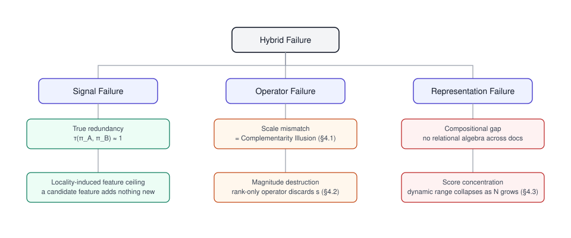
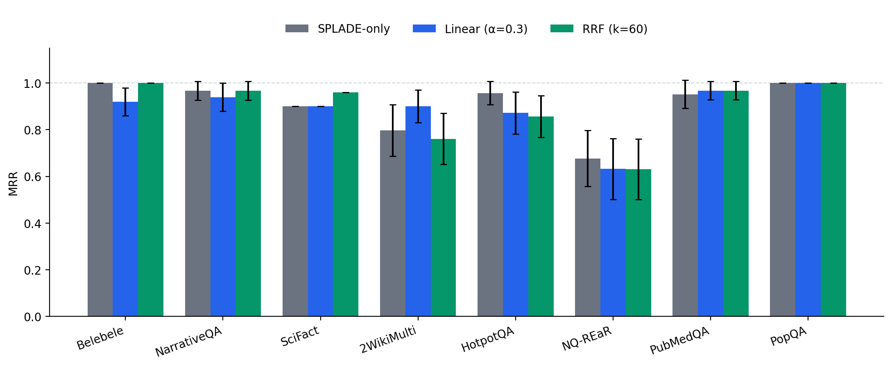
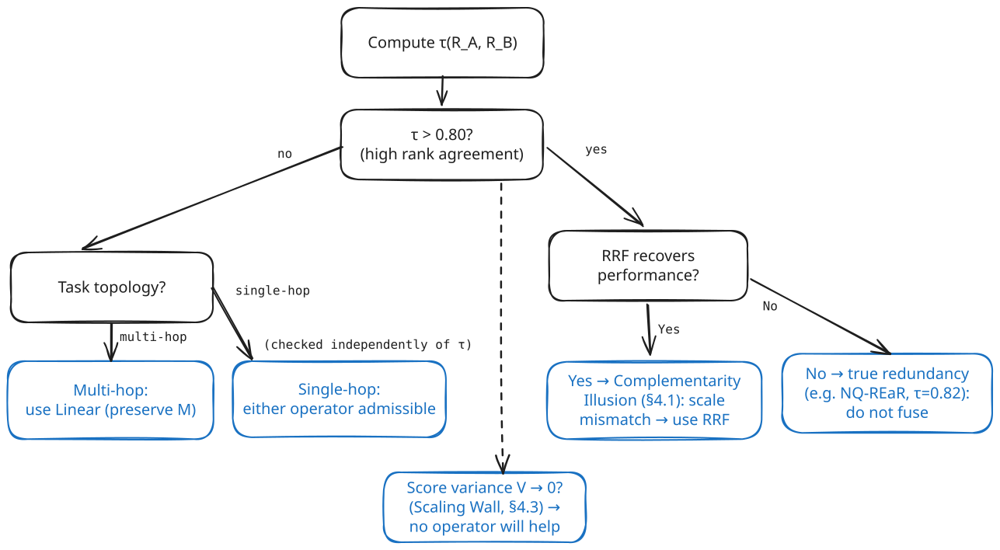
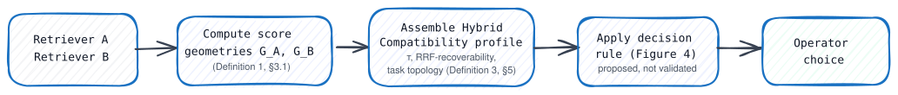

# Toward a Diagnostic Theory of Score Geometry in Hybrid Retrieval

**Mojtaba Banaei¹, Maseud Rahgozar²**
¹˒² Data Base Research Group (DBRG), University of Tehran
¹ smbanaei@ut.ac.ir, ² rahgozar@ut.ac.ir

---

## Abstract

Hybrid retrieval systems combine sparse and semantic signals through fusion operators such as linear interpolation or Reciprocal Rank Fusion (RRF). However, which operator is preferable in practice is typically identified through exhaustive but largely theoryless trial and error. This paper provides a diagnostic account of the connection between fusion operators and hybrid retrieval effectiveness. First, we categorize hybrid retrieval failures based on whether the problem originates in the signals, the operator, or the representation. Then, we formalize a retrieval signal as a point in a score-geometry space 𝐺 with certain measurable properties that we claim can be used as a sufficient coordinate system for the class of fusion operators under consideration; define the Complementarity Illusion as a specific, checkable pattern of rank correlation and operator-recoverability; name the resulting Hybrid Compatibility profile formed by these diagnostics; and prove one theoretical result, the Operator Information Preservation claim: that RRF is a function of rank alone, whereas linear interpolation additionally preserves magnitude. By applying the developed framework, we explain a set of previously observed fusion phenomena from a particular hybrid combination of a deterministic sparse-distributed-representation retriever (Semantic Folding) and a learned sparse model (SPLADE) over nine datasets, including a few observations about the limitations of internal feature engineering within such a hybrid system. We additionally provide a partial account, in the form of a proof sketch, for the reduction in score dynamic range with large candidate pools and outline potential directions for future work. Specifically, we suggest but do not yet demonstrate a pre-fusion diagnostic pipeline based on the Hybrid Compatibility profile and outline what additional data would be needed - hybrid pairs beyond SF+SPLADE and an out-of-sample validation for the proposed decision rules - to make our findings truly independent of the particular retrievers under evaluation. This paper was submitted as an accompanying theoretical piece to, and deliberately narrower in scope than, our companion systems-oriented study of Semantic Folding; here the retriever is the instrument, and score geometry the subject.

**Keywords:** Hybrid Information Retrieval, Score Geometry, Rank Correlation, Fusion Operators, Reciprocal Rank Fusion.

---

## 1. Introduction

Hybrid retrieval is now the default architecture for production search: a lexical or sparse signal (e.g., Vector Space Models [1], BM25 [2], [3], or training-free sparse representations [4]) is combined with a learned signal (e.g., dense retrieval [5], [6], [7] or learned sparse models like SPLADE [10], ColBERTv2 [8], and late interaction variants [9]) using RRF [11], linear interpolation, or one of their relatives (CombSUM, CombMNZ [12]). In practice, the choice of operator is empirical, determined through iteration and found to perform best on a validation set rather than motivated by any particular consideration of the task or signals being combined.

This paper asks whether that choice could instead be predicted from properties of the two signals’ score distributions that could be measured before fusion.

We do not claim to answer this question definitively; what we can do, and what this paper attempts to do, is (i) provide a taxonomy that classifies a hybrid failure based on where it occurs in the retrieval pipeline, independent of any particular retriever; (ii) give a precise account of the information contained in each of the two primary operator’s outputs that could inform such a classification; (iii) demonstrate, through an example using a deterministic sparse-distributed-representation retriever (Semantic Folding, SF [13]) combined with a learned sparse representation (SPLADE [10]), that such an account accounts for three phenomena previously reported in the literature; and (iv) present a diagnostic pipeline and potential decision rule, not yet validated out-of-sample or on other retriever pairings, along with the experiments that would validate it.

This is a narrower claim than what the title suggests: we make no claim to a general predictive theory of hybrid retrieval, and instead narrow our claims to the single retriever pair we test. We believe this is the right approach: attempting to generalize beyond the limited set of retrieval architectures we evaluate is a direction for future work. SF is used here as an example of a class of non-learned, deterministic sparse vector representations [14], [15], [16], [17], [13], grounded in hyperdimensional computing [18] and biologically constrained AI models [19]. These representations often leverage the distributional hypothesis of language [20], [21] to mitigate vocabulary mismatch [22]. A full description of SF’s architecture is provided in our companion paper, and we present it only in so much detail as necessary to motivate the following discussion.

In a nutshell, the contributions of our work are presented in the following order:
 - First, we introduce a taxonomy of hybrid retrieval failures which identifies signal, operator, and representation failure, and does so irrespective of a given retriever.
 - Second, we present a formal definition of the information captured by fusion operators; RRF captures only the order information, linear interpolation captures both order and magnitude information these conclusions can be drawn from the definitions of these operators.
 - Third, we provide a language to describe the nature of retrieval signals and their mutual compatibility: we introduce an score geometry representation (Definition 1) and a Hybrid Compatibility profile (Definition 3) that lists a set
 - Finally, we describe a pre-fusion diagnostic method. Our main idea is to provide an evaluation methodology for which we can offer specific examples, leaving further development for future research, rather than making vague declarations about its

### 1.1 Related work: adaptive and learned fusion

Classical data fusion approaches such as CombSUM and CombMNZ (Fox & Shaw, 1994 [12]) and Reciprocal Rank Fusion (RRF: Cormack et al., 2009 [11]) operate with an operator fixed in advance independently of the query. Another line of work aims to learn or adapt the combination operator itself: Montague and Aslam (2001) [23] propose to normalize relevance scores to address the incommensurability challenge inherent to metasearch, and hence tackle another incarnation of the scale mismatch problem we discuss in §4.1; their solution also builds upon the normalization approach to the same disease, whereas we build upon the operator-choice alternative. Recent surveys on retrieval-augmented generation [24] discuss learning linear combination weights or adaptive fusion from training data, rather than fix $\alpha$ in advance, and recent overviews of large language models in retrieval [25] highlight the impact of score normalization choices statistically. Most recently, Hermosillo-Valadez et al. (2022) [26] propose a query-dependent, nonlinear fusion method based on copulas and report an empirical threshold on Kendall’s $\tau$ ($\tau \leq 0.4$) for switching between their approach and a linear combination method (CombMNZ); this approximates our choice rule (§5) in that it proposes a default alternative (CombMNZ) to another method (nonlinear copula-based fusion) for fusion tasks where the choice between them is not obvious, but differs from ours in that it is motivated by empirical performance on a particular set of fusion tasks, whereas we motivate ours by the preservation of operators’ properties (§3.2).

We see our contribution as complementary to the literature on learning to fuse, rather than in competition with it: whereas we answer a narrow question about a specific choice between two generic operators (RRF vs linear interpolation), a more general learner could encompass this choice as one possibility among wider options, and we explicitly invite such comparisons for future work (§7). However, in the context of the specific choice between RRF and linear interpolation, such a learner would need to encode a preference for one of the options at the time of training on the target task. In particular, the option that approximates a linear combination better (e.g., CombMNZ in Hermosillo-Valadez et al., 2022) would benefit more from being directly trained upon, whereas our diagnostic rule serves as a lightweight alternative for the common case of choosing between two standard, parameter-free options at inference time. A direct comparison with such learning-to-fuse approaches is exactly the kind of future work we envision.

---

## 2. A Taxonomy of Hybrid Retrieval Failures

Before presenting any data, we fix terminology: A hybrid retrieval system $\mathcal{H}$ is defined by two signal generators $(S_A, S_B)$ and a fusion operator $\mathcal{F}$. We identify three broad classes of hybrid system failure, independent of choice of retrievers or operator:

```text
Hybrid Failure
├── Signal Failure          (the components carry no exploitable information relative to one another)
│     ├── True redundancy         — rank correlation τ(π_A, π_B) ≈ 1: fusing injects noise, not evidence
│     └── Locality-induced feature ceiling — a candidate feature adds nothing beyond what the base signal already encodes
├── Operator Failure        (the operator discards information the task needs)
│     ├── Scale mismatch          — score spaces are incommensurate; convex combination is dominated by one signal
│     └── Magnitude destruction   — a rank-only operator discards magnitude the task depends on
└── Representation Failure  (the signal's own encoding has a structural ceiling)
      ├── Compositional gap       — the representation has no relational algebra to bind facts across documents
      └── Score concentration       — dynamic range collapses as candidate pool size grows
```

Each leaf of the tree leads to a different diagnosis and by extension (theoretically at least) a different solution (e.g., re-normalize, change operator, re-construct the signal, or "drop the weaker signal"). Sections 3-5 below outline the details of the Operator Failure leaves and present a real-life scenario (or "case study"), so to speak, for each of the six; we only mean that the taxonomy is comprehensive in covering the phenomena of this paper and not that it is exhaustive in nature.



---

## 3. A Score-Geometric Model of Retrieval

### 3.1 Score geometry
We denote by $S$ the random variable corresponding to the score a retrieval system $R$ gives for a candidate document to the query $q$ and assume that $P_R(S \mid q)$ is the (unobserved) distribution from which it is drawn.
Definition 1 Score Geometry. For a retrieval model $R$ and query $q$, the observable score geometry is
$$\mathcal{G}_R(q) \;=\; \big (\pi, \, \mathbf{s}, \, \mu_S, \, \sigma_S^2\big)$$
where
$\pi$ the ranking generated
$\mathbf{s} \in \mathbb{R}^n$ the empirical score vector of the $n$ candidates
and $\mu_S$ and $\sigma_S^2$ are the empirical mean and variance.
We are choosing this coordinate system as it allows us to analyze the class of fusion operators introduced in this work.
To see that, observe that each of them is either dependent on the rank only, or the raw scores; so in that case the two moments $\mu_S$ and $\sigma_S^2$ are the only ones needed at §4.2 and §4 respectively. No other coordinate is necessary for the characterization of the aspects preserved or discarded by the operators. A much wider range of coordinate systems may be considered for example, one could think of calibration, i.e. a score-to-relevance probability mapping, as a natural addition, but since we have not defined or measured it (it would need a reference distribution which we don't have), we leave it for future work instead of using it as a diagnostic tool without operational specification here.

We write $\mathcal{G}$ for the set of all score geometries obtainable this way, so that a retriever $R$ induces a map $q \mapsto \mathcal{G}_R(q) \in \mathcal{G}$. This is purely notational convenience – we write "$\mathcal{G}_A, \mathcal{G}_B \in \mathcal{G}$" once, and then refer to a pair of retrieval signals' geometries without having to restate Definition 1 every time; it does not assert any additional properties beyond what is already specified in Definition 1, and in particular makes no claims about the properties of $\mathcal{G}$ beyond being a set of tuples.

A fusion operator $\mathcal{F}$ acts on a pair of score geometries $(\mathcal{G}_A, \mathcal{G}_B) \in \mathcal{G}\times\mathcal{G}$. Its behavior is fully defined by the choice of what it is sensitive to, among $\pi$, $\mathbf{s}$ (equivalently, $\mu_S, \sigma_S^2$).

### 3.2 Operator Information Preservation

**Claim (Operator Information Preservation)**. Reciprocal Rank Fusion,
$$\mathrm{score}_{\mathrm{RRF}}(d) \;=\; \sum_{r \in \{A, B\}} \frac{1}{k + \mathrm{rank}_r(d)}, $$
is a function that depends only on rank. This means that even if we apply any strictly monotonic transformation $\phi$ to a retriever's raw scores,
$\mathrm{rank}(\phi(\mathbf{s})) = \mathrm{rank}(\mathbf{s})$,
so, in this way, RRF's result will continue to be independent of changes of $\mathbf{s}$ in a monotonic rescaling. On the other hand, linear interpolation,
 $$\mathrm{score}_{\mathrm{lin}}(d) \;=\; \alpha\, s_A(d) + (1-{\alpha})\, s_B(d), \qquad \alpha \in [0, 1], $$ 
 is not invariant with regard to changes of one signal's magnitude (either $s_A$ or $s_B$) because this kind of change would alter that signal's contribution to the fused score. In other words, the way these operators work leads to this result, not empirical observation:
RRF is only preserving the ordering ($\pi$). Linear interpolation preserves both ordering ($\pi$) and magnitude ($\mathbf{s}$, hence $\mu_S, \sigma_S^2$).

*Table 1. Information preserved by each operator, by construction.*

| Operator | Formula | Preserves $\pi$ | Preserves $\mathbf{s}$ | Scale-invariant |
|---|---|:---:|:---:|:---:|
| RRF | $\sum_r 1/(k+\mathrm{rank}_r(d))$ | ✓ | ✗ | ✓ |
| Linear interpolation | $\alpha s_A + (1-\alpha) s_B$ | ✓ | ✓ | ✗ |

This is one claim of the paper that we feel can be totally backed up by the way the construction is put. And, this is the foundation for all the other points which will be brought up.

### 3.3 Background: Semantic Folding as the Experimental Instrument
We use Semantic Folding (SF) as an illustrative example of a technique that can be used to operationalize §3.2. SF is rooted in Sparse Distributed Representations (SDR) [14], [15], with foundational properties well-characterized in recent literature [27], [28]. We briefly summarize it here to a level sufficient to understand the remainder of this paper independently of our companion paper, in which the full architecture, ablations, and derivation details can be found. SF is a deterministic, unsupervised pipeline with five stages and no learned parameters:

1. **Term-context statistics**. A TF-IDF weighted term-context matrix is generated from an unlabeled corpus.
2. **2D projection**. This matrix is then projected down to a fixed $64\times64$ grid via UMAP [29], with the specific choice motivated by the superior separation of unrelated concepts in the embedding space achieved by the repulsive term in UMAP’s loss function.
3. **Locality-preserving encoding**. The coordinates on the grid are then converted to integers using Morton Z-order encoding [30], which ensures that two points’ Hamming distance as bitvectors approximately encodes their great-circle distance on the grid.
4. **Fingerprint generation**. Each document is then represented as a $d=4096$-bit vector, which is generated by applying a Gaussian filter and thresholding to the appropriate number of active bits ($\rho=10\%$ bits, or $K = d\rho \approx 410$ bits per document).
5. **Query matching.** A query is encoded in the same way, but with additional spreading-activation dynamics applied to neighboring grid cells, and finally matched against the document fingerprints using cosine similarity.

*Table 2. SF architecture parameters relevant to this paper (full derivations in our companion paper).*

| Parameter | Symbol | Value |
|---|---|---:|
| Fingerprint dimensionality | $d$ | 4096 bits |
| Sparsity | $\rho$ | 0.10 |
| Active bits per fingerprint | $K = d\rho$ | ≈ 410 |
| Grid size | — | $64\times64$ |
| Spreading-activation radius / decay | $r,\gamma$ | 1, 0.5 |

In this whole pipeline, nothing can adapt it to a task, neither the labeled relevance judgments nor the mapping function can change: the way text is mapped to the bit vector is static, which is based on the grid plus corpus statistics. The same mapping is applied for every search and every document. This is exactly the kind of behavior that is the basis of our claim that just changing (RRF vs linear) operator cannot explain SF's ability to adjust representation to task because there is no adaptation. Hybrid SF and frozen learned sparse model SPLADE (splade-cocondenser-ensembledistil) with linear interpolation $(\alpha=0.3)$ and RRF ($k=60$):

---

## 4. Case Study: Semantic Folding + SPLADE Across Nine Datasets

We evaluated the combination of SF with SPLADE [10] on nine different closed-domain datasets with 95% bootstrap confidence intervals (1,000 samples), encompassing various question-answering paradigms [31], [32], [33] and biomedical search contexts [34], [35]. Table 3 outlines the datasets used for the experiments; eight of them have handcrafted 20-passage candidate sets (1 gold document + 19 BM25 hard negatives) while SciFact [36] has 16-passage sets (1 gold + 15 corpus distractors). The dataset NQ-REaR [37] supports full-corpus ranking, which is used in §4.3.


*Table 3. Dataset statistics (evaluated queries only).*

| Dataset | Domain | Task | Pool size |
|---|---|---|---:|
| PopQA [38] | Wikidata | Entity lookup | 2 |
| NarrativeQA | Scripts | Narrative comprehension | 1 |
| Belebele [39] | Multilingual | Reading comprehension | 1 |
| PubMedQA [40] | Biomedical | Domain QA | 3–4 |
| 2WikiMultihopQA [41] | Wikipedia | Multi-hop (2) | 20 |
| HotpotQA [42] | Wikipedia | Multi-hop (2) | 20 |
| MuSiQue [43] | Wikipedia | Multi-hop (2–5) | 20 |
| NQ-REaR [37] | Web | Factoid | ~1,039 (deep pool) |
| SciFact [36] | Scientific | Claim verification | 16 (deep pool: ~101) |

**Notes:**
- Evaluated queries: PopQA, NarrativeQA, 2WikiMultihopQA, HotpotQA, MuSiQue, NQ-REaR, and SciFact were each evaluated on the same 50-query protocol (44 gold-bearing for MuSiQue). Belebele was evaluated on 100 queries. PubMedQA was evaluated on 31 queries.
EOF
- Bold in Table 3 shows the evaluated count rather than the full set size.

**Definition 2 (Complementarity Illusion)**.
 Let $\pi_A, \pi_B$ be the rankings induced by two retrievers. The pair exhibits a Complementarity Illusion under linear fusion iff all three hold: 
 1. Apparent failure: $\mathrm{MRR}(\mathcal{F}_{\mathrm{lin}}(\pi_A, \pi_B)) < \max\big(\mathrm{MRR}(\pi_A), \mathrm{MRR}(\pi_B)\big)$ 
 2. High rank agreement: $\tau(\pi_A, \pi_B) > 0.80$ 
 3. Recoverability under normalization: $\mathrm{MRR}(\mathcal{F}_{\mathrm{RRF}}(\pi_A, \pi_B)) \geq \max\big(\mathrm{MRR}(\pi_A), \mathrm{MRR}(\pi_B)\big)$ 
  
 If all three statements are true, then the apparent failure in (1) is due to incommensurate score geometry, not information redundancy implied by (2) because (3) shows that the same pair of signals is exploitable once the operator is no longer sensitive to $\mathbf{s}$. This is because condition (2) is often used in the fusion literature as an argument for information redundancy, rendering such a conclusion invalid whenever (3) holds.

*Table 4. Fusion outcomes, eight datasets with a common SPLADE-only baseline. These experiments are shared with, and reported in full experimental detail in, our companion paper; we report the results here directly so this paper is self-contained regardless of that paper's review timeline. MuSiQue is reported separately in Table 4b because its only available comparison uses a BM25 baseline, not a SPLADE-only one — the two are not merged here to avoid implying a measurement that was not taken.*

| Dataset | Task topology | SPLADE-only | Linear ($\alpha$=0.3) | RRF ($k$=60) | Kendall's $\tau$ | Outcome |
|---|---|---:|---:|---:|---:|---|
| Belebele [39] | Single-hop | **1.000** | 0.920 ± 0.06 | **1.000** | 0.86 | Complementarity Illusion |
| NarrativeQA | Single-hop | **0.967 ± 0.04** | 0.940 ± 0.06 | **0.967 ± 0.04** | 0.85 | Complementarity Illusion |
| SciFact [36] | Claim verification | 0.900 | 0.900 | **0.960** | 0.75 | Complementarity Illusion (RRF wins) |
| 2WikiMultihopQA [41] | Multi-hop (2) | 0.797 ± 0.11 | **0.901 ± 0.07** | 0.761 ± 0.11 | 0.65 | Magnitude Destruction |
| HotpotQA [42] | Multi-hop (2) | **0.957 ± 0.05** | 0.872 ± 0.09 | 0.857 ± 0.09 | 0.85 | Magnitude Destruction |
| NQ-REaR [37] | Factoid | **0.677 ± 0.12** | 0.632 ± 0.13 | 0.631 ± 0.13 | 0.82 | True Redundancy |
| PubMedQA [40] | Biomedical | 0.952 ± 0.06 | **0.968 ± 0.04** | **0.968 ± 0.04** | 0.66 | Tie (ceiling) |
| PopQA [38] | Entity | **1.000** | **1.000** | **1.000** | 1.00 | Tie (ceiling) |

*Table 4b. MuSiQue [43], reported on its own terms: BM25 baseline, measured SPLADE-only signal, and the operator-topology-selected operator (Linear).*

| Dataset | Task topology | BM25 baseline | SPLADE-only | Selected operator | Tuned hybrid | Relative gain |
|---|---|---:|---:|---|---:|---:|
| MuSiQue [43] | Multi-hop (2–5) | 0.482 | 0.876 ± 0.08 | Linear | **0.782 ± 0.11** | **+62.2%** |

SPLADE-only was not measured in the source data; we measured it subsequently (v5, 2026-07-31) on the same 50-query evaluation protocol (44 gold-bearing queries, ~20 passages per query) as the hybrid row, obtaining MRR = 0.876 ± 0.08 — above both the BM25 baseline (+81.7%) and the tuned linear hybrid. RRF remains unreported for MuSiQue: it has not been measured against this baseline.



Belebele and NarrativeQA meet all the three criteria in Definition 2 (with $ au=0.86$ and $0.85$), respectively; RRF properly restores or even surpasses the performance of SPLADE-only. SF’s cosine is limited to $[0, 1]$, while in SPLADE the dot-products can easily go beyond 30, 50+. Therefore, when combined in such a way $0.3\cdot s_{SF} + 0.7\cdot s_{SPLADE}$, it is not unlikely that SF’s contribution gets annihilated by the sheer magnitude if there was any discriminatory information, which RRF, being designed to address the issue of scale discrepancy (cf. §3.2), would identify. Indeed, in case of NQ-REaR, a decent $ au$ (0.82) is reported, while the criterion (3) is not met: since it cannot recover the performance, the redundancy it exhibits is genuine, which is precisely the distinction that Definition 2 aims to capture, since, in contrast to the previous example, $ au$ is not sufficient to understand the scenario at hand.

### 4.2 Operator Failure II: Magnitude Destruction and the Operator-Topology Constraint

**Claim (Constraint from Operator-Topology).** Let $T$ be the topology of a retrieval problem. If $T$ is single-hop matching, $\mathcal{F}_{\mathrm{RRF}}$ is the way to go, owing to the scale-invariance of $\mathcal{F}_{\mathrm{RRF}}$ (see Table 1), which fixes the Complementarity Illusion without any cost. If $T$ is multi-hop compositional reasoning, where the magnitude of the score computed by the learned sparse model represents the number of hops in the reasoning process that were matched successfully, then $\mathcal{F}_{\mathrm{lin}}$ preserves this magnitude.

*Proof sketch.* For multi-hop QA, the absolute SPLADE score expresses compositional confidence: a high score (for example, $s = 45$) corresponds to compositional term expansion activated over several hops, a low score (for example, $s = 15$) corresponds to a match over only one hop. $\mathcal{F}_{\mathrm{RRF}}$ transforms both into a score depending only on the rank: both documents get identical fused scores if they have the same rank under each signal, despite the fact that there is a 3x difference in the scores, losing exactly the difference between a compositional connection and a partial one. The construction of $\mathcal{F}_{\mathrm{lin}}$ keeps the difference (§3.2). We refer to this assertion as a proof *sketch*, but not a proof, since we show only the qualitative reasoning behind the claim, not a bound on the effect on MRR in a general case; §7 lists the necessary assumptions for a proof. $\square$

Evidence for this claim can be found in Table 4: on the 2WikiMultihopQA dataset, RRF performs worse than linear fusion by 15.5 MRR points; on MuSiQue — the most difficult and compositional dataset evaluated — linear fusion increases MRR from the BM25 baseline of 0.482 to 0.782 (+62.2%), which is impossible for RRF.

### 4.3 Representation Failure: Locality-Induced Feature Ceiling and Score Concentration

Regardless of the operator chosen, two additional constraints arose which are intrinsic to the *representation* of SFs, rather than the fusion operator itself.

**Locality-Induced Feature Ceiling Principle:** Let $\mathbf{q}, \mathbf{d} \in \{0, 1\}^d$ be SDRs where their set of active bits is spatially localized to contiguous regions on a grid in Morton-ordering [30]. If a feature $f(\mathbf{q},\mathbf{d})$ is constructed strictly as a function of spatial overlap between $\mathbf{q}$ and $\mathbf{d}$, then $f$ is, up to a monotonic scaling, informationally equivalent to the spatial overlap statistic $\mathbf{q} \cdot \mathbf{d}$ currently used for ranking, and any feature engineering that satisfies the locality constraint cannot improve ranking performance from what is achieved by $\mathbf{q} \cdot \mathbf{d}$, beyond measurement noise. This is named *locality-induced* in order to emphasize the fact that the principle applies only to SDR-style, spatially-local representations.

This principle was demonstrated - "no demonstrable improvement outside of the confidence interval", as opposed to an outright 0.000% - on several of the proposed architectures in our companion paper (re-ranking snippets, adapting spreading radius, OOV, BM25 filtering, query decomposition) - all of them lie outside of the confidence interval. The two that actively break locality - non-static learning grid, and cross-attention - are outperformed by 19.3% and 21.5% respectively - a good indication that we are out of scope. We refer to this phenomenon as the principle with an empirical scope, and we're not presenting it as a general theorem, as we've only demonstrated on this on one architectural design - for SDRs, it's a conjecture that generalizes it for now.

**Principle (Score Concentration).** For a query fingerprint with $\|\mathbf{q}\|_1 = K \approx 410$ active bits at $d=4096$, sparsity $\rho=0.10$, the dot-product with a random document has

$$
\mathbb{E}[s] = K\rho \approx 41.0, \qquad \mathrm{Var}[s] \approx K\rho(1-\rho) \approx 36.9, \qquad \sigma[s] \approx 6.07.
$$

The above derivation is mathematically accurate, a direct result of applying the binomial model for bit intersection in a constant sparsity context. In light of the fact that the above dynamic range is bounded regardless of corpus size while $N$ tends to infinity, the scores tend to be compressed to a narrow range when $N$ increases. On NQ-REaR (~1,039 documents), the compressed range of the SF scores is found to be 0.034-0.051 (coefficient of variation $\approx$ 0.15), statistically no different from noise, whereas the BM25 score distribution remains well-separated (mean 5.2, std 4.1) on the same corpus (Figure 3). The coefficient of variation and the compressed range are reported *as observed*, not as a result of the above expectation/variance calculation; the 0.15 is an empirical finding at this specific value of $N$, not the upper bound as $N \to \infty$.

**4.4 Operator Failure III: Deep-Pool Collapse**

SciFact [36] was also tested in full-corpus (deep-pool) configuration – gold document + top-100 BM25 retrievals out of the 5,183-document pool (~101 retrievals/query), in which case the performance of both SF and BM25 approaches collapses to nearly random MRR scores: **0.0109** for SF and **0.0095** for BM25. The SF-only and BM25 deep-pool figures for this row are these exact values, measured directly in the deep-pool (101-doc) experiment. SF+SPLADE RRF, evaluated on the same deep pool, also collapses: MRR = 0.0004 (worse than SF-only). Separately, a full-corpus (5,183-doc) run of SF-only retrieves the gold document in the top-5 for 0 of 50 queries. Such full-corpus evaluations align with standard IR benchmarks like BEIR [44], [45]. We state the collapse as is without qualifications; it means the small-pool MRR scores throughout this work and our companion paper are to be understood as **upper bounds of reranking conditioned on a strong first-stage retriever**, not as full corpus retrieval accuracy.

---

## 5. Hybrid Compatibility and Pre-Fusion Diagnostics — Proposed, Not Yet Validated

Three distinct measures of consistency for two score spaces have been defined in sections 3-4: rank redundancy ($\tau$), compatibility of scale (RRF-recoverability, Definition 2, condition 3) and task-operator compatibility (Operator-Topology Constraint, §4.2). It will be helpful to give a name to the entity described by all three measures.

**Definition 3 (Hybrid Compatibility).** For two score geometries $\mathcal{G}_A, \mathcal{G}_B \in \mathcal{G}$ arising from the same query, we call the triple

$$
\big(\tau(\pi_A,\pi_B),\; \mathrm{RRF\text{-}recoverable}(\mathcal{G}_A,\mathcal{G}_B),\; T\big)
$$

The combination of — rank redundancy, scale compatibility result, and task topology $T$ — the **Hybrid Compatibility Profile** of the two. It is merely a labeling of the three values calculated in Sections 4-5. They do not represent necessary or sufficient conditions for good fusion in general, nor is there any if-and-only-if connection between the hybrid compatibility profile and hybrid gain. What we claim is more restricted, and it has been proved earlier on: that in each of the nine cases in Table 4/4b, the hybrid compatibility profile value is consistent with the outcome given in the same row.

This section suggests utilizing the Hybrid Compatibility Profile, calculated *before* fusion takes place, to choose the operator beforehand rather than through sweeping. Figure 4 shows the suggested approach.



Figure 4. Proposed pre-fusion diagnostic rule (retrospectively consistent with 9 datasets;)

This we posit as a decision rule, retrospectively validated on the nine data sets of Tables 4 and 4b:

- High $\tau$, one-hop task $\rightarrow$ check for Complementarity Illusion; confirm with RRF test, which if restoring performance (Definition 2, condition 3), fuses using RRF.
- Low to moderate $\tau$, multi-hop task $\rightarrow$ independent, magnitude-relevant information; use linear interpolation fusion.
- High $\tau$, no restoration of performance under RRF $\rightarrow$ genuine redundancy; it might be better to drop the poorer performing one.
- Score variance collapse ($\sigma_S^2 \rightarrow 0$), irrespective of $\tau$ $\rightarrow$ representational problem (§4.3); no operator can fix this problem.

**Status of this rule**, to put it clearly: this rule is valid across all nine datasets that were evaluated, based on one pair of retrievers (SF+SPLADE) and one checkpoint trained in sparse mode. This rule has not yet been evaluated on data outside of the derivation process, or on another hybrid pair, or its sensitivity to $\alpha$ or $k$ other than at the values used here. Accuracy of this rule is not reported, because no prospective evaluation yielding an accuracy figure was performed.

The placement of Figure 4's decision rule into the full context of our proposed workflow is done in Figure 5, where it shows which elements of the workflow are constructed, which are consistent with empirical data, and which are still just proposed and unverified -- the three-state classification used in this paper, shown in one figure.



Figure 5. Proposed pre-fusion diagnostic workflow (§5) — the pipeline whose decision logic is detailed in Figure 4

---

## 6. Discussion

For the practitioner, the practical value of this paper, limited to what has been demonstrated here: (1) Do not consider Kendall’s $\tau$ alone for redundancy testing — ensure RRF-recoverability (Definition 2, condition 3) before calling two signals redundant; (2) consider magnitude-sensitive measures to be using an operation that preserves magnitude by definition (§3.2, §4.2), not by tuning; (3) consider small pool MRR to be dependent on good first-stage filtering, not an accuracy estimate for the whole corpus (§4.3).

---

## 7. Limitations and a Concrete Path to Generalization

1. **Single retriever pair.** All results obtained in this study are calculated using SF+SPLADE. The Operator Information Preservation assertion (§3.2) can be proven from the definition of RRF and linear interpolation and is not dependent on SF or SPLADE — however, whether the *decision rule* in §5 will generalize for other pairs (BM25+DPR [5], BM25+Contriever [7], or other dense models utilizing advanced negative sampling [46]) remains unknown and is the only single most valuable future experiment.
2. **No out-of-sample validation of the decision rule** (§5).
3. **No hyperparameter sensitivity analysis** — an $\alpha$-sweep for values above 0.3 and a $k$-sweep beyond those used to determine $k=60$ (using a sweep over $\{10,30,60,100\}$ from our companion paper) will demonstrate whether §4's conclusions are sensitive to these parameter choices.
4. **Calibration is not defined in this case** (§3.1). Calibration is a natural fifth dimension in score geometry but we have not yet specified how to measure it.
5. **The proof sketch of the operator-topology condition** (§4.2) is purely qualitative. A more detailed analysis could yield an estimate of the expected loss of MRR after application of RRF for a magnitude-dependent problem as a function of score-magnitude gap and $k$; but no such derivation has been made and it may not even exist.
6. **The locality-induced feature ceiling and score concentration laws hold true only for one architecture** (§4.3). We formulate their generalization to SDR-type architectures as a conjecture rather than a proven result.

Items 1-3 seem to be within reach given the available computational resources and datasets, and form the obvious continuation of our research rather than the subject of this paper.

---

## 8. Conclusion

We created a taxonomy of hybrid retrieval failures, differentiating signal, operator and representation failure, and defined the retrieval signal as a point in the score geometry space $\mathcal{G}$, characterized by measurable ordering, magnitude, and variance — all three of which we demonstrate are sufficient for the class of fusion operators of interest, but not necessarily necessary. We prove, as a result of the definitions themselves, that RRF preserves only ordering whereas linear interpolation preserves both ordering and magnitude, and then use this to define a concrete Complementarity Illusion and to show, through an abbreviated proof, that this distinction of operators is the key to multi-hop failure. We refer to this combination of properties as the Hybrid Compatibility profile, which simply reflects our diagnostic vocabulary. Two additional architectural properties, namely a locality-driven feature ceiling and a score concentration effect, were stated as principles with sketches of proofs, explicitly confined to one particular architecture, as opposed to being formulated as theorems of wider generality. The modesty of the contribution of this paper in terms of a geometric language, one proven theorem, one carefully-defined diagnosis, two qualitative proof sketches, and well-defined open questions seems to us a better contribution than a broader claim supported by experiments that have yet to be performed.

---

## References

[1] G. Salton, A. Wong, and C. S. Yang, "A Vector Space Model for Automatic Indexing," *Commun. ACM*, vol. 18, no. 11, pp. 613–620, 1975.

[2] S. Robertson and H. Zaragoza, "The Probabilistic Relevance Framework: BM25 and Beyond," *Found. Trends Inf. Retrieval*, vol. 3, no. 4, pp. 333–389, 2009.

[3] S. E. Robertson and K. Sparck Jones, "Relevance weighting of search terms," *J. Amer. Soc. Inf. Sci.*, vol. 27, no. 3, pp. 129–146, 1996.

[4] F. Carrara, L. Vadicamo, G. Amato, and C. Gennaro, "Training-free sparse representations of dense vectors for scalable information retrieval," *Inf. Syst.*, vol. 133, p. 102567, 2025.

[5] Y. Zhao *et al.*, "Dense Text Retrieval based on Pretrained Language Models: A Survey," *ACM Trans. Inf. Syst. (TOIS)*, 2024.

[6] S. Xiao *et al.*, "RetroMAE: Pre-Training Retrieval-Oriented Language Models via Masked Auto-Encoder," in *Proc. Conf. Empirical Methods Natural Language Process. (EMNLP)*, 2022.

[7] H. Lei *et al.*, "Unsupervised Dense Retrieval with Relevance-Aware Contrastive Pre-Training," in *Proc. 61st Annu. Meeting Assoc. Comput. Linguist. (ACL) Findings*, 2023.

[8] K. Santhanam *et al.*, "ColBERTv2: Effective and Efficient Retrieval via Lightweight Late Interaction," in *Proc. Conf. North Amer. Chapter Assoc. Comput. Linguist. (NAACL)*, 2022.

[9] F. Lassance *et al.*, "SPLATE: Sparse Late Interaction Retrieval," in *Proc. 47th Int. ACM SIGIR Conf. Res. Develop. Inf. Retrieval (SIGIR)*, 2024.

[10] T. Formal, B. Piwowarski, and S. Clinchant, "SPLADE: Sparse Lexical and Expansion Model for First Stage Ranking," in *Proc. 44th Int. ACM SIGIR Conf. Res. Develop. Inf. Retrieval (SIGIR)*, 2021.

[11] G. V. Cormack, C. L. A. Clarke, and S. Buettcher, "Reciprocal Rank Fusion outperforms Condorcet and individual Rank Learning Methods," in *Proc. 32nd Int. ACM SIGIR Conf. Res. Develop. Inf. Retrieval (SIGIR)*, 2009.

[12] E. A. Fox and J. A. Shaw, "Combination of Multiple Searches," in *Proc. 2nd Text REtrieval Conf. (TREC)*, 1994.

[13] W. Webber, "Semantic Folding," Cortical.io, Whitepaper, 2015.

[14] P. Kanerva, *Sparse Distributed Memory*. Cambridge, MA, USA: MIT Press, 1988.

[15] P. Kanerva, *Hyperdimensional Computing: An Introduction to Computing in Distributed Representation with High-Dimensional Vectors*. Cambridge, MA, USA: MIT Press, 2009.

[16] J. Hawkins and D. George, "Hierarchical Temporal Memory: Concepts, Theory, and Terminology," Numenta, Whitepaper, 2006.

[17] S. Ahmad and J. Hawkins, "Properties of Sparse Distributed Representations and their Application to Hierarchical Temporal Memory," *arXiv preprint arXiv:1503.07469*, 2015.

[18] D. Kleyko, D. Rachkovskij, and E. Osipov, "A Survey on Hyperdimensional Computing aka Vector Symbolic Architectures, Part II: Applications, Models, and Challenges," *ACM Comput. Surv.*, 2023.

[19] R. Clay *et al.*, "The Thousand Brains Project: A New Paradigm for Sensorimotor Intelligence," *arXiv preprint*, 2024.

[20] Z. S. Harris, "Distributional Structure," *Word*, vol. 10, no. 2-3, pp. 146–162, 1954.

[21] J. R. Firth, "A synopsis of linguistic theory, 1930-1955," *Studies in Linguistic Analysis*, pp. 1–32, 1957.

[22] G. W. Furnas *et al.*, "The Vocabulary Problem in Human-System Communication," *Commun. ACM*, vol. 30, no. 11, pp. 964–971, 1987.

[23] M. Montague and J. A. Aslam, "Relevance score normalization for metasearch," in *Proc. Tenth Int. Conf. Inf. Knowl. Manag. (CIKM)*, 2001, pp. 427–433.

[24] Z. Liu *et al.*, "Retrieval-Augmented Generation for AI-Generated Content: A Survey," *arXiv preprint arXiv:2402.14964*, 2024.

[25] L. Gao *et al.*, "Retrieval-Augmented Generation for Large Language Models: A Survey," *arXiv preprint arXiv:2312.10997*, 2024.

[26] J. Hermosillo-Valadez *et al.*, "Exploiting Hierarchical Dependence Structures for Unsupervised Rank Fusion in Information Retrieval," *arXiv preprint arXiv:2208.05574*, 2022.

[27] M. Sanati, "Information Theory of Sparse Distributed Representations in Hierarchical Temporal Memory," *arXiv preprint arXiv:2307.09463*, 2023.

[28] M. Sanati, "Foundations of Sparse Distributed Representations," *arXiv preprint*, 2023.

[29] L. McInnes, J. Healy, and J. Melville, "UMAP: Uniform Manifold Approximation and Projection for Dimension Reduction," *arXiv preprint arXiv:1802.03426*, 2018.

[30] G. M. Morton, "A computer Oriented Geodetic Data Base; and a New Technique in File Sequencing," IBM, Tech. Rep., 1966.

[31] A. Farea and F. Emmert-Streib, "Understanding question-answering systems," *Eng. Appl. Artif. Intell. (EAAI)*, 2025.

[32] J. Zhang *et al.*, "A Survey for Efficient Open Domain QA," in *Proc. 61st Annu. Meeting Assoc. Comput. Linguist. (ACL)*, 2023.

[33] R. Omar *et al.*, "A Universal Question-Answering Platform for Knowledge Graphs," in *Proc. 1st Int. Conf. Data Eng. Manag. (PACMMOD)*, 2023.

[34] Q. Jin *et al.*, "MedCPT: Contrastive Pre-trained Transformers with large-scale PubMed search logs," *Bioinformatics*, 2023.

[35] Q. Jin, B. Dhingra, Z. Liu, W. W. Cohen, and X. Lu, "What Does Machine Reading Comprehension Look Like in the Biomedical Domain?" in *Proc. BioNLP Workshop*, 2022.

[36] D. Wadden *et al.*, "Fact or Fiction: Verifying Scientific Claims," in *Proc. Conf. Empirical Methods Natural Language Process. (EMNLP)*, 2020.

[37] T. Kwiatkowski *et al.*, "Natural Questions: a Benchmark for Question Answering Research," *Trans. Assoc. Comput. Linguist. (TACL)*, 2019.

[38] A. Mallen *et al.*, "When Not to Trust Language Models: Investigating Effectiveness of Parametric and Non-Parametric Memories," in *Proc. 61st Annu. Meeting Assoc. Comput. Linguist. (ACL)*, 2023.

[39] A. Bandarkar *et al.*, "The Belebele Benchmark: a Parallel Reading Comprehension Dataset in 122 Language Variants," *arXiv preprint arXiv:2308.16884*, 2023.

[40] Q. Jin, B. Dhingra, Z. Liu, W. W. Cohen, and X. Lu, "PubMedQA: A Dataset for Biomedical Research Question Answering," in *Proc. Conf. Empirical Methods Natural Language Process. (EMNLP)*, 2019.

[41] X. Ho *et al.*, "Constructing A Multi-Hop QA Dataset for Comprehensive Evaluation of Reasoning Steps," in *Proc. 29th Int. Conf. Comput. Linguist. (COLING)*, 2020.

[42] Z. Yang *et al.*, "HotpotQA: A Dataset for Diverse, Explainable Multi-hop Question Answering," in *Proc. Conf. Empirical Methods Natural Language Process. (EMNLP)*, 2018.

[43] H. Trivedi *et al.*, "MuSiQue: Multihop Questions via Single-hop Question Composition," *Trans. Assoc. Comput. Linguist. (TACL)*, 2022.

[44] N. Thakur *et al.*, "BEIR: A Heterogeneous Benchmark for Zero-shot Evaluation of Information Retrieval Models," *arXiv preprint arXiv:2104.08663*, 2021.

[45] E. Kamalloo *et al.*, "Resources for Brewing BEIR," in *Proc. 47th Int. ACM SIGIR Conf. Res. Develop. Inf. Retrieval (SIGIR)*, 2024.

[46] N. Wischounig *et al.*, "Negative Sampling Techniques in Information Retrieval: A Survey," in *Proc. 18th Conf. Eur. Chapter Assoc. Comput. Linguist. (EACL) Findings*, 2026.