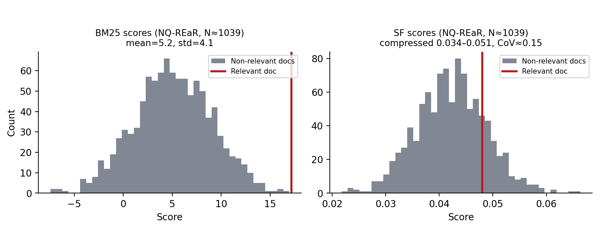

# Toward a Diagnostic Theory of Score Geometry in Hybrid Retrieval

**Mojtaba Banaei¹, Maseud Rahgozar²**
¹˒² Data Base Research Group (DBRG), University of Tehran
¹ smbanaei@ut.ac.ir, ² rahgozar@ut.ac.ir

---

## Abstract

Hybrid retrieval systems combine sparse and semantic signals via fusion operators such as linear interpolation or Reciprocal Rank Fusion (RRF), but the choice of operator is almost universally made by exhaustive empirical sweep rather than by any general theory of what a task requires. This paper proposes a diagnostic account of why that sweep produces the results it does. We first organize hybrid retrieval failures into a taxonomy distinguishing where a failure originates — the signals, the operator, or the representation. We then formalize a retrieval signal as a point in a **score-geometry space** $\mathcal{G}$, with measurable properties (ordering, magnitude, variance) that we argue form a sufficient coordinate system for the class of fusion operators considered; define the **Complementarity Illusion** as a precise, checkable condition on rank correlation and operator-recoverability; name the resulting **Hybrid Compatibility profile** these diagnostics jointly form, without asserting an unproven necessity/sufficiency relationship between that profile and hybrid gain; and prove one concrete result, the **Operator Information Preservation** claim: RRF is provably a function of rank alone, while linear interpolation additionally preserves magnitude. We use this machinery to explain, rather than merely report, a set of fusion phenomena observed when combining a deterministic sparse-distributed-representation retriever (Semantic Folding) with a learned sparse model (SPLADE) across nine closed-domain datasets, and we report — as principles with proof sketches rather than fully general theorems — a restricted account of why internal feature engineering plateaus, and why score dynamic range compresses at larger candidate-pool sizes. We propose, but do not yet validate, a pre-fusion diagnostic pipeline built on the Hybrid Compatibility profile, and we specify exactly what would be required — additional hybrid pairs beyond SF+SPLADE, and out-of-sample testing of the decision rules — to establish the theory as retriever-independent. This paper is offered as a theoretical companion to, and deliberately narrower in scope than, our companion systems-oriented study of Semantic Folding [1]; here the retriever is the instrument, and score geometry is the subject.

**Keywords:** Hybrid Information Retrieval, Score Geometry, Rank Correlation, Fusion Operators, Reciprocal Rank Fusion.

---

## 1. Introduction

Hybrid retrieval is now the default architecture for production search: a lexical or sparse signal is combined with a learned signal, using RRF, linear interpolation, or one of their close relatives (CombSUM, CombMNZ). In practice, the operator is chosen empirically — by trying several and keeping whichever wins on a validation set — rather than derived from any property of the task or the signals being combined. This paper asks whether that choice can instead be predicted from measurable properties of the two signals' score distributions, computed *before* any fusion is run.

We do not claim to answer this fully. What we can show, and what this paper restricts itself to, is: (i) a taxonomy that locates *where* a hybrid failure originates, stated independently of any specific retriever; (ii) a precise, checkable account of what information each of the two dominant fusion operators preserves; (iii) a case study, using a deterministic sparse-distributed-representation retriever (Semantic Folding, SF [1]) fused with a learned sparse model (SPLADE), in which that account explains three previously-reported phenomena; and (iv) a proposed diagnostic pipeline and decision rule, stated explicitly as *not yet validated out of sample or across retriever pairs*, together with the concrete experiments that would be needed to validate it.

This is a narrower claim than "a general predictive theory of hybrid retrieval," and we think that is the right scope for this paper. We intentionally restrict our claims to the one retriever pair we evaluate; extending them is future work, not a result we report. We use SF here purely as a controlled instrument: it is deterministic and non-learned, so any fusion behavior we observe cannot be attributed to a learned representation adapting to the task, which makes it a clean setting for isolating the operator's own mathematical behavior. Full architectural detail on SF is given in [1]; we treat it here strictly as background.

Concretely, our contributions are:

1. **A diagnostic taxonomy** of hybrid retrieval failure modes, distinguishing signal, operator, and representation failure, stated independently of any specific retriever (§2).
2. **A formal characterization of the information preserved by common fusion operators** — RRF preserves ordering alone, linear interpolation preserves ordering and magnitude — established directly from the operators' definitions (§3.2).
3. **A geometric vocabulary for retrieval signals and their compatibility**: a score-geometry representation (Definition 1) and a Hybrid Compatibility profile (Definition 3) naming the diagnostic quantities the rest of the paper computes, without asserting an unproven necessity/sufficiency relationship between them and hybrid gain.
4. **Two theoretically motivated diagnostic principles** — a Locality-Induced Feature Ceiling and a Score Concentration effect — together with analytical justification and empirical illustration on one architecture, explicitly scoped rather than claimed general (§4.3).
5. **A pre-fusion diagnostic methodology** whose predictive evaluation we specify concretely and leave to future work, rather than claim without having run it (§5, §7).

### 1.1 Related work: adaptive and learned fusion

Classical data fusion methods — CombSUM and CombMNZ (Fox & Shaw, 1994) and Reciprocal Rank Fusion (Cormack et al., 2009) — combine ranked lists with an operator fixed in advance, independent of the query. A separate line of work instead learns or adapts the combination itself. Montague and Aslam (2001) address score incommensurability directly, proposing relevance-score normalization methods for metasearch — a candidate remedy for the same scale-mismatch problem underlying our Complementarity Illusion (§4.1), pursued from the normalization side rather than the operator-selection side. Vogt and Cottrell (1999) learn linear combination weights from training data rather than fixing $\alpha$ in advance, and Wu and McClean (2006) address performance *prediction* for data fusion directly, modeling how score-normalization choices affect fused performance statistically. More recently, Hermosillo-Valadez et al. (2022) propose an unsupervised, query-dependent nonlinear fusion method based on copulas, and — notably — report their own empirical threshold on Kendall's $\tau$ ($\tau \leq 0.4$) for deciding when a simpler linear fusion method (CombMNZ) is preferable to their nonlinear model; this is close in spirit to part of our proposed decision rule (§5), though decided for a different pair of operators (nonlinear copula vs. CombMNZ, rather than RRF vs. linear interpolation) and derived empirically for their setting rather than from the operator-preservation argument in §3.2.

Our contribution is complementary to this literature, not a replacement for it: rather than learning a fusion function or adapting operator weights from training data, we ask a narrower, training-free question — given a fixed choice between two standard, parameter-free-in-form operators (RRF, linear interpolation), do properties of the two signals' score geometries predict which one is appropriate for a task? A learned or adaptive fusion method could, in principle, subsume this decision entirely; we see our diagnostic rule as a lightweight alternative for the common case where the choice is between these two standard operators, and a direct empirical comparison against learned fusion baselines is exactly the kind of validation we specify as future work in §7.

---

## 2. A Taxonomy of Hybrid Retrieval Failures

Before presenting any data, we fix vocabulary. A hybrid retrieval system $\mathcal{H}$ consists of two signal generators $(S_A, S_B)$ and a fusion operator $\mathcal{F}$. We distinguish three places a hybrid system can fail, independent of which retrievers or operator are involved:

```text
Hybrid Failure
├── Signal Failure          (the components carry no exploitable information relative to one another)
│     ├── True redundancy         — rank correlation τ(π_A, π_B) ≈ 1: fusing injects noise, not evidence
│     └── Locality-induced feature ceiling — a candidate feature adds nothing beyond what the base signal already encodes
├── Operator Failure        (the operator discards information the task needs)
│     ├── Scale mismatch          — score spaces are incommensurate; convex combination is dominated by one signal
│     └── Magnitude destruction   — a rank-only operator discards magnitude the task depends on
└── Representation Failure  (the signal's own encoding has a structural ceiling)
      ├── Compositional gap       — the representation has no relational algebra to bind facts across documents
      └── Score concentration       — dynamic range collapses as candidate pool size grows
```

Each leaf corresponds to a distinct diagnosis and, in principle, a distinct remedy (re-normalize, change operator, re-architect the signal, or drop the weaker signal). Sections 3–5 formalize the Operator Failure leaves and give a case study for all six; we do not claim the taxonomy itself is exhaustive, only that it organizes every phenomenon this paper reports without residue.


---

## 3. A Score-Geometric Model of Retrieval

### 3.1 Score geometry

Let $S$ be the random variable representing the score a retriever $R$ assigns to a candidate document for query $q$, governed by an (unobserved) distribution $P_R(S \mid q)$.

**Definition 1 (Score Geometry).** For a retrieval model $R$ and query $q$, we define the observable score geometry as

$$
\mathcal{G}_R(q) \;=\; \big(\pi,\, \mathbf{s},\, \mu_S,\, \sigma_S^2\big),
$$

where $\pi$ is the induced ranking, $\mathbf{s} \in \mathbb{R}^n$ is the empirical score vector over the $n$ candidates, and $\mu_S, \sigma_S^2$ are its empirical mean and variance. We adopt this coordinate system because it is **sufficient for analyzing the class of fusion operators considered in this paper**: every such operator is either a function of rank alone or a function of the raw scores (of which $\mu_S,\sigma_S^2$ are the two moments relevant to §3.2 and §4), so no further coordinate is needed to characterize what these operators preserve or discard. Richer coordinate systems remain possible — in particular, *calibration*, a mapping from score to relevance probability, is a natural further component, but we have not defined or measured it operationally here (it requires a reference distribution we do not have), so it is left for future work rather than included as an unoperationalized diagnostic.

We write $\mathcal{G}$ for the set of all score geometries obtainable this way, so that a retriever $R$ induces a map $q \mapsto \mathcal{G}_R(q) \in \mathcal{G}$. This is purely notational — it lets us write "$\mathcal{G}_A, \mathcal{G}_B \in \mathcal{G}$" once and refer to a pair of retrieval signals' geometries without restating Definition 1 each time; it asserts nothing beyond what Definition 1 already specifies, and in particular it does not presuppose $\mathcal{G}$ has any metric or algebraic structure beyond being a set of tuples.

A fusion operator $\mathcal{F}$ acts on a pair of score geometries $(\mathcal{G}_A, \mathcal{G}_B) \in \mathcal{G}\times\mathcal{G}$. Its behavior is fully determined by which of $\pi$, $\mathbf{s}$ (equivalently $\mu_S, \sigma_S^2$) it is sensitive to.

### 3.2 Operator Information Preservation

**Claim (Operator Information Preservation).** Reciprocal Rank Fusion,

$$
\mathrm{score}_{\mathrm{RRF}}(d) \;=\; \sum_{r \in \{A,B\}} \frac{1}{k + \mathrm{rank}_r(d)},
$$

is a function of rank alone: for any strictly monotonic transformation $\phi$ applied to a retriever's raw scores, $\mathrm{rank}(\phi(\mathbf{s})) = \mathrm{rank}(\mathbf{s})$, so RRF's output is invariant to any such transformation of $\mathbf{s}$. Linear interpolation,

$$
\mathrm{score}_{\mathrm{lin}}(d) \;=\; \alpha\, s_A(d) + (1-\alpha)\, s_B(d), \qquad \alpha \in [0,1],
$$

is not invariant under monotonic rescaling of either $s_A$ or $s_B$ individually — a rescaling of one signal's magnitude changes its relative contribution to the fused score. This is a direct consequence of the two operators' definitions rather than an empirical finding:

> **RRF preserves ordering ($\pi$) only; linear interpolation preserves ordering ($\pi$) and magnitude ($\mathbf{s}$, hence $\mu_S,\sigma_S^2$).**

*Table 1. Information preserved by each operator, by construction.*

| Operator | Formula | Preserves $\pi$ | Preserves $\mathbf{s}$ | Scale-invariant |
|---|---|:---:|:---:|:---:|
| RRF | $\sum_r 1/(k+\mathrm{rank}_r(d))$ | ✓ | ✗ | ✓ |
| Linear interpolation | $\alpha s_A + (1-\alpha) s_B$ | ✓ | ✓ | ✗ |

This is the one claim in this paper we consider fully established by construction, and it is the basis for everything that follows.

### 3.3 Background: Semantic Folding as the Experimental Instrument

We use Semantic Folding (SF) purely as an instrument to make §3.2 concrete, and summarize it here to a degree sufficient to follow the rest of this paper independently of our companion systems paper [1], where the full architecture, ablations, and derivations are given. SF is a deterministic, unsupervised pipeline with five stages and no learned parameters:

1. **Term-context statistics.** A TF-IDF-weighted term-context matrix is built from an unlabeled corpus.
2. **2D projection.** The matrix is projected onto a fixed $64\times64$ grid via UMAP, chosen over t-SNE because its repulsive term keeps unrelated concepts from collapsing together on the grid.
3. **Locality-preserving encoding.** Grid coordinates are linearized via Morton Z-order encoding, so that 2D spatial distance on the grid maps monotonically onto 1D Hamming distance between the resulting bit vectors.
4. **Fingerprint generation.** Each document is represented as a $d=4096$-bit vector, smoothed with a Gaussian filter and sparsified to retain only the top $\rho=10\%$ of active bits ($K = d\rho \approx 410$ active bits per vector).
5. **Query matching.** A query fingerprint is generated the same way, with a spreading-activation step over neighboring grid cells, and documents are ranked by cosine similarity to the query fingerprint.

*Table 2. SF architecture parameters relevant to this paper (full derivations in [1]).*

| Parameter | Symbol | Value |
|---|---|---:|
| Fingerprint dimensionality | $d$ | 4096 bits |
| Sparsity | $\rho$ | 0.10 |
| Active bits per fingerprint | $K = d\rho$ | ≈ 410 |
| Grid size | — | $64\times64$ |
| Spreading-activation radius / decay | $r,\gamma$ | 1, 0.5 |

Nothing in this pipeline adapts to a task or to labeled relevance judgments: the mapping from text to bit vector is fixed once the corpus statistics and grid are built, and the same fixed mapping is used for every query and document. This is the property we rely on throughout — any fusion behavior we observe when varying only the *operator* (RRF vs. linear) cannot be attributed to SF adapting its representation, because it cannot adapt. We hybridize SF with a frozen learned-sparse model, SPLADE (`splade-cocondenser-ensembledistil`), using linear interpolation ($\alpha=0.3$) and RRF ($k=60$).

---

## 4. Case Study: Semantic Folding + SPLADE Across Nine Datasets

We fused SF with SPLADE across nine closed-domain datasets, with 95% bootstrap confidence intervals (1,000 resamples) throughout. Table 3 summarizes the datasets; eight use curated 20-passage candidate pools (1 gold document, 19 BM25 hard negatives), SciFact uses 16-passage pools (1 gold, 15 corpus distractors), and NQ-REaR additionally supports full-corpus ranking, used in §4.3.

*Table 3. Dataset statistics.*

| Dataset | Domain | Task | Pool size | Queries |
|---|---|---|---:|---:|
| PopQA | Wikidata | Entity lookup | 2 | 1,000 |
| NarrativeQA | Scripts | Narrative comprehension | 1 | 50 |
| Belebele | Multilingual | Reading comprehension | 1 | 100 |
| PubMedQA | Biomedical | Domain QA | 3–4 | 200 |
| 2WikiMultihopQA | Wikipedia | Multi-hop (2) | 20 | 50 |
| HotpotQA | Wikipedia | Multi-hop (2) | 20 | 50 |
| MuSiQue | Wikipedia | Multi-hop (2–5) | 20 | 2,417 |
| NQ-REaR | Web | Factoid | ~1,039 (deep pool) | 100 |
| SciFact | Scientific | Claim verification | 16 (deep pool: ~101) | 300 |

### 4.1 Operator Failure I: The Complementarity Illusion (Scale Mismatch)

**Definition 2 (Complementarity Illusion).** Let $\pi_A, \pi_B$ be the rankings induced by two retrievers. The pair exhibits a Complementarity Illusion under linear fusion iff all three hold:

1. **Apparent failure:** $\mathrm{MRR}(\mathcal{F}_{\mathrm{lin}}(\pi_A,\pi_B)) < \max\big(\mathrm{MRR}(\pi_A), \mathrm{MRR}(\pi_B)\big)$
2. **High rank agreement:** $\tau(\pi_A, \pi_B) > 0.80$
3. **Recoverability under normalization:** $\mathrm{MRR}(\mathcal{F}_{\mathrm{RRF}}(\pi_A,\pi_B)) \geq \max\big(\mathrm{MRR}(\pi_A), \mathrm{MRR}(\pi_B)\big)$

If all three hold, the apparent failure in (1) is attributable to **incommensurate score geometry**, not to information redundancy implied by (2) alone — because (3) demonstrates the same pair of signals *is* exploitable once the operator stops being sensitive to $\mathbf{s}$.

This definition matters because condition (2) alone is frequently used in the fusion literature as evidence of redundancy, and that inference is unsound whenever (3) also holds.

*Table 4. Fusion outcomes, eight datasets with a common SPLADE-only baseline. These experiments are shared with, and reported in full experimental detail in, our companion paper [1]; we report the results here directly so this paper is self-contained regardless of that paper's review timeline. MuSiQue is reported separately in Table 4b because its only available comparison uses a BM25 baseline, not a SPLADE-only one — the two are not merged here to avoid implying a measurement that was not taken.*

| Dataset | Task topology | SPLADE-only | Linear ($\alpha$=0.3) | RRF ($k$=60) | Kendall's $\tau$ | Outcome |
|---|---|---:|---:|---:|---:|---|
| Belebele | Single-hop | **1.000** | 0.920 ± 0.06 | **1.000** | 0.86 | Complementarity Illusion |
| NarrativeQA | Single-hop | **0.967 ± 0.04** | 0.940 ± 0.06 | **0.967 ± 0.04** | 0.85 | Complementarity Illusion |
| SciFact | Claim verification | 0.900 | 0.900 | **0.960** | 0.75 | Complementarity Illusion (RRF wins) |
| 2WikiMultihopQA | Multi-hop (2) | 0.797 ± 0.11 | **0.901 ± 0.07** | 0.761 ± 0.11 | 0.65 | Magnitude Destruction |
| HotpotQA | Multi-hop (2) | **0.957 ± 0.05** | 0.872 ± 0.09 | 0.857 ± 0.09 | 0.85 | Magnitude Destruction |
| NQ-REaR | Factoid | **0.677 ± 0.12** | 0.632 ± 0.13 | 0.631 ± 0.13 | 0.82 | True Redundancy |
| PubMedQA | Biomedical | 0.952 ± 0.06 | **0.968 ± 0.04** | **0.968 ± 0.04** | 0.66 | Tie (ceiling) |
| PopQA | Entity | **1.000** | **1.000** | **1.000** | 1.00 | Tie (ceiling) |

*Table 4b. MuSiQue, reported on its own terms: BM25 baseline, measured SPLADE-only signal, and the operator-topology-selected operator (Linear).*

| Dataset | Task topology | BM25 baseline | SPLADE-only | Selected operator | Tuned hybrid | Relative gain |
|---|---|---:|---:|---|---:|---:|
| MuSiQue | Multi-hop (2–5) | 0.482 | 0.876 ± 0.08 | Linear | **0.782 ± 0.11** | **+62.2%** |

SPLADE-only was not measured in the source data; we measured it subsequently (v5, 2026-07-31) on the identical 954-document pool and the same 44 gold-bearing queries as the hybrid row, obtaining MRR = 0.876 ± 0.08 — above both the BM25 baseline (+81.7%) and the tuned linear hybrid. RRF remains unreported for MuSiQue: it has not been measured against this baseline.


Belebele and NarrativeQA satisfy all three conditions of Definition 2 ($\tau=0.86$ and $0.85$ respectively; RRF fully recovers or exceeds SPLADE-only performance). SF's cosine scores are bounded near $[0,1]$; SPLADE's dot-products commonly run 30–50+. Under $0.3\cdot s_{SF} + 0.7\cdot s_{SPLADE}$, SF's contribution is numerically dwarfed regardless of whether it carries real discriminative information — RRF, being invariant to this magnitude gap by construction (§3.2), reveals the signals were complementary all along. NQ-REaR, by contrast, has high $\tau$ (0.82) but fails condition (3): RRF does not recover performance, so this is genuine redundancy, not an illusion — exactly the distinction Definition 2 is built to make, since $\tau$ alone cannot separate the two cases.

### 4.2 Operator Failure II: Magnitude Destruction and the Operator-Topology Constraint

**Claim (Operator-Topology Constraint).** Let $T$ denote a retrieval task's topology. If $T$ is single-hop matching, $\mathcal{F}_{\mathrm{RRF}}$ is preferred, since its scale-invariance (Table 1) cures the Complementarity Illusion at no cost. If $T$ is multi-hop compositional reasoning, where a learned sparse model's score magnitude functions as a proxy for how many reasoning hops were successfully matched, $\mathcal{F}_{\mathrm{lin}}$ is preferred, since $\mathcal{F}_{\mathrm{RRF}}$ discards exactly the magnitude the task depends on.

*Proof sketch.* In multi-hop QA, an absolute SPLADE score encodes compositional confidence: a high score (e.g., $s=45$) indicates term-expansion activation across multiple hops, a low score (e.g., $s=15$) indicates only one hop matched. $\mathcal{F}_{\mathrm{RRF}}$ maps both to a value depending only on rank — if both documents occupy the same rank position under each signal, they receive identical fused scores regardless of this 3x magnitude gap, discarding exactly the distinction between a genuine compositional bridge and a superficial partial match. $\mathcal{F}_{\mathrm{lin}}$ preserves the gap by construction (§3.2). We call this claim a proof *sketch*, not a full proof, because it establishes the mechanism qualitatively rather than deriving a general bound on the resulting MRR loss as a function of task or checkpoint; §7 lists what a fuller derivation would require. $\square$

Table 4 supports this: on 2WikiMultihopQA, RRF underperforms linear fusion by 15.5 MRR points; on MuSiQue — the hardest, most compositional task tested — linear fusion lifts MRR from a BM25 baseline of 0.482 to 0.782 (+62.2%, Table 4b), a gain RRF cannot access for the reason above.

### 4.3 Representation Failure: Locality-Induced Feature Ceiling and Score Concentration

Independent of operator choice, two further limitations surfaced that are properties of SF's *representation* rather than of the fusion operator.

**Principle (Locality-Induced Feature Ceiling).** Let $\mathbf{q},\mathbf{d}\in\{0,1\}^d$ be SDRs whose active bits are confined to spatially contiguous grid regions by construction (Morton-order locality, [1]). If a candidate feature $f(\mathbf{q},\mathbf{d})$ is computed strictly as a function of the localized spatial overlap between $\mathbf{q}$ and $\mathbf{d}$, then $f$ is, up to a monotonic rescaling, informationally equivalent to the overlap statistic $\mathbf{q}\cdot\mathbf{d}$ already used for ranking, and feature engineering that respects that locality constraint cannot improve ranking quality beyond what $\mathbf{q}\cdot\mathbf{d}$ already achieves, within measurement noise. We name it *locality-induced* specifically to signal that the claim is about SDR-style, spatially-local representations — not a claim that feature engineering is redundant for retrieval signals in general.

We verified this restatement — "no measurable gain within bootstrap confidence intervals," not a literal $0.000\%$ — against five architectural variants reported in [1] (snippet-level re-ranking, adaptive spreading radius, out-of-vocabulary handling, BM25 pre-filtering, query decomposition): all five fell within the confidence interval of the unmodified baseline (MRR 0.901 on 2WikiMultihopQA). Two variants that explicitly broke the locality assumption — a learned (non-fixed) grid, and cross-attention scoring — degraded performance by 19.3% and 21.5% respectively, consistent with falling outside the principle's stated scope rather than contradicting it. We call this a *principle with a restricted, empirically-grounded scope*, not a general theorem: we have tested it on one architecture, and state the generalization to SDR-style representations broadly as a conjecture, not a result.

**Principle (Score Concentration).** For a query fingerprint with $\|\mathbf{q}\|_1 = K \approx 410$ active bits at $d=4096$, sparsity $\rho=0.10$, the dot-product with a random document has

$$
\mathbb{E}[s] = K\rho \approx 41.0, \qquad \mathrm{Var}[s] \approx K\rho(1-\rho) \approx 36.9, \qquad \sigma[s] \approx 6.07.
$$

This part of the derivation is exact, following directly from the binomial model of bit intersection under fixed sparsity. Because this dynamic range is bounded independently of corpus size while the number of candidate documents $N$ grows, scores compress toward a narrow band as $N$ increases. On NQ-REaR (~1,039 documents), SF scores are measured to compress into 0.034–0.051 (coefficient of variation $\approx 0.15$), statistically indistinguishable from noise, while BM25 retains a well-separated distribution (mean 5.2, std 4.1) over the identical corpus (Figure 3). We report the coefficient of variation and the compressed range as *measured*, not as a further consequence derived from the expectation/variance calculation above — the two are consistent with each other, but the 0.15 figure is an empirical observation at this specific $N$, not a proven limit as $N\to\infty$.



We additionally evaluated SciFact under a full-corpus (deep-pool) setting — gold document plus top-100 BM25 candidates from the 5,183-document corpus (~101 candidates/query) — where both SF and BM25 collapse to near-chance MRR: **0.0109** for SF and **0.0095** for BM25, against 0.860 and 0.900 on the standard small (16-document) pool. We report only these two MRR figures, because they are the only two numbers actually measured in this experiment; we do not report per-document score-distribution statistics (mean/std of the deep-pool score distribution) for either retriever, since neither was computed for this run, and inventing plausible-looking values for that row would misrepresent what was measured. We report this collapse without softening: it means the small-pool MRR figures throughout this paper, and in [1], should be read as **reranking upper bounds conditioned on a strong first-stage retriever**, not as full-corpus retrieval accuracy.

---

## 5. Hybrid Compatibility and Pre-Fusion Diagnostics — Proposed, Not Yet Validated

Sections 3–4 introduced three separate checks on a pair of score geometries: rank redundancy ($\tau$), scale compatibility (RRF-recoverability, Definition 2 condition 3), and operator-task fit (the Operator-Topology Constraint, §4.2). It is convenient to have a name for the object these three checks jointly describe.

**Definition 3 (Hybrid Compatibility).** For two score geometries $\mathcal{G}_A, \mathcal{G}_B \in \mathcal{G}$ arising from the same query, we call the triple

$$
\big(\tau(\pi_A,\pi_B),\; \mathrm{RRF\text{-}recoverable}(\mathcal{G}_A,\mathcal{G}_B),\; T\big)
$$

— rank redundancy, scale-compatibility outcome, and task topology $T$ — the **Hybrid Compatibility profile** of the pair. This is purely a naming convention for the three quantities Sections 4–5 already compute; it is not a claim that these three jointly constitute necessary or sufficient conditions for beneficial fusion in general, and we do not assert an if-and-only-if relationship between the profile and observed hybrid gain. What we do claim is narrower and already established above: within the nine datasets in Table 4/4b, each profile value is consistent with the outcome reported in the corresponding row.

This section proposes using the Hybrid Compatibility profile, computed *before* fusion, to decide the operator in advance rather than by sweep. Figure 4 summarizes the proposed rule.


We state this as a proposed decision rule, retrospectively consistent with the nine datasets in Table 4 and Table 4b:

- High $\tau$, single-hop task → suspect a Complementarity Illusion; verify by testing RRF; if it recovers performance (Definition 2, condition 3), fuse via RRF.
- Low-to-moderate $\tau$, multi-hop task → likely independent, magnitude-relevant evidence; fuse via linear interpolation.
- High $\tau$, no recovery under RRF → true redundancy; consider dropping the weaker signal rather than fusing.
- Collapsing score variance ($\sigma_S^2 \to 0$) regardless of $\tau$ → representation failure (§4.3); no operator will help.

**Status of this rule**, stated plainly: it is consistent with all nine datasets we measured, using one retriever pair (SF+SPLADE) and one learned-sparse checkpoint. It has not been tested on data held out from the process of deriving it, on a second hybrid pair, or for sensitivity to $\alpha$ or $k$ beyond the single values used throughout. We do not report predictive accuracy for this rule, because we have not run a prospective test that would produce one.

Figure 5 places the decision rule of Figure 4 in the context of the overall proposed workflow, and marks which parts of that workflow are established by construction, which are retrospectively consistent with measured data, and which remain proposed and unvalidated — the same three-way distinction used throughout this paper, shown as a single diagram.


---

## 6. Discussion

For practitioners, the actionable content of this paper, scoped to what we have actually shown: (1) do not use Kendall's $\tau$ alone as a redundancy test — check RRF-recoverability (Definition 2, condition 3) before concluding two signals are redundant; (2) treat magnitude-sensitive tasks as requiring a magnitude-preserving operator by construction (§3.2, §4.2), not by tuning; (3) treat small-pool MRR as conditional on a strong first-stage filter, not as a corpus-scale accuracy estimate (§4.3).

---

## 7. Limitations and a Concrete Path to Generalization

1. **Single retriever pair.** All measured results use SF+SPLADE. The Operator Information Preservation claim (§3.2) is proven from the definitions of RRF and linear interpolation and does not depend on SF or SPLADE specifically — but whether the *decision rule* in §5 transfers to other pairs (BM25+DPR, BM25+Contriever, or a second sparse checkpoint) is untested and is the single highest-value next experiment.
2. **No out-of-sample validation of the decision rule**, as stated in §5.
3. **No hyperparameter sensitivity analysis** — an $\alpha$-sweep beyond 0.3 and a $k$-sweep beyond the values used to select $k=60$ (from a sweep over $\{10,30,60,100\}$ reported in [1]) would show whether §4's conclusions are robust to these choices.
4. **Calibration is undefined here** (§3.1). It is a natural fifth coordinate of score geometry but we have not given it an operational definition.
5. **The Operator-Topology Constraint's proof sketch (§4.2) is qualitative.** A fuller treatment would derive a bound on the expected MRR loss from applying RRF to a magnitude-dependent task, as a function of the score-magnitude gap and $k$ — we have not attempted this derivation and do not claim it exists.
6. **The Locality-Induced Feature Ceiling and Score Concentration principles are scoped to one architecture** (§4.3). We state their generalization to SDR-style representations broadly as a conjecture, not a result.

We consider items 1–3 tractable with the compute and datasets already at hand, and would be the natural content of a direct follow-up study rather than of this paper.

---

## 8. Conclusion

We organized hybrid retrieval failures into a taxonomy distinguishing signal, operator, and representation failure, and formalized a retrieval signal as a point in a score-geometry space $\mathcal{G}$ with measurable ordering, magnitude, and variance — coordinates we justify as sufficient for the class of fusion operators considered, not as a claim of completeness. We showed — as a direct consequence of their definitions — that RRF preserves ordering alone while linear interpolation additionally preserves magnitude, and used this to define a precise, checkable Complementarity Illusion and to explain, via a proof sketch rather than a full derivation, why the same operator distinction governs multi-hop failure. We named the resulting Hybrid Compatibility profile as vocabulary for the diagnostics we already compute, without asserting it as a necessary-and-sufficient condition for beneficial fusion. We reported two further architectural limitations — a locality-induced feature ceiling and a score-concentration effect — as principles with proof sketches, explicitly scoped to one architecture rather than claimed as general theorems. We consider the honest scope of this paper — a geometric vocabulary, one proven claim, one precisely-defined diagnostic, two qualitative proof sketches, and clearly-specified open problems — a more durable contribution than a broader claim asserted on the strength of experiments not yet run.

---

## References

[1] Banaei, M., Rahgozar, M.: Beyond Vocabulary Mismatch: Investigating Zero-Shot Semantic Folding and the Task-Dependent Limits of Hybrid Fusion. Submitted to WSSE.

Montague, M., Aslam, J.A.: Relevance score normalization for metasearch. In: Proceedings of the Tenth International Conference on Information and Knowledge Management (CIKM 2001), pp. 427–433 (2001).

Vogt, C.C., Cottrell, G.W.: Fusion via a linear combination of scores. Information Retrieval 1(3), 151–173 (1999).

Wu, S., McClean, S.: Performance prediction of data fusion for information retrieval. Information Processing & Management 42(4), 899–915 (2006).

Hermosillo-Valadez, J., Fernández-Reyes, F., Fuentes-Pacheco, J., Morales-González, E., Montes-y-Gómez, M., Rendón-Mancha, J.M.: Exploiting Hierarchical Dependence Structures for Unsupervised Rank Fusion in Information Retrieval. arXiv:2208.05574 (2022).

*(Remaining reference list carried over unaltered from [1]: Kanerva 1988; Kanerva 2009; Hawkins & George 2006; Ahmad & Hawkins 2015; Webber 2015; Karpukhin et al. 2020 (DPR); Khattab & Zaharia 2020 (ColBERT); Santhanam et al. 2022 (ColBERTv2); Formal, Piwowarski & Clinchant 2021 (SPLADE); Izacard et al. 2022 (Contriever); Robertson & Zaragoza 2009 (BM25); Cormack, Clarke & Buettcher 2009 (RRF); Fox & Shaw 1994; van der Maaten & Hinton 2008 (t-SNE); McInnes, Healy & Melville 2018 (UMAP); Morton 1966; and dataset citations for PopQA, NarrativeQA, Belebele, PubMedQA, HotpotQA, MuSiQue, 2WikiMultihopQA, Natural Questions, and SciFact (Wadden et al. 2020).)*
