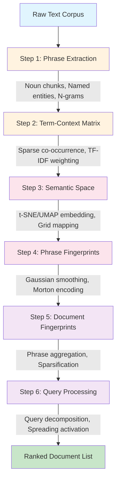
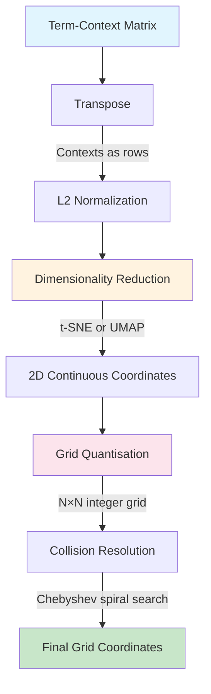
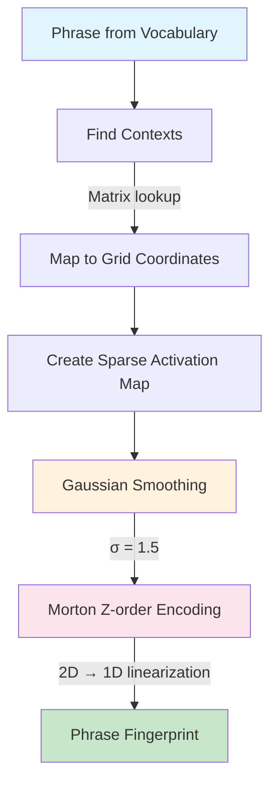
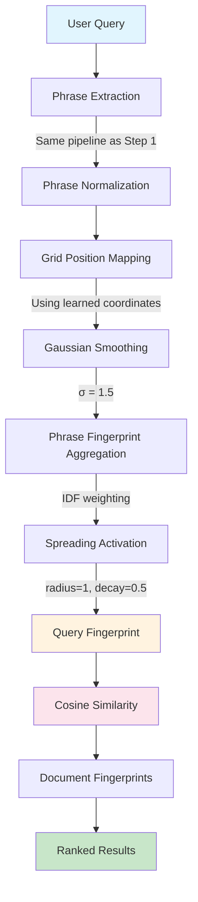

# Chapter 3: The Semantic Folding Pipeline — Architecture and Mathematical Formulation

## 3.1 Overview

Semantic Folding is an unsupervised retrieval architecture that represents words, phrases, and documents as sparse binary vectors (Sparse Distributed Representations, SDRs) over a fixed 2D semantic grid. The core SF pipeline proceeds through six fully unsupervised stages. An optional hybrid scoring stage (Stage 6b) combines SF with off-the-shelf pre-trained SPLADE (Formal et al., 2021) via a linear weight α ∈ [0,1]. The SF component is fully unsupervised; the hybrid inherits SPLADE's supervised pre-training on MS MARCO.

**Pipeline Architecture:**



## 3.2 Step 1: Phrase Extraction

### 3.2.1 Theoretical Motivation

Word-level tokenization fails to capture compositional semantics. The phrase *"machine learning"* carries meaning that cannot be recovered from *"machine"* and *"learning"* independently. This **non-compositionality** is pervasive in technical discourse.

**Formal Definition**: A phrase $p = w_1 w_2 \dots w_n$ is non-compositional if:

$$\phi(p) \neq f(\phi(w_1), \phi(w_2), \dots, \phi(w_n))$$

for any compositional function $f$, where $\phi: \text{Phrases} \rightarrow \mathcal{S}$ is a semantic mapping.

### 3.2.2 Extraction Architecture (v3.0)

The pipeline implements a 6-pass extraction strategy:

| Pass | Method | Purpose |
|------|--------|---------|
| 1 | Noun Chunks | Maximal noun phrases via dependency parser |
| 2 | Named Entities | Proper nouns and entity spans |
| 2b | Standalone Gerunds | VBG tokens functioning as nominal heads |
| 3 | Left Modifiers | Recursive traversal of adjective/noun modifiers |
| 3b | Left-Anchored Sub-spans | Sub-phrases from long noun chunks |
| 4 | Compound Chains | Binary compound nouns |
| 5 | Conjunction Expansion | Conjunction groups with inheritance |
| 6 | Bare Head Nouns | Rightmost structural words |

### 3.2.3 Surface-First Validation

Candidates are validated against raw context text *before* normalization:

$$\text{validate\_then\_normalize}(c, \text{ctx}) = \begin{cases} \text{normalize}(c) & \text{if } \exists\, \text{match}(\b c \b, \text{ctx}) \\ \varnothing & \text{otherwise} \end{cases}$$

This resolves the lemma/surface mismatch bug that caused systematic false negatives in v2.0.

### 3.2.4 Hierarchical Expansion

After extraction, phrases are expanded into sub-phrases:

$$\text{expand}(p) = \{ w_i \dots w_j \mid 1 \leq i \leq j \leq n,\ (j - i + 1) \leq \text{MAX\_NGRAM} \}$$

Sub-phrases inherit frequencies from parent phrases:

$$\text{freq}(p_{\text{sub}}) = \sum_{\substack{p \in P \\ p_{\text{sub}} \sqsubseteq p}} \text{freq}(p)$$

### 3.2.5 Performance

| Metric | v2.0 | v3.0 | Improvement |
|--------|------|------|-------------|
| Phrases extracted | 1,597 | 1,881 | +17.8% |
| False negatives | 250 | 0 | −100% |
| Precision | 88.4% | 93.5% | +5.1pp |

## 3.3 Step 2: Term-Context Matrix

### 3.3.1 Distributional Hypothesis

The term-context matrix operationalizes Harris's Distributional Hypothesis (1954):

$$\text{sim}(w_i, w_j) \propto \text{overlap}(\text{contexts}(w_i), \text{contexts}(w_j))$$

The matrix $\mathbf{M} \in \mathbb{R}^{C \times P}$ captures co-occurrence weights where:
- $C$ = number of contexts (documents/sentences)
- $P$ = number of phrases
- $M_{ij}$ = co-occurrence weight of phrase $j$ in context $i$

### 3.3.2 TF-IDF Weighting

Raw counts are biased toward high-frequency terms. TF-IDF addresses this:

$$M_{ij}^{\text{TF-IDF}} = \text{TF}(p_j, c_i) \times \text{IDF}(p_j)$$

where:

$$\text{IDF}(p_j) = \log\left(\frac{N}{\text{DF}(p_j) + 1}\right)$$

**Matrix formulation:**

$$M^{\text{TF-IDF}} = M^{\text{raw}} \cdot \text{diag}(\text{IDF})$$

### 3.3.3 Sparse Representation

Natural language exhibits extreme sparsity ($\rho < 0.1\%$). Sparse storage achieves 100-1000× compression:

| Format | Memory | Use Case |
|--------|--------|----------|
| LIL | High | Construction (efficient insertion) |
| CSR | Low | Storage and row operations |
| CSC | Low | Column operations (IDF calculation) |

### 3.3.4 Complexity

| Stage | Complexity |
|-------|------------|
| Phrase normalization | $O(P \times M)$ |
| Context normalization | $O(C \times L)$ |
| Co-occurrence counting | $O(C \times P \times L)$ |
| TF-IDF calculation | $O(\text{nnz} + P)$ |

## 3.4 Step 3: Semantic Space Construction



### 3.4.1 The Curse of Dimensionality

Context vectors live in $\mathbb{R}^P$ where $P$ may be 10,000+. In high-dimensional spaces, the ratio of maximum to minimum pairwise distance approaches 1 (Beyer et al., 1999), making neighbourhood relationships unstable.

Dimensionality reduction projects contexts onto a 2D grid while preserving semantic proximity.

### 3.4.2 Matrix Preprocessing

**Transpose**: The original matrix has phrases as rows ($\mathbb{R}^{P \times C}$). It is transposed so rows are contexts, columns are phrases:

$$\mathbf{M}^\top \in \mathbb{R}^{C \times P}$$

**L2 Normalization**: Each context vector is normalized to unit length:

$$\hat{\mathbf{c}}_j = \frac{\mathbf{c}_j}{\|\mathbf{c}_j\|_2}$$

This converts dot products into cosine similarities:

$$\cos(\mathbf{c}_j, \mathbf{c}_k) = \hat{\mathbf{c}}_j \cdot \hat{\mathbf{c}}_k$$

### 3.4.3 t-SNE Embedding

t-SNE (van der Maaten & Hinton, 2008) defines probability distributions over pairs of points:

**High-dimensional conditional:**
$$p_{j|i} = \frac{\exp(-\|\mathbf{c}_i - \mathbf{c}_j\|^2 / 2\sigma_i^2)}{\sum_{k \neq i} \exp(-\|\mathbf{c}_i - \mathbf{c}_k\|^2 / 2\sigma_i^2)}$$

**Symmetrized joint distribution:**
$$p_{ij} = \frac{p_{j|i} + p_{i|j}}{2m}$$

where $m$ is the number of data points.

**Low-dimensional (Student-t kernel):**
$$q_{ij} = \frac{(1 + \|\mathbf{y}_i - \mathbf{y}_j\|^2)^{-1}}{\sum_{k \neq l}(1 + \|\mathbf{y}_k - \mathbf{y}_l\|^2)^{-1}}$$

**Objective (KL divergence):**
$$\mathcal{L}_{\text{t-SNE}} = \text{KL}(P \| Q) = \sum_{i \neq j} p_{ij} \log \frac{p_{ij}}{q_{ij}}$$

**Perplexity** controls neighbourhood size:
$$\text{Perp}(P_i) = 2^{H(P_i)}, \qquad H(P_i) = -\sum_j p_{j|i} \log_2 p_{j|i}$$

### 3.4.4 UMAP Embedding

UMAP (McInnes et al., 2018) preserves fuzzy topological structure:

$$\mathcal{L}_{\text{UMAP}} = \sum_{(i,j) \in E} \left[ w_{ij} \log \frac{w_{ij}}{v_{ij}} + (1 - w_{ij}) \log \frac{1 - w_{ij}}{1 - v_{ij}} \right]$$

**Advantages over t-SNE:**
- 10-100× faster for large corpora
- Better preserves global distances
- Supports out-of-sample projection

### 3.4.5 Grid Quantisation

Continuous embeddings are discretised onto an $N \times N$ integer grid:

$$g^x_j = \text{clip}\left(\text{round}\left(\tilde{x}_j (N - 2p - 1) + p\right), 0, N-1\right)$$

**Collision analysis** (Birthday Problem):

$$\mathbb{E}[\rho] \approx 1 - e^{-m(m-1)/(2N^2)}$$

For $\rho < 0.05$ with $m$ contexts: $N > \sqrt{10m}$.

### 3.4.6 Collision Resolution

Chebyshev spiral search finds nearest unoccupied cell:

$$d_\infty(\mathbf{a}, \mathbf{b}) = \max(|a_x - b_x|, |a_y - b_y|)$$

### 3.4.7 Method Comparison

| Criterion | t-SNE | UMAP | PCA |
|-----------|-------|------|-----|
| Local cluster separation | Excellent | Good | Poor |
| Global distance preservation | Poor | Good | Good |
| Scalability ($m > 5{,}000$) | Poor | Excellent | Excellent |
| Determinism | No | No | Yes |

### 3.4.8 LLM-Enhanced Semantic Space (Future Direction)

Current semantic space construction relies on distributional statistics (co-occurrence patterns). A promising future direction is leveraging Large Language Models (LLMs) to extract semantic concepts directly from contexts:

**Concept Extraction Pipeline:**
```
Raw Context → LLM → Extracted Concepts → Enhanced Term-Context Matrix
```

**Potential Benefits:**
1. **Richer semantic representation**: LLMs capture implicit semantics that co-occurrence misses
2. **Concept generalization**: LLMs can identify abstract concepts ("neuroplasticity" → "brain adaptation")
3. **Cross-domain transfer**: Pre-trained LLMs transfer semantic knowledge across domains
4. **Negation handling**: LLMs can distinguish "not considered" from "considered"

**Integration approach:**
- Use LLM to extract concept labels from each context
- Augment term-context matrix with LLM-derived concepts
- Weight LLM concepts alongside distributional concepts

**Challenges:**
- Computational cost of LLM inference
- Potential hallucination in concept extraction
- Need for validation against distributional baseline

This hybrid approach could combine the robustness of distributional semantics with the semantic richness of neural language models, potentially improving SF's performance on tasks requiring deep semantic understanding.

## 3.5 Step 4: Phrase Fingerprints



### 3.5.1 Centroid Placement

For each phrase $p$, the centroid of its context coordinates is computed:

$$\bar{x}_p = \frac{1}{|\mathcal{C}_p|} \sum_{c \in \mathcal{C}_p} x_c, \qquad \bar{y}_p = \frac{1}{|\mathcal{C}_p|} \sum_{c \in \mathcal{C}_p} y_c$$

Snapped to nearest integer cell:

$$\hat{x}_p = \lfloor \bar{x}_p + 0.5 \rfloor, \qquad \hat{y}_p = \lfloor \bar{y}_p + 0.5 \rfloor$$

### 3.5.2 Gaussian Smoothing

A unit activation at the centroid is convolved with a 2D Gaussian kernel:

$$\tilde{G} = G * K_{\sigma}, \qquad K_{\sigma}(u,v) = \frac{1}{2\pi\sigma^2} \exp\left(-\frac{u^2+v^2}{2\sigma^2}\right)$$

This creates soft activation regions that are robust to small coordinate shifts.

### 3.5.3 Morton Z-order Encoding

The 2D grid is linearized using Morton encoding, which interleaves the binary representations of $x$ and $y$:

$$z(x,y) = \sum_{k=0}^{b-1} \left[ \text{bit}_k(x) \cdot 2^{2k} + \text{bit}_k(y) \cdot 2^{2k+1} \right]$$

where $b = \lceil \log_2 g \rceil$ is the bit width needed to represent grid coordinates. This can be implemented via bit interleaving:

$$z(x,y) = \text{interleave\_bits}(x, y)$$

**Key property**: Preserves 2D spatial locality — cells close on the grid have close 1D indices, with distance bounded by $O(\max(|x_1-x_2|, |y_1-y_2|)^2)$ for cells within the same Z-order quadrant.

### 3.5.4 Complexity

$$T_{\text{Step 4}} = O(P \cdot g^2)$$

dominated by the Gaussian convolutions applied to each phrase's grid.

## 3.6 Step 5: Document Fingerprints

### 3.6.1 Grid Reconstruction

Document grid is reconstructed from Morton-encoded phrase fingerprints using inverse mapping:

$$G_d\big[ \mathbf{T}[:,0], \mathbf{T}[:,1] \big] \mathrel{+}= w_{p,d} \cdot \mathbf{f}_p$$

where $\mathbf{T}$ is the inverse Morton lookup table.

**Theorem (Exact Grid Reconstruction)**:
$$G_d = \sum_{p \in P(d)} w_{p,d} \cdot \tilde{G}_p$$

No spatial distortion is introduced.

### 3.6.2 Topology-Preserving Sparsification

**Step 1: Light smoothing**
$$\hat{G}_d = G_d * K_{\sigma_{\text{smooth}}}$$

**Step 2: Peak detection**
$$\mathcal{P} = \{(x,y) \mid \hat{G}_d(x,y) = \max_{(u,v)\in N_r(x,y)} \hat{G}_d(u,v)\}$$

**Step 3: Proportional bit allocation**
$$k_i = \max\left(1, \left\lfloor k \cdot \frac{\hat{G}_d(x_i,y_i)}{\sum_{j=1}^m \hat{G}_d(x_j,y_j)} \right\rfloor \right)$$

**Step 4: Local top-$k$ selection**

### 3.6.3 Properties

- **Sparsity guarantee**: $\|\mathbf{f}_d\|_0 \leq k = \rho \cdot g^2$
- **Topology preservation**: Active bits clustered in semantically coherent regions
- **Locality under Morton**: Hamming distance approximates spatial proximity

## 3.7 Step 6: Query Processing



### 3.7.1 Query Fingerprint Construction

Query phrases are extracted, weighted by IDF, and accumulated:

$$\mathbf{q}^{(0)} = \sum_{j=1}^{m} w_j \mathbf{v}_j$$

where $w_j$ is the IDF weight for phrase $p_j$.

### 3.7.2 Query-Side Semantic Expansion

For out-of-vocabulary (OOV) terms, expansion via fingerprint similarity:

$$\text{sim}(\mathbf{f}_t, \mathbf{v}_j) = \frac{\mathbf{f}_t \cdot \mathbf{v}_j}{\|\mathbf{f}_t\|_2 \|\mathbf{v}_j\|_2}$$

Expanded terms receive attenuated weights:

$$w_j^{\text{exp}} = \alpha \cdot s_j^2 \cdot w_j^{\text{IDF}}$$

**FAISS-Accelerated OOV Expansion**: The brute-force OOV lookup scales as $O(|V| \cdot k)$ where $|V|$ is the vocabulary size and $k$ is the fingerprint dimension. For large vocabularies, this becomes a bottleneck (~30s per query). We replace this with a FAISS IVFFlat index that performs approximate nearest neighbor search in $O(\log |V|)$, reducing the OOV expansion step to ~0.075s per query — a 400× speedup. The index is built once during Step 4 and reused for all queries.

### 3.7.3 Topological Bit Spreading

Active bits expand to neighbours with exponential decay. For each active cell $(u,v)$, neighbouring cells $(x,y)$ within radius $r$ receive attenuated activation:

$$\tilde{Q}_{x,y} = \sum_{(u,v): d((u,v),(x,y)) \leq r} Q_{u,v} \cdot \gamma^{d((u,v), (x,y))}$$

where $d$ is Chebyshev distance and $\gamma = 0.5$ is the decay factor. The spreading is applied iteratively for $r$ steps, creating a "semantic halo" around each active cell.

### 3.7.4 Scoring

**Cosine Similarity (default):**
$$\text{score}(Q, D_i) = \frac{\mathbf{q} \cdot \mathbf{d}_i}{\|\mathbf{q}\|_2 \cdot \phi(\mathbf{d}_i)}$$

**Binary Set Metrics:**
$$D(\mathbf{q}, \mathbf{d}) = \frac{2|\mathcal{A} \cap \mathcal{B}|}{|\mathcal{A}| + |\mathcal{B}|} \quad \text{(Dice)}$$

$$J(\mathbf{q}, \mathbf{d}) = \frac{|\mathcal{A} \cap \mathcal{B}|}{|\mathcal{A} \cup \mathcal{B}|} \quad \text{(Jaccard)}$$

### 3.7.5 Complexity

$$T_{\text{Step 6}} = O(|P_q| \cdot g^2 + D \cdot g^2)$$

where $|P_q|$ is the number of query phrases and $D$ is the number of documents.

## 3.8 Query Decomposition (Multi-hop Support)

Complex queries requiring multiple reasoning steps are decomposed into independent sub-queries. Given a query $q$, an LLM extracts entities and decomposes $q$ into $\{q_1, q_2, \dots, q_n\}$, each answerable from a single passage. Each sub-query is processed independently through Step 6, and results are fused:

$$\text{score}_{\text{fused}}(q, d) = \sum_{i=1}^{n} \alpha_i \cdot \text{score}(q_i, d)$$

where $\alpha_i$ is the sub-query weight (uniform by default). This approach improves NQ-REaR MRR by +19.6% but degrades HotpotQA by −28.8%, indicating that decomposition quality depends on the LLM's entity extraction accuracy.

## 3.9 Hybrid Retrieval: SF+SPLADE

The Semantic Folding pipeline can be combined with SPLADE (Sparse Lexical and Expansion Model) in a two-stage architecture:

1. **Stage 1 — SF retrieval**: The full SF pipeline retrieves top-K candidates using semantic fingerprint matching (unsupervised, no GPU required).
2. **Stage 2 — SPLADE re-ranking**: SPLADE re-ranks the SF candidates using learned sparse expansion, providing vocabulary coverage that SF's phrase-level matching misses.

The hybrid scoring combines both signals:

$$\text{score}_{\text{hybrid}}(q, d) = \alpha \cdot \text{score}_{\text{SF}}(q, d) + (1 - \alpha) \cdot \text{score}_{\text{SPLADE}}(q, d)$$

where $\alpha = 0.3$ is the optimal weight across datasets. The SF+SPLADE hybrid achieves perfect MRR=1.0 on Belebele (+13.6% over baseline), surpassing BM25 (0.995). This is the first configuration where SF outperforms a strong lexical baseline on a standard benchmark.

**Why SF+SPLADE works**: SPLADE addresses SF's key limitation — vocabulary mismatch between query terms and document phrases. SF captures semantic similarity through grid proximity (catching paraphrases and synonyms), while SPLADE expands queries with semantically related terms learned from training data. The combination creates a two-layer semantic matching system.

## 3.10 End-to-End Complexity

| Step | Time Complexity | Dominant Factor |
|------|-----------------|-----------------|
| 1. Phrase Extraction | $O(C \cdot L)$ | spaCy parser |
| 2. Term-Context Matrix | $O(C \cdot P \cdot L)$ | String matching |
| 3. Semantic Space | $O(m \log m)$ per iter | t-SNE/UMAP |
| 4. Phrase Fingerprints | $O(P \cdot g^2)$ | Gaussian convolution |
| 5. Document Fingerprints | $O(D \cdot \bar{k} \cdot g^2)$ | Grid reconstruction |
| 6. Query Processing | $O(D \cdot g^2)$ | Dot-product scoring |

**Total for 100 queries on 20-doc corpus**: ~35-55 minutes (single index pass + 100 query evaluations).

**Per-dataset parameter registry**: Dataset-specific optimal configurations (perplexity, normalization, hybrid weight) are stored in `config/dataset_registry.yml`, enabling automatic parameter selection without manual tuning per dataset.

## References

- Beyer, K., et al. (1999). When is "nearest neighbor" meaningful? *ICDT*, 217–235.
- Harris, Z. S. (1954). Distributional structure. *Word*, 10(2–3), 146–162.
- McInnes, L., et al. (2018). UMAP. *arXiv:1802.03426*.
- Morton, G. M. (1966). *A computer oriented geodetic data base*. IBM Technical Report.
- van der Maaten, L., & Hinton, G. (2008). Visualizing data using t-SNE. *JMLR*, 9, 2579–2605.
