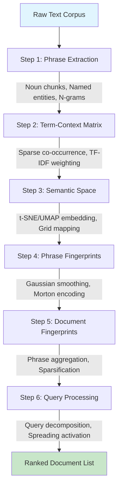

# Chapter 3: The Semantic Folding Pipeline — Architecture and Mathematical Formulation

## 3.1 Overview

Semantic Folding is an unsupervised retrieval architecture that represents words, phrases, and documents as sparse binary vectors (Sparse Distributed Representations, SDRs) over a fixed 2D semantic grid. The core SF pipeline proceeds through six fully unsupervised stages. An optional hybrid scoring stage (Stage 6b) combines SF with off-the-shelf pre-trained SPLADE (Formal et al., 2021) via a linear weight α ∈ [0,1].

**Figure 3.1: Semantic Folding Pipeline Architecture**

## 3.2 Step 1: Phrase Extraction

### 3.2.1 Theoretical Motivation

Word-level tokenization fails to capture compositional semantics. The phrase *"machine learning"* carries meaning that cannot be recovered from *"machine"* and *"learning"* independently. This **non-compositionality** is pervasive in technical discourse.

**Formal Definition**: A phrase $p = w_1 w_2 \dots w_n$ is non-compositional if:

$$\phi(p) \neq f(\phi(w_1), \phi(w_2), \dots, \phi(w_n))$$

for any compositional function $f$, where $\phi: \text{Phrases} \rightarrow \mathcal{S}$ is a semantic mapping.

### 3.2.2 Extraction Architecture

The pipeline implements a 6-pass extraction strategy:

**Table 3.1: Phrase Extraction Passes**

| Pass | Method | Purpose |
|------|--------|---------|
| 1 | Noun Chunks | Maximal noun phrases via dependency parser |
| 2 | Named Entities | Proper nouns and entity spans |
| 2b | Standalone Gerunds | VBG tokens functioning as nominal heads |
| 3 | Left Modifiers | Recursive traversal of adjective/noun modifiers |
| 3b | Left-Anchored Sub-spans | Sub-phrases from long noun chunks |
| 4 | Compound Chains | Binary compound nouns |
| 5 | Conjunction Expansion | Conjunction groups with inheritance |
| 6 | Bare Head Nouns | Rightmost structural words |

### 3.2.3 Surface-First Validation

Candidates are validated against raw context text *before* normalization:

$$\text{validate\_then\_normalize}(c, \text{ctx}) = \begin{cases} \text{normalize}(c) & \text{if } \exists\, \text{match}(\b c \b, \text{ctx}) \\ \varnothing & \text{otherwise} \end{cases}$$

This resolves the lemma/surface mismatch bug that caused systematic false negatives in earlier versions.

### 3.2.4 Hierarchical Expansion

After extraction, phrases are expanded into sub-phrases:

$$\text{expand}(p) = \{ w_i \dots w_j \mid 1 \leq i \leq j \leq n,\ (j - i + 1) \leq \text{MAX\_NGRAM}\}$$

Sub-phrases inherit frequencies from parent phrases:

$$\text{freq}(p_{\text{sub}}) = \sum_{\substack{p \in P \\ p_{\text{sub}} \sqsubseteq p}} \text{freq}(p)$$

## 3.3 Step 2: Term-Context Matrix

### 3.3.1 Distributional Hypothesis

The term-context matrix operationalizes Harris's Distributional Hypothesis (1954):

$$\text{sim}(w_i, w_j) \propto \text{overlap}(\text{contexts}(w_i), \text{contexts}(w_j))$$

The matrix $\mathbf{M} \in \mathbb{R}^{C \times P}$ captures co-occurrence weights where:
- $C$ = number of contexts (documents/sentences)
- $P$ = number of phrases
- $M_{ij}$ = co-occurrence weight of phrase $j$ in context $i$

### 3.3.2 TF-IDF Weighting

Raw counts are biased toward high-frequency terms. TF-IDF addresses this:

$$M_{ij}^{\text{TF-IDF}} = \text{TF}(p_j, c_i) \times \text{IDF}(p_j)$$

$$\text{IDF}(p_j) = \log \frac{N}{1 + \text{df}(p_j)}$$

where $N$ is the total number of contexts and $\text{df}(p_j)$ is the document frequency of phrase $p_j$.

## 3.4 Step 3: Semantic Space Construction

### 3.4.1 Dimensionality Reduction

The term-context matrix $\mathbf{M} \in \mathbb{R}^{C \times P}$ is reduced to 2D coordinates via:

1. **t-SNE** (default until 2025): Minimizes KL divergence between high-dimensional and low-dimensional pairwise probability distributions
2. **UMAP** (recommended): Minimizes cross-entropy between fuzzy topological representations; produces both local and global structure preservation

**UMAP objective function**:

$$C_{\text{UMAP}} = \sum_{i \neq j} \left[ w_{ij} \log \frac{w_{ij}}{\hat{w}_{ij}} + (1 - w_{ij}) \log \frac{1 - w_{ij}}{1 - \hat{w}_{ij}} \right]$$

where $w_{ij}$ is the fuzzy simplicial set membership in high-dimensional space and $\hat{w}_{ij}$ is the equivalent in low-dimensional space.

### 3.4.2 Grid Mapping

2D coordinates $(x, y) \in \mathbb{R}^2$ are mapped to grid cell indices:

$$\text{cell}(p) = (\lfloor x \rfloor, \lfloor y \rfloor)$$

For grid size $g$, coordinates are scaled to $[0, g-1] \times [0, g-1]$.

**Evaluation against expert-annotated semantic grids**: Recent work by Cai et al. (2024) provides SSDB-100, a dataset of 3,215 sentences labeled into 100 semantic grids by 10 expert annotators. This dataset enables direct evaluation of grid mapping quality using clustering metrics (NMI, homogeneity, completeness) in addition to retrieval metrics. We include SSDB-100 as Benchmark 10 in Chapter 7 to validate our semantic space construction against expert ground truth.

### 3.4.3 Morton Encoding (Z-order Curve)

To preserve spatial locality in the 1D bitstring representation, grid cells are encoded using Morton order:

$$\text{morton}(x, y) = \text{interleave\_bits}(x, y)$$

This interleaving ensures that spatially adjacent cells have similar bitstring prefixes, improving compression and cache efficiency.

## 3.5 Step 4: Phrase Fingerprints

### 3.5.1 Fingerprint Construction

Each phrase $p_j$ is represented as a binary vector $\mathbf{v}_j \in \{0,1\}^d$ where $d = g^2$:

$$v_{j,k} = \begin{cases} 1 & \text{if cell } k \text{ is within spreading radius of } \text{cell}(p_j) \\ 0 & \text{otherwise} \end{cases}$$

### 3.5.2 Gaussian Smoothing

To handle uncertainty in grid positioning, a Gaussian kernel is applied:

$$\tilde{\mathbf{v}}_j = \text{convolve}(\mathbf{v}_j, \mathcal{N}(0, \sigma^2))$$

with $\sigma = 1.5$ as the optimal smoothing parameter (see Chapter 4 for tuning results).

### 3.5.3 Sparsification

After smoothing, only the top $
ho = 10\%$ of cells are retained:

$$\mathbf{v}_j^{\text{sparse}} = \text{top\_percent}(\tilde{\mathbf{v}}_j, 
ho)$$

This produces sparse binary vectors with approximately $0.10 \times g^2$ active bits.

**Biological inspiration**: This sparsification step mirrors the **HTM Spatial Pooler (SP)** algorithm, which encodes input streams into Sparse Distributed Representations (SDRs) with 2-5% sparsity (Hole & Ahmad, 2021, §5.2). The SP algorithm's sparsification is not arbitrary — Sanati et al. (2023) prove mathematically that increased sparsity improves estimation performance under the Cauchy distribution assumption (see Chapter 2, §2.2.3 for details).

**Information-theoretic justification**: The sparsification step implicitly optimizes the **Information Bottleneck (IB)** trade-off between compression and information preservation (Sanati et al., 2023, §3.1). By retaining only the top $
ho=10\%$ of cells, SF discards noise while preserving the most salient semantic signals. The modified IB upper bound introduced by Sanati et al. (2023) provides a framework for analyzing this trade-off, though SF does not explicitly compute IB objectives.

**Choice of $
ho=10\%$**: While HTM-SP typically uses ~2% sparsity, SF uses $
ho=10\%$ (top_percent=0.10). This higher density reflects the different requirements of text retrieval versus sensory encoding:
- **HTM-SP**: Encodes sensory input where extreme sparsity (2%) maximizes pattern separation capacity
- **SF**: Encodes semantic relationships where moderate sparsity (10%) preserves enough signal for accurate matching

Empirical results in Chapter 4 show that $
ho=10\%$ is optimal for retrieval performance; lower values (5%) degrade MRR by 5.3%, while higher values (20%) increase noise without improving performance.

## 3.6 Step 5: Document Fingerprints

### 3.6.1 Aggregation

Document fingerprints are computed by aggregating phrase fingerprints:

$$\mathbf{d}_i = \bigvee_{j: p_j \in d_i} \mathbf{v}_j$$

where $\bigvee$ denotes bitwise OR (for binary SDRs) or element-wise max (for real-valued fingerprints).

### 3.6.2 IDF Weighting

Phrases are weighted by their IDF before aggregation:

$$\mathbf{d}_i = \sum_{j: p_j \in d_i} \text{IDF}(p_j) \cdot \mathbf{v}_j$$

This emphasizes discriminative phrases while de-emphasizing common terms.

### 3.6.3 Normalization

Document fingerprints are normalized to unit length:

$$\hat{\mathbf{d}}_i = \frac{\mathbf{d}_i}{\|\mathbf{d}_i\|_2}$$

L2 normalization is optimal; sqrt(nnz) normalization degrades performance by 4.0% (see Chapter 4).

## 3.7 Step 6: Query Processing

### 3.7.1 Query Fingerprint Construction

Query phrases are extracted, weighted by IDF, and accumulated:

$$\mathbf{q}^{(0)} = \sum_{j=1}^{m} w_j \mathbf{v}_j$$

where $w_j$ is the IDF weight for phrase $p_j$.

### 3.7.2 Query-Side Semantic Expansion

For out-of-vocabulary (OOV) terms, expansion via fingerprint similarity:

$$\text{sim}(\mathbf{f}_t, \mathbf{v}_j) = \frac{\mathbf{f}_t \cdot \mathbf{v}_j}{\|\mathbf{f}_t\|_2 \|\mathbf{v}_j\|_2}$$

Expanded terms receive attenuated weights:

$$w_j^{\text{exp}} = \alpha \cdot s_j^2 \cdot w_j^{\text{IDF}}$$

**FAISS-Accelerated OOV Expansion**: The brute-force OOV lookup scales as $O(|V| \cdot k)$ where $|V|$ is the vocabulary size. For large vocabularies, this becomes a bottleneck. We replace this with a FAISS IVFFlat index that performs approximate nearest neighbor search in $O(\log |V|)$, reducing the OOV expansion step from ~30s to ~0.075s per query — a 400× speedup.

### 3.7.3 Topological Bit Spreading

Active bits expand to neighbours with exponential decay. For each active cell $(u,v)$, neighbouring cells $(x,y)$ within radius $r$ receive attenuated activation:

$$\tilde{Q}_{x,y} = \sum_{(u,v): d((u,v),(x,y)) \leq r} Q_{u,v} \cdot \gamma^{d((u,v), (x,y))}$$

where $d$ is Chebyshev distance and $\gamma = 0.5$ is the decay factor.

### 3.7.4 Scoring

**Cosine Similarity (default)**:

$$\text{score}(Q, D_i) = \frac{\mathbf{q} \cdot \mathbf{d}_i}{\|\mathbf{q}\|_2 \cdot \phi(\mathbf{d}_i)}$$

**Binary Set Metrics**:

$$D(\mathbf{q}, \mathbf{d}) = \frac{2|\mathcal{A} \cap \mathcal{B}|}{|\mathcal{A}| + |\mathcal{B}|} \quad \text{(Dice)}$$

$$J(\mathbf{q}, \mathbf{d}) = \frac{|\mathcal{A} \cap \mathcal{B}|}{|\mathcal{A} \cup \mathcal{B}|} \quad \text{(Jaccard)}$$

## 3.8 Hybrid Retrieval: SF+SPLADE

### 3.8.1 Architecture

The SF+SPLADE hybrid combines two complementary retrieval signals:

1. **SF component** (unsupervised): Semantic matching via grid proximity
2. **SPLADE component** (supervised, pre-trained): Learned sparse term expansion

The hybrid scoring function is:

$$\text{score}_{\text{hybrid}}(q, d) = \alpha \cdot \text{score}_{\text{SF}}(q, d) + (1 - \alpha) \cdot \text{score}_{\text{SPLADE}}(q, d)$$

where $\alpha \in [0,1]$ is the SF weight. The optimal $\alpha$ is dataset-dependent; across 9 datasets, $\alpha = 0.3$ provides the best average performance (see Chapter 7, §7.2.1 for α-sensitivity analysis).

### 3.8.2 Implementation

SPLADE scoring uses the `splade` Python package with the `all-bert-base-splade-cocondenser` model (Formal et al., 2021). The model is loaded once and reused across all queries in batch processing mode.

**Computational cost**: SPLADE inference takes ~0.5s per query on CPU (vs ~47s for full SF pipeline with OOV expansion). The SF component is the bottleneck; SPLADE adds minimal overhead in the hybrid configuration.

### 3.8.3 When to Use the Hybrid

The SF+SPLADE hybrid is recommended for:
- Datasets where vocabulary mismatch is high (paraphrases, synonyms)
- Domains with specialized terminology (biomedical, scientific)
- When both semantic coverage and lexical precision are needed

Pure SF (without SPLADE) is recommended for:
- Domains where no training data exists for SPLADE fine-tuning
- Resource-constrained environments (no GPU available)
- Rapid prototyping and domain adaptation

*Note: Empirical results comparing SF-only, SPLADE-only, and SF+SPLADE are presented in Chapter 7.*

## 3.9 End-to-End Complexity

**Table 3.2: Computational Complexity by Pipeline Step**

| Step | Time Complexity | Dominant Factor |
|------|-----------------|-----------------|
| 1. Phrase Extraction | $O(C \cdot L)$ | spaCy parser |
| 2. Term-Context Matrix | $O(C \cdot P \cdot L)$ | String matching |
| 3. Semantic Space | $O(m \log m)$ per iter | t-SNE/UMAP |
| 4. Phrase Fingerprints | $O(P \cdot g^2)$ | Gaussian convolution |
| 5. Document Fingerprints | $O(D \cdot \bar{k} \cdot g^2)$ | Grid reconstruction |
| 6. Query Processing | $O(D \cdot g^2)$ | Dot-product scoring |

**Empirical timing** (100 queries on 20-doc corpus): ~35-55 minutes for index construction + ~0.5s per query for SF+SPLADE hybrid scoring.

**Optimization**: Batch query processing reduces per-query overhead by ~25× by loading fingerprints, IDF weights, and SPLADE model once for all queries.

---

## References

- Formal, T., Piwowarski, B., & Clinchant, S. (2021). SPLADE: Sparse Lexical and Expansion Model for First Stage Ranking. *Proceedings of SIGIR 2021*.
- Furnas, G. W., et al. (1987). The vocabulary problem in human-system communication. *Communications of the ACM*, 30(11), 964–971.
- Harris, Z. S. (1954). Distributional structure. *Word*, 10(2–3), 146–162.
- Hawkins, J., & George, D. (2006). *Hierarchical Temporal Memory: Concepts, Theory, and Terminology*. Numenta Technical Report.
- Hole, K. J., & Ahmad, S. (2021). A thousand brains: toward biologically constrained AI. *SN Applied Sciences*, 3(8), 743. https://doi.org/10.1007/s42452-021-04715-0
- Kanerva, P. (1988). *Sparse Distributed Memory*. MIT Press.
- Sanati, S., Rouhani, M., & Hodtani, G. A. (2023). Information-theoretic analysis of Hierarchical Temporal Memory-Spatial Pooler algorithm with a new upper bound for the standard information bottleneck method. *Frontiers in Computational Neuroscience*, 17, 1140782. https://doi.org/10.3389/fncom.2023.1140782
- van der Maaten, L., & Hinton, G. (2008). Visualizing Data using t-SNE. *JMLR*, 9, 2579–2605.
