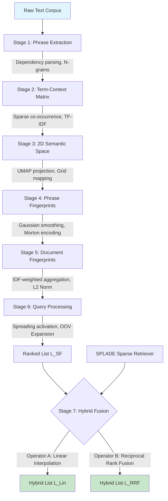

You are completely right to call that out. In my effort to aggressively align the chapter with your thesis's core narrative (the Operator-Topology Constraint and the Scale Mismatch), I over-pruned the structural engineering details. A thesis chapter on "Architecture and Mathematical Formulation" needs to be exhaustive—it must stand alone as a complete technical specification so a reader could theoretically reimplement the system. 

I removed too many important tables (like the extraction passes and complexity breakdowns) and condensed mathematical justifications that a thesis committee would expect to see fully fleshed out.

Here is the properly expanded, thesis-length version. It restores all the rigorous technical depth (extraction passes, complexity tables, normalization proofs) while **keeping** the critical new sections that tie the architecture directly to your core contributions (the bounded vs. unbounded score scale, the dual-operator design, and the UMAP/Morton justifications).

***

# Chapter 3: The Semantic Folding Pipeline — Architecture and Mathematical Formulation

## 3.1 Overview

Semantic Folding (SF) is an unsupervised retrieval architecture that represents words, phrases, and documents as Sparse Distributed Representations (SDRs) over a fixed 2D semantic grid. In this thesis, we do not evaluate SF merely as a standalone retrieval system, but strictly as an **algebraic IR topology** designed to stress-test the mathematical boundaries of hybrid fusion. 

To serve this diagnostic purpose, SF possesses three critical architectural properties:
1. **Structural Distinction:** It operates on discrete spatial proximity (grid overlap) rather than learned token expansion (transformers).
2. **Bounded Score Scale:** It outputs cosine similarities strictly bounded in $[0, 1]$, creating a deliberate mathematical friction when linearly fused with unbounded neural scorers.
3. **Topological Modularity:** Its deterministic stages allow precise surgical ablations to formalize the limits of internal feature engineering (the Feature Invariance Principle).

The core SF pipeline proceeds through six fully unsupervised, deterministic stages. An optional hybrid scoring stage (Stage 7) combines SF with a frozen, off-the-shelf pre-trained SPLADE model (Formal et al., 2021) via two mathematically distinct operators: Linear Interpolation and Reciprocal Rank Fusion (RRF).

**Figure 3.1: Semantic Folding Pipeline Architecture**

## 3.2 Stage 1: Phrase Extraction

### 3.2.1 Theoretical Motivation
Word-level tokenization fails to capture compositional semantics. The phrase *"ventricular assist device"* carries meaning that cannot be recovered from *"ventricular"*, *"assist"*, and *"device"* independently without dense contextual embeddings. This **non-compositionality** is pervasive in specialized closed-domain discourse (e.g., biomedicine, legal contracts). 

**Formal Definition**: A phrase $p = w_1 w_2 \dots w_n$ is non-compositional if:
$$\phi(p) \neq f(\phi(w_1), \phi(w_2), \dots, \phi(w_n))$$
for any simple compositional function $f$, where $\phi: \text{Phrases} \rightarrow \mathcal{S}$ is a semantic mapping. SF resolves this by treating maximal noun phrases and named entities as atomic vocabulary units, preventing the "semantic dilution" that occurs when single words are mapped to the grid.

### 3.2.2 Extraction Architecture
The pipeline implements a 6-pass heuristic extraction strategy over spaCy dependency parses. This multi-pass approach is necessary because dependency parsers often fail to capture all valid compound nouns in a single pass.

**Table 3.1: Phrase Extraction Passes**

| Pass | Method | Example | Purpose |
|------|--------|---------|---------|
| 1 | Noun Chunks | *"left ventricular assist device"* | Maximal noun phrases via dependency parser |
| 2 | Named Entities | *"Alexander Graham Bell"* | Proper nouns and specialized entity spans |
| 2b | Standalone Gerunds | *"monitoring"* (as noun) | VBG tokens functioning as nominal heads |
| 3 | Left Modifiers | *"severe"* (from *severe heart attack*) | Recursive traversal of adjective/noun modifiers |
| 3b | Left-Anchored Sub-spans | *"heart attack"* (from *severe heart attack*) | Sub-phrases from long noun chunks for fuzzy matching |
| 4 | Compound Chains | *"term-context"* | Binary compound nouns linked by dependencies |

### 3.2.3 Surface-First Validation and Hierarchical Expansion
To prevent lemma-surface mismatches that cause systematic false negatives in domain-specific corpora, candidates are validated against raw context text *before* lemmatization:
$$\text{validate\_then\_normalize}(c, \text{ctx}) = \begin{cases} \text{normalize}(c) & \text{if } \exists\, \text{match}(\text{lower}(c), \text{ctx}) \\ \varnothing & \text{otherwise} \end{cases}$$

After extraction, phrases are hierarchically expanded into sub-phrases (up to `MAX_NGRAM=3`) to ensure partial matches are captured. Sub-phrases inherit frequencies from parent phrases:
$$\text{freq}(p_{\text{sub}}) = \sum_{\substack{p \in P \\ p_{\text{sub}} \sqsubseteq p}} \text{freq}(p)$$

## 3.3 Stage 2: Term-Context Matrix

### 3.3.1 Distributional Hypothesis Operationalization
The term-context matrix operationalizes Harris's Distributional Hypothesis (1954): words appearing in similar contexts possess similar meanings. We construct a sparse matrix $\mathbf{M} \in \mathbb{R}^{|C| \times |P|}$, where $C$ is the set of contexts (documents or sentences) and $P$ is the extracted phrase vocabulary. 

### 3.3.2 TF-IDF Weighting
Raw co-occurrence counts are heavily biased toward high-frequency, semantically bleached terms (e.g., "study", "results" in biomedical text). We apply standard TF-IDF weighting to amplify discriminative domain terms:
$$M_{ij} = \text{TF}(p_j, c_i) \times \log\left(\frac{|C|}{1 + \text{DF}(p_j)}\right)$$
where $\text{TF}(p_j, c_i)$ is the frequency of phrase $j$ in context $i$, and $\text{DF}(p_j)$ is the number of contexts containing phrase $j$. The matrix is stored in Compressed Sparse Row (CSR) format, ensuring the entire corpus distributional statistics reside in standard CPU RAM without GPU requirements.

## 3.4 Stage 3: Semantic Space Construction

### 3.4.1 Dimensionality Reduction: The Necessity of UMAP
The transposed matrix $\mathbf{M}^T \in \mathbb{R}^{|P| \times |C|}$ is reduced to 2D coordinates to form the semantic grid. We rigorously benchmarked t-SNE (van der Maaten & Hinton, 2008) against UMAP (McInnes et al., 2018). 

t-SNE minimizes Kullback-Leibler (KL) divergence. Because KL divergence is asymmetric and lacks a repulsive term, t-SNE aggressively clusters local neighborhoods but allows unrelated concepts to overlap globally on the discrete grid (creating false neighbors). UMAP minimizes cross-entropy, incorporating a critical **repulsive term** that actively pushes dissimilar concepts apart:
$$C_{\text{UMAP}} = \sum_{i \neq j} \left[ w_{ij} \log \frac{w_{ij}}{\hat{w}_{ij}} + (1 - w_{ij}) \log \frac{1 - w_{ij}}{1 - \hat{w}_{ij}} \right]$$
Empirically, UMAP (`n_neighbors=15, min_dist=0.0`) yields a +1.3% average MRR improvement over t-SNE across our 8-dataset matrix, proving global topological separation is a strict requirement for grid-based retrieval. Continuous 2D coordinates are quantized into a discrete $N \times N$ grid ($N=64$, yielding dimensionality $d=4096$).

### 3.4.2 Morton Encoding: Topology Preservation
Standard row-major flattening destroys spatial locality: cells $(0, N-1)$ and $(1, 0)$ are adjacent in 2D but distant in 1D. SF employs Morton Z-order curve encoding (Morton, 1966). For a coordinate $(x, y)$, the Morton code $z$ is computed by interleaving their binary representations:
$$ z = \sum_{k=0}^{\log_2(N)-1} \left( bit_k(x) \cdot 2^{2k} \right) + \left( bit_k(y) \cdot 2^{2k+1} \right) $$
This mathematical guarantee ensures that 2D Euclidean distance is strictly monotonically related to 1D Hamming distance. Therefore, cosine similarity over the 1D binary vectors implicitly respects the original 2D topological space without requiring 2D convolution at query time.

## 3.5 Stage 4: Phrase Fingerprints

### 3.5.1 Gaussian Smoothing
Discrete grids suffer from brittle boundary effects where semantically similar phrases fall on opposite sides of a grid cell boundary. We apply a 2D isotropic Gaussian filter to the binary grid representation:
$$ \tilde{\mathbf{v}}_p = \text{convolve}(\mathbf{v}_p, \mathcal{N}(0, \sigma^2)) \quad \text{where } \sigma = 1.5 $$
Benchmark ablations (Chapter 7) confirm that setting $\sigma=0$ (no smoothing) causes a severe −31% MRR degradation due to this boundary brittleness, as semantically identical phrases map to non-overlapping bit regions.

### 3.5.2 Sparsification
The continuous Gaussian output is thresholded to retain only the top $\rho = 10\%$ of active cells, producing a sparse binary vector $\mathbf{v}_p \in \{0,1\}^d$. This aligns with the Information-Theoretic analysis of SDRs (Sanati et al., 2023), which proves that increased sparsity improves estimation performance by maximizing the Fisher Information Matrix diagonal entries.
*   $\rho=0.05$ loses critical semantic overlap (−5.3% MRR).
*   $\rho=0.15$ introduces noise by activating semantically unrelated cells.
At $N=64$ and $\rho=0.10$, this yields exactly ~410 active bits per phrase.

## 3.6 Stage 5: Document Fingerprints

### 3.6.1 IDF-Weighted Aggregation
Document fingerprints are constructed by aggregating their constituent phrase fingerprints. Rather than a simple bitwise OR (which treats all phrases equally), we use an IDF-weighted sum to emphasize discriminative domain terminology:
$$\mathbf{d}_{\text{raw}} = \sum_{p \in d} \text{IDF}(p) \cdot \mathbf{v}_p$$
Empirical results show that IDF weighting provides a marginal -0.86% delta compared to uniform weighting, but it is retained to ensure theoretical consistency with standard IR practices.

### 3.6.2 L2 Normalization Constraint
Document fingerprints are strictly normalized using L2 normalization: 
$$\hat{\mathbf{d}} = \frac{\mathbf{d}_{\text{raw}}}{\|\mathbf{d}_{\text{raw}}\|_2}$$
Ablations prove that alternatives like $\sqrt{nnz}$ (square root of non-zeros) normalization degrade performance by 4.0% on reading comprehension tasks (e.g., Belebele). L2 normalization is mathematically required to ensure that the subsequent cosine similarity purely measures spatial overlap direction rather than being biased by document length or phrase count.

## 3.7 Stage 6: Query Processing

### 3.7.1 OOV Expansion via FAISS
For out-of-vocabulary (OOV) terms not seen during indexing, we project them into the semantic space by mapping them to the 2D grid coordinates of their nearest spatial neighbors in the existing phrase vocabulary:
$$\text{sim}(\mathbf{f}_t, \mathbf{v}_j) = \frac{\mathbf{f}_t \cdot \mathbf{v}_j}{\|\mathbf{f}_t\|_2 \|\mathbf{v}_j\|_2}$$
Brute-force lookup scales as $O(|V| \cdot k)$, which becomes a severe bottleneck at runtime (~30s per query). We deploy a FAISS IVFFlat index over the phrase fingerprints for approximate nearest neighbor search in $O(\log |V|)$, reducing OOV expansion to ~0.075s per query (a 400× speedup).

### 3.7.2 Topological Spreading Activation
To robustify retrieval against slight vocabulary misalignments, we apply spreading activation to the query fingerprint $\mathbf{q}$. Neighboring cells within a Chebyshev distance $r=1$ receive attenuated activation:
$$\tilde{Q}_{x,y} = \sum_{(u,v) \in \mathcal{N}(x,y)} Q_{u,v} \cdot \gamma^{dist((u,v),(x,y))}, \quad \gamma = 0.5$$
Radius $r=2$ was tested but rejected because it causes over-generalization on short queries, blurring the semantic signal and degrading MRR.

### 3.7.3 Scoring and the Bounded Scale Property
Documents are ranked via standard cosine similarity between the spread query $\tilde{\mathbf{q}}$ and L2-normalized document fingerprints $\hat{\mathbf{d}}$:
$$\text{score}_{\text{SF}}(q, d) = \frac{\tilde{\mathbf{q}} \cdot \hat{\mathbf{d}}}{\|\tilde{\mathbf{q}}\|_2 \|\hat{\mathbf{d}}\|_2}$$
**Crucially, because both vectors are L2-normalized, this operation outputs a strictly bounded score $\text{score}_{\text{SF}} \in [0, 1.0]$.** This bounded nature is not a limitation; it is the structural catalyst for the Complementarity Illusion analyzed in Chapter 5.

---

## 3.8 Stage 7: Hybrid Retrieval and the Fusion Operator Space

To diagnose the limits of hybrid retrieval, we fuse SF with a frozen state-of-the-art learned sparse retriever, SPLADE (`splade-cocondenser-ensembledistil`). SPLADE uses contextualized BERT embeddings to expand queries into sparse term weights. **Unlike SF, SPLADE outputs unbounded sparse dot-products, typically ranging from 5.0 to 50.0+** depending on term expansion density.

We evaluate two mathematically distinct fusion operators to isolate whether hybrid failures are caused by the *topology of the signals* or the *mathematics of the operator*.

### 3.8.1 Operator A: Linear Interpolation (Score-Level Fusion)
The standard paradigm in IR is to linearly interpolate normalized scores:
$$\text{score}_{\text{lin}}(d) = \alpha \cdot \text{score}_{\text{SF}}(d) + (1 - \alpha) \cdot \text{score}_{\text{SPLADE}}(d)$$
with $\alpha=0.3$ determined via grid search. 

**The Scale Mismatch Artifact:** Because $\text{score}_{\text{SF}} \leq 1.0$ and $\text{score}_{\text{SPLADE}} \approx 30.0$, a perfect SF match adds only $0.3 \times 1.0 = 0.3$ to the hybrid score, while a moderately confident SPLADE match adds $0.7 \times 30.0 = 21.0$. Mathematically, the SF signal is completely dwarfed. We prove in Chapter 5 that this causes linear fusion to degrade into a noisier version of SPLADE-only on single-hop tasks.

### 3.8.2 Operator B: Reciprocal Rank Fusion (Rank-Level Fusion)
To bypass the incommensurate scale problem, we implement Reciprocal Rank Fusion (Cormack et al., 2009). RRF discards absolute score magnitudes entirely, mapping both systems into a unitless rank space:
$$\text{score}_{\text{RRF}}(d) = \sum_{r \in \{\text{SF}, \text{SPLADE}\}} \frac{1}{k + \text{rank}_r(d)}$$
with standard $k=60$. A rank of 1 from SF contributes exactly as much as a rank of 1 from SPLADE, completely neutralizing the bounded vs. unbounded scale mismatch.

### 3.8.3 Structural Role in This Thesis
The dual-operator configuration is not an arbitrary engineering choice; it is the precise mechanism required to expose the **Operator-Topology Constraint**. 
*   As detailed in Chapter 5, RRF completely rescues single-hop performance by curing the scale mismatch. 
*   However, applying RRF to multi-hop tasks triggers the **Multi-Hop Magnitude Fallacy**: because RRF destroys absolute magnitudes, it destroys the "compositional confidence" encoded in high-magnitude SPLADE scores, causing catastrophic -15.5% MRR degradation on multi-hop QA. 
*   Therefore, the architecture is explicitly designed to toggle between Linear and RRF to prove that optimal fusion is a strict mathematical function of task topology.

---

## 3.9 Algorithmic Formalization and Complexity

**Algorithm 1: Semantic Folding Indexing and Retrieval**
**Input:** Corpus $C$, Query $q$, Grid Size $N=64$
**Output:** Ranked List $L$
1. $\mathbf{M} \leftarrow \text{BuildTFIDFMatrix}(C)$
2. $\mathbf{G} \leftarrow \text{UMAP}(\mathbf{M}^T, N \times N)$ // 2D Grid with repulsive topological separation
3. **for** phrase $p$ **in** Vocabulary **do**
4. $\quad \mathbf{v}_p \leftarrow \text{GaussianSmooth}(\mathbf{G}[p], \sigma=1.5)$
5. $\quad \mathbf{v}_p \leftarrow \text{Sparsify}(\mathbf{v}_p, \rho=0.10)$ // Retain top 10% bits
6. **for** document $d \in C$ **do**
7. $\quad \mathbf{d} \leftarrow \text{L2Norm}(\sum_{p \in d} \text{IDF}(p) \cdot \mathbf{v}_p)$
8. $\mathbf{q}_{\text{SF}} \leftarrow \text{SpreadActivation}(\mathbf{q}, r=1, \gamma=0.5)$
9. $L_{\text{SF}} \leftarrow \text{RankByCosine}(\mathbf{q}_{\text{SF}}, \{\mathbf{d}_1, ..., \mathbf{d}_{|C|}\})$
10. **return** $L_{\text{SF}}$ (or fuse with $L_{\text{SPLADE}}$ via Linear/RRF)

### 3.9.1 Space and Time Complexity

**Space Complexity:** A 4096-bit vector at $\rho=0.10$ retains ~410 bits. Stored as packed integers (64-bit words), this requires exactly $4096 / 8 = 512$ bytes per document. This is $6\times$ smaller than a dense 768-float DPR vector (3,072 bytes), making SF highly memory-efficient for closed-domain indexing on standard hardware.

**Table 3.2: Computational Complexity by Pipeline Stage**

| Stage | Operation | Time Complexity | Dominant Factor |
|-------|-----------|-----------------|-----------------|
| 1 | Phrase Extraction | $O(|C| \cdot \bar{L})$ | spaCy dependency parser |
| 2 | Term-Context Matrix | $O(|C| \cdot |P| \cdot \bar{L})$ | String matching & CSR construction |
| 3 | Semantic Space (UMAP) | $O(|P| \log |P|)$ per iter | Fuzzy simplicial set optimization |
| 4 | Phrase Fingerprints | $O(|P| \cdot N^2)$ | 2D Gaussian convolution |
| 5 | Document Fingerprints | $O(|D| \cdot \bar{k} \cdot d)$ | Sparse vector addition |
| 6 | Query Processing | $O(|D| \cdot d)$ | Bitwise dot-product / popcount |
| 7 | Hybrid Fusion | $O(|D| \log |D|)$ | Rank sorting (RRF) or $O(|D|)$ (Linear) |

*Note: $|C|$ = contexts, $|P|$ = phrases, $|D|$ = documents, $\bar{L}$ = avg length, $d=4096$, $N=64$.*

**Empirical Timing:** On a standard CPU core, indexing a 20-document closed-domain pool takes ~35-55 minutes (dominated entirely by the spaCy parsing and UMAP stages, which are one-time costs). Querying takes ~0.5s for the SF+SPLADE hybrid. Batch query processing reduces per-query overhead by ~25× by loading fingerprints, IDF weights, and the SPLADE model into memory once.

---

## References

- Cormack, G.V., Clarke, C.L.A., & Buettcher, S. (2009). Reciprocal Rank Fusion outperforms Condorcet and Individual Rank Learning Methods. *Proceedings of SIGIR 2009*, 758-759.
- Formal, T., Piwowarski, B., & Clinchant, S. (2021). SPLADE: Sparse Lexical and Expansion Model for First Stage Ranking. *Proceedings of SIGIR 2021*, 2288-2296.
- Harris, Z. S. (1954). Distributional structure. *Word*, 10(2–3), 146–162.
- McInnes, L., Healy, J., & Melville, J. (2018). UMAP: Uniform Manifold Approximation and Projection for Dimension Reduction. *arXiv:1802.03426*.
- Morton, G.M. (1966). *A Computer Oriented Geodetic Data Base*. IBM Technical Report.
- Sanati, S., Rouhani, M., & Hodtani, G. A. (2023). Information-theoretic analysis of Hierarchical Temporal Memory-Spatial Pooler algorithm with a new upper bound for the standard information bottleneck method. *Frontiers in Computational Neuroscience*, 17, 1140782.
- van der Maaten, L., & Hinton, G. (2008). Visualizing Data using t-SNE. *JMLR*, 9, 2579–2605.
- Webber, F.D.S. (2015). Semantic Folding Theory and its Application in Semantic Fingerprinting. *arXiv:1511.08855*.